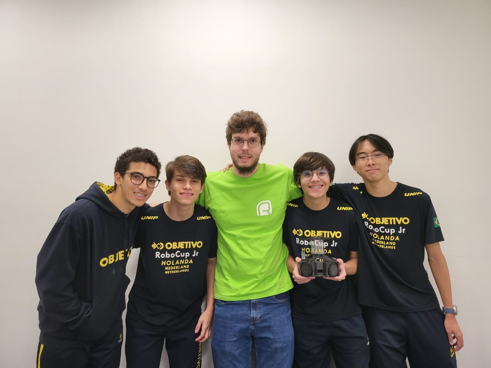
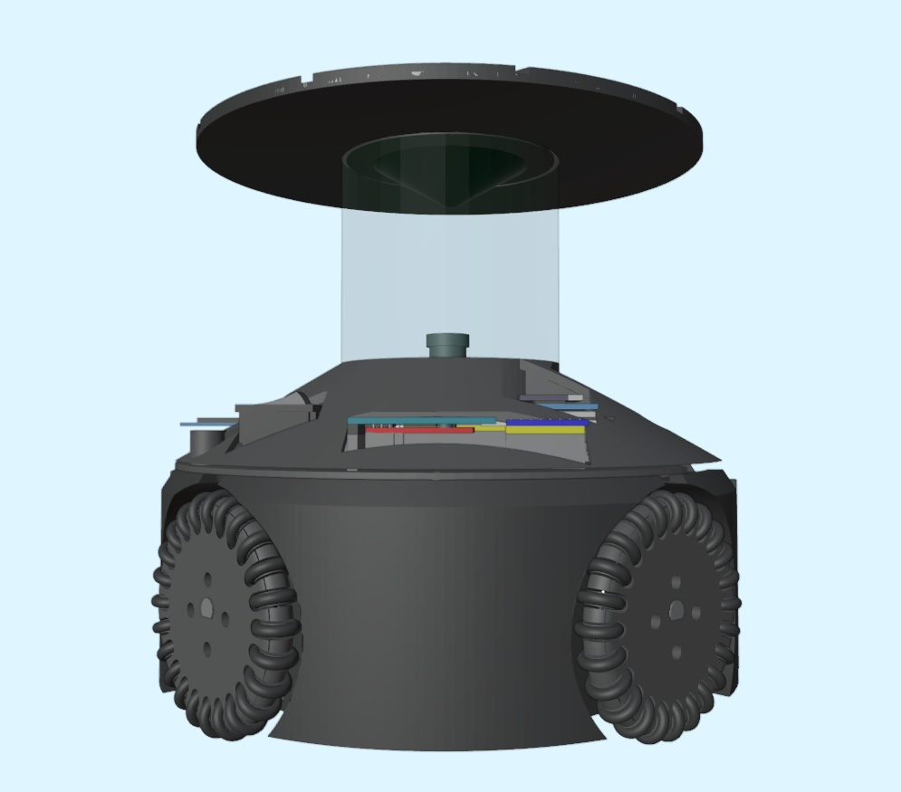
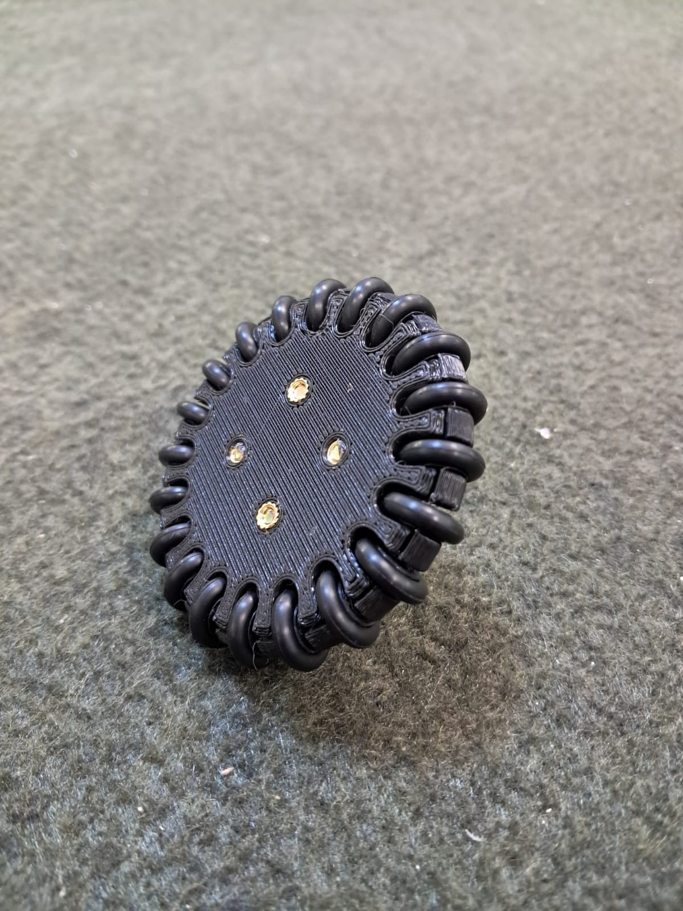
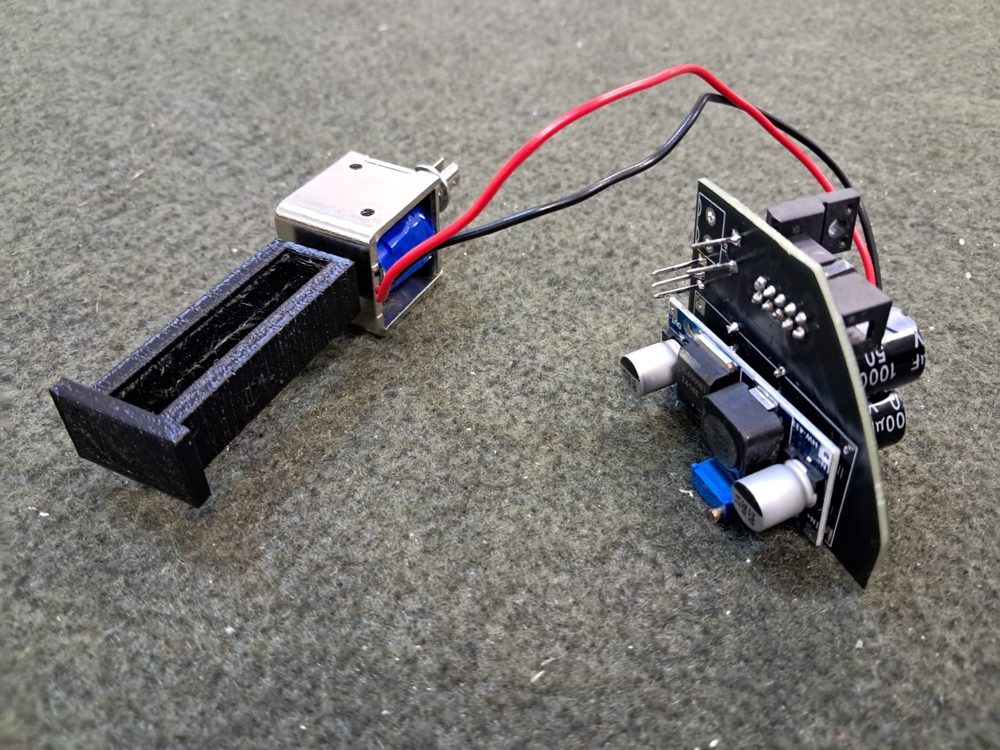
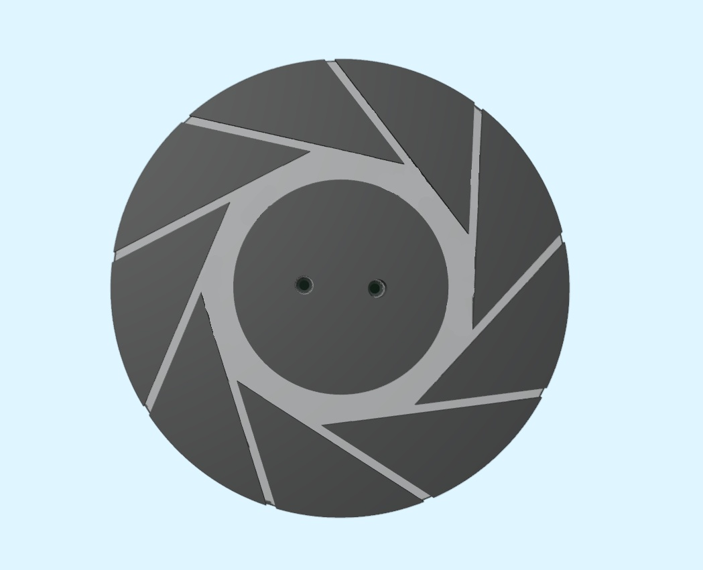
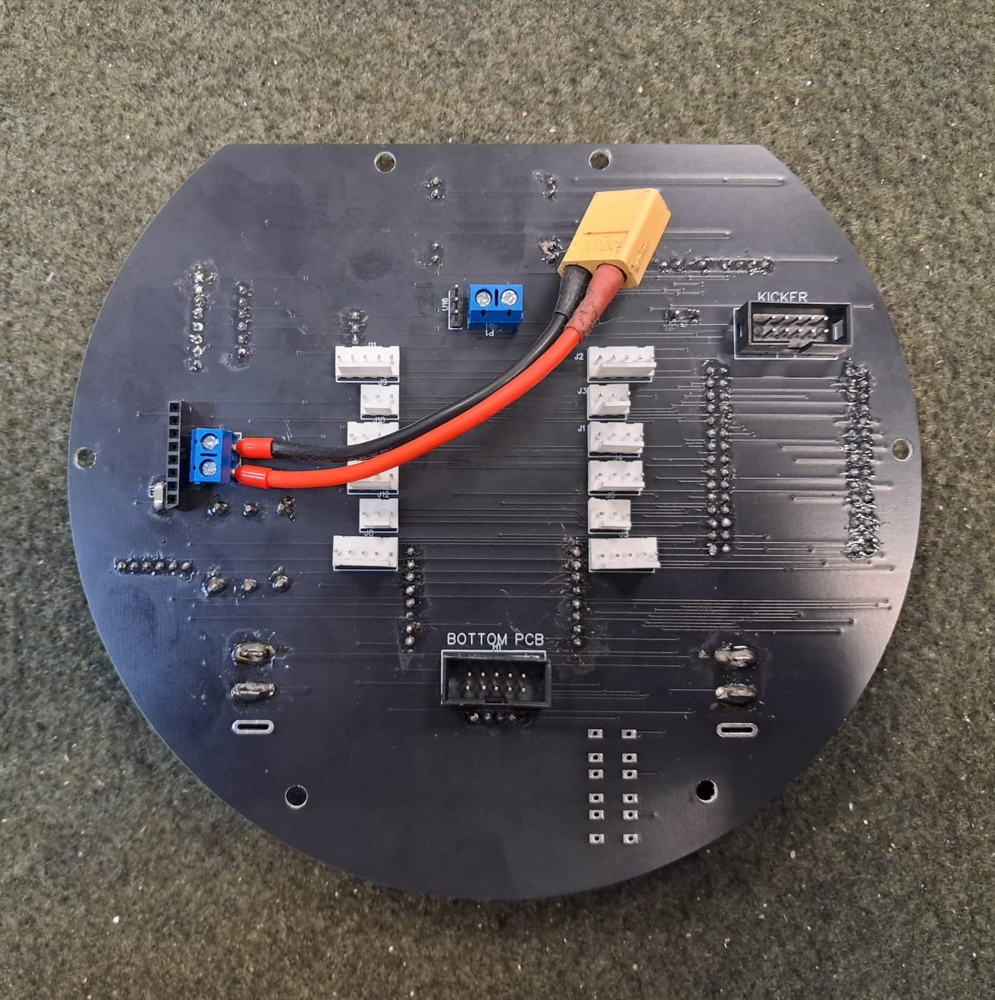
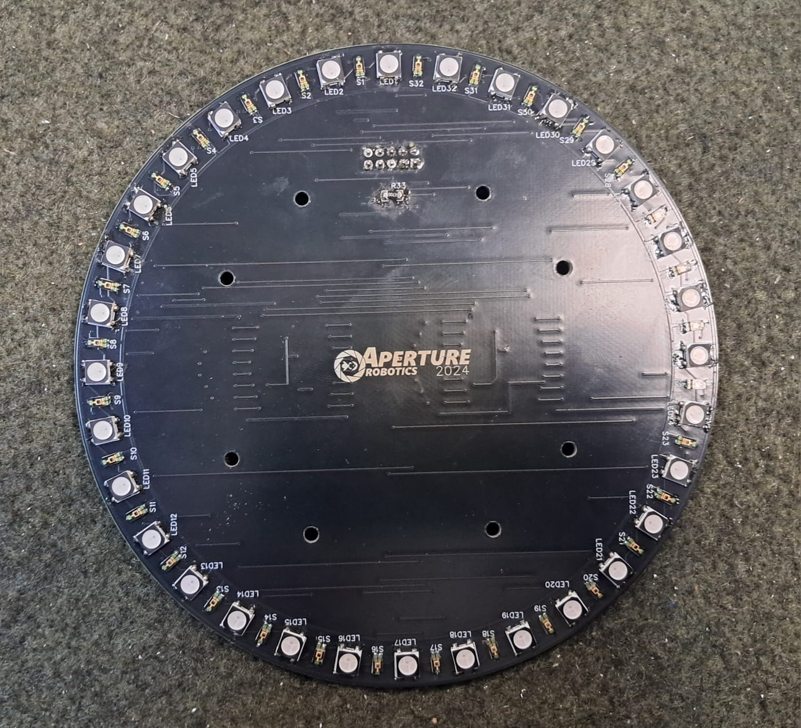

## Timestamp

*Timestamp*

7/12/2025 6:49:04

## Team Name

*What is your team's name?*

Aperture Open

## League

*What league do you participate in?*

Open League

## Country

*Where are you from?*

São Paulo, Brazil

## Contact

*If other teams have questions about your robot, now or in the future, what email address(es) can we publish along with this document for people to reach you?

(You can put in multiple email addresses, like multiple team members, an email for the whole team or both. Feel free to share other ways of communication like Discord handles)*

aperture.soccer@gmail.com

## Social Media

*Team Social Media Links (if you have any)*

aperture.soccer (Instagram), Aperture Robotics (Youtube)

## Team Photo

*Upload a photo of your whole team with your mentor and robots

Note: This is not mandatory and will be published along with your TDP if you choose to upload something*

## Members & Roles

*What are the names of the team members and their role(s)?*

Leonardo Rosendo: Captain and General Hardware
Lucas Suzena: General Software
Gabriel Hamada : General Camera and Documentation
Ivan Pontes: Mechanics and Eletronics

## Meeting Frequency

*How often did your team meet?
(e.g. 90 minutes once per week or a day every weekend.)*

9 hours per week.

## Meeting Place

*Where did you meet to work on your robot?
(e.g. a robotics room at school, at some other place, one of your homes, school library etc.)*

School robotics lab.

## Start Date

*When did your team start working on this year's robot?*

June 20th.

## Past Competitions

*Which RoboCupJunior competitions have you competed in and in which leagues?*

Campeonato Brasileiro de Robotica 2022 (National): Lightweight League
Robocup Jr France 2023 (World Championship): Lightweight League
Campeonato Brasileiro de Robotica 2023 (National): Lightweight League
Robocup Jr Netherlands 2023 (World Championship) : Lightweight League
Campeonato Brasileiro de Robotica 2024 (National): Open League
Robocup Jr Americas 2025 (Super Regional): Open League

## Mentor Contribution

*Which parts of your work received the most contribution from your mentor?*

Reviewed the PCBs and helped us chose and purchase some of the robot components.

## Workload Management

*How did you manage the workload?*

For communication we use WhatsApp and Discord, for code sharing and backup we use GitHub, and for schedule management we use Notion.

## AI Tools

*Which AI tools did you use?*

None

## Robot1 Overall

*Robot 1 Overall View*

## Robot1 Front

*Robot 1 Front view*

## Robot1 Back

*Robot 1 Back view*

## Robot1 Top

*Robot 1 Top View*

## Robot1 Bottom

*Robot 1 Bottom View*

## Robot1 Right

*Robot 1 Right View*

## Robot1 Left

*Robot 1 Left View*

## Positioning & Movement

*How do you find your position inside the field and how do you use that position to move your robots around?*

We use a color detection code in the OpenMV Cam H7 Plus using the OpenMV firmware
(Python). In the STM (C++), after receiving the information of the goals and ball from the camera, we use trigonometry to calculate the position of the robot on the field.

We use two methods to calculate positions. If the robot is detecting the two goals, it uses only the absolute positions of the goals on the field and the relative angles to them to calculate the robot's position precisely. But if only one goal is appearing, the robot uses linear interpolation first to convert the distances in pixels to the goals to values in
centimeters and then, with the absolute positions and relative angles of the goals, uses
trigonometry to get its position on the field. The second method is less precise, because it depends on a precise reading of pixels on the camera, and the camera resolution is not good for precision, since we prioritize a better FPS in the camera over an image resolution bigger than necessary.

The robot relies only in angles to get the ball and conduct it to the goal, but it can use positions for tasks like defending the goal, or using a specific strategy to move on the field other than going on a straight line.

## Robot2 Overall

*Robot 2 Overall View*

## Robot2 Front

*Robot 2 Front view*

## Robot2 Back

*Robot 2 Back view*

## Robot2 Top

*Robot 2 Top View*

## Robot2 Bottom

*Robot 2 Bottom View*

## Robot2 Right

*Robot 2 Right View*

## Robot2 Left

*Robot 2 Left View*

## Mechanical Design

*How did you design the mechanical parts of your robots?*

We used OpenSCAD, a software for creating solid 3D CAD objects using its own programming language. This makes the organization of the files and precise modeling easier.

With only one season in Open and little time to produce new robots, we managed to improve a lot our robot, going from an adaptation of our Lightweight robots to an international level robot of Soccer Open, bringing a lot of methods and inovation to our national league. Our design combines methods learned and improved by all the generations of our team since 2017, like the omnidirectional wheels using ABS instead of PLA, providing a more resistant and cheaper wheel, the use of complete PCBs printed in glass fiber and copper (a cheaper option to print boards) to reduce the numbers of cables on the robot while serving as the robot's structure, with methods of teams from all over the world, like the use of a conical mirror of aluminum molded in a lathe, explained by the Russian team "Comma,", complemented with a study of mirrors made heating mirrored sheets, with the help of the Slovak team ”LNX Robots”, a kicker mechanism inspired in the American team "Team Elite", and general inspiration of other international teams.

For the future, since we plan to keep the same boards and components for the next season, we will only improve what we already have of mechanical parts, such as producing wheels and structural parts in metal and improve our dribbler mechanism to use less space and work better.

## Build Method

*How did you build your design?*

For parts made in PLA and ABS we used a 3D printer, using saws and metal files to cut and sand exceeding parts of the supports.

For PCBs, we design our own boards in EasyEDA, and order their printing in JLCPCBs, that offers different options of printing, but we prefer ordering the PCBs in copper and glass fiber, because it is a cheaper but reliable type of material. During our years in Soccer, we developed various strategies to improve our PCBs, such as using one side of the board for vertical wires and the other for horizontal wires.

For the mirrors, we calculate the dimensions of our own conical mirrors in GeoGebra, a website for calculations in a Cartesian Plane. After defining the diameter and height of the mirror, we order the aluminum molding with a local machining company, and then sand and polish it to achieve a good reflection.

The main methods used by Soccer teams are the use of an aluminum cylinder on a lathe and the heating of a mirrored plastic sheet. Our initial idea was to mold an aluminum plate in a cone, because of the good reflection of the aluminum and that it would not require the use of a lathe, but we did not find a way to easily bend it.

We then changed to the second method, using a mirrored sheet. Normally, the material used is a PVC (Polyvinyl Chloride) or PS (Polystyrene) sheet mirrored using a thin layer of aluminum. Since this type of material was not available in Brazil, we tried using a PVC plate coated with acrylic and mirrored with a cheap material, but although we managed to heat and mold it in the conical shape, the material did not retain its reflexive properties after the process. We also tested using a mirror pyramid, but it had too many blind spots and was difficult to produce.

Another tests include the use of a chrome spray, spray mirror and mirrored insulfilm, all with insufficient outcomes. After severe searching and testing, we ended up with two solutions, each one similar to one of the methods explained above.

The first one was polishing spherical aluminum mold, which allowed us to get satisfactory reflection results. The second one is using an imported mirrored sheet made of PET (Polyethylene Terephthalate), that we cut in a circle and fold it on an 3D printed cone. Although it has a higher distortion, we managed to achieve a much better vision of the field.

In the final steps of the production of our robot, we found a way to produce the mirror on a lathe, so we calculated the dimensions of the mirror in the cartesian plane, ordered the molding of an aluminum cylinder on the lathe, and then we polished it until it had a
satisfactory reflection. This is the method we are currently using.

The images of our tests with mirrors can be seen in our complete TDP (made with the previous international template), that can be accessed scanning the QR Code in our poster. Also, feel free to come talk with us if you have any questions or suggestions.

## Motors & Reason

*How many motors have you used and why?*

The motors are located in the bottom board at an angle of 90° to each other. We use four Nidec 24H brushless motors of 12V that can go up to 3900 rpm and are exclusively used for the movement of the robot. We use this disposition of motors because it is the best way to implement a precise omnidirectional movement.

The four wheels of the robot use the idea of omnidirectional wheels. Being printed in ABS with 20 sub wheels distributed around the edge, the wheels have a total diameter of 65mm.

Since the motors are disposed perpendicularly to each other and each wheel has sub
wheels perpendicular to the motor turning axis, if two parallel motors move to one direction, the other two motors will still accompany the movement, as the sub wheels will spin instead of the whole wheel, allowing a quick and fluid movement on the field.

## Kicker Design

*If your robot has a kicker, explain how you designed and built the mechanics of the kicker*

We decided to use a JF-0826B solenoid of 6V and 20N, as it was a common and cheap
option to buy, and when powered with 48V, we end up with a stronger but smaller kicker.

We made the kicker system on its separate board, as managing a higher voltage on the main board could be dangerous. The board is designed to fit inside the robot, also aiming for occupying less space.

## Dribbler Design

*If your robot has a dribbler, explain how you designed and built the mechanics of the dribbler.*

The initial idea was to use a belting system from the motor to the roller, as suggested by the Russiam team "Comma,", as it would be more reliable than using gears.

But we had a problem with avaliable space on the robot, as making it too high would
prejudicate the camera vision. So, we ended up using the own case of the motor as the
dribbler roller to save space, and used silicone molded parts to provide grip to the dribbler.

## CAD Files

*CAD design files*

https://github.com/Aperture-Robotics/Aperture-Open-SCAD.git

## Mechanical Innovation

*Mechanical Innovation*

A part normally underrated of the mechanic aspect of the robot is its aesthetic design. The importance of having a clean and aesthetic design goes from later helping in the electrical and software part of the work, to having a unique robot, that stands out during the matches. After all, Soccer matches should also be nice to watch in the spectators perspective.

Instead of only focusing only on the basic functions for the robot, we also included aspects that consider aesthetic purposes, differing from the other teams in Soccer Open. Some of those aspects include the mirror support having a representation of our team logo while maintaining the modernity of the robot, having a helmet for the robot, that covers the components of the robot, absorving impacts and enhancing its shape and designing custom PCBs that serve as the robot's structure and allow us to use almost no cables on the robot while keeping the eletrical part organized and reducing risks, since loose cables can twine and cause problems.

## Mechanical Photos

*Photos of your mechanical designs highlights*

## Electronics Block Diagram

*Provide us with a block diagram of your robot's electronics*

[https://drive.google.com/open?id=1G7eh_zGZzAWgvekzxD-fJ5gtnBLmHZgx](https://drive.google.com/open?id=1G7eh_zGZzAWgvekzxD-fJ5gtnBLmHZgx)

## Power Circuit

*How does your power circuits work?*

The robot uses a 12.6V LiPo battery that is used directly for the motors, and either
converted by a XL6009 step up in the kicker board to 48V, used in the kicker system, or by a SY8205 step down in the top board to 5V, used in the STM32 and other components. The SY8205 is a model of step down much more efficient than the others already tested, being able to convert nine tenths of the original electrical energy.

We also use a mini regulator in the bottom board from 5V to 3.3V to power the LEDs (note that in the top board this regulator is not needed, as the own STM converts 5V to 3.3V).

## Motor Drive Circuit

*How do you drive your motors? Explain the circuits you use for that*

Our motor uses PFM (Pulse Frequency Modulation) to control the RPM of each motor. The motors, that also have an integrated encoder and a two phases encoder, have functions using digital pins to control directions and to brake. They are powered with 12.6V of the battery.

## Microcontroller & Reason

*What kind of micro controller or board do you use for your robot? Why did you decide to use this part for your robot? If you have more than 1 processor, explain each one separately.*

With the removal of the infrared sensors (used to detect the ball in the Lightweight
modality), we used two microcontrollers instead of three.

Located in the top board, the STM32F405 is the main microcontroller, being responsible for the reading of most sensors and the control of the motors and reactions of the robot. This microcontroller has 168 MHz of processing frequency, 192 kB of RAM memory, and 1024 kB of ROM memory, also allowing the expansion of the ROM memory with an SD card.

Being responsible for the reading and processing of the camera images, the OpenMV Cam H7 Plus is located on the top board and has a built-in camera. We started using it instead of the STM32H750, because although it is more expensive, the H7 Plus has many advantages compared to the STM. The differences between the two microcontrollers, together with a comparison of the two camera sensors we tested can be seen in our complete TDP (made with the previous international template), that can be accessed scanning the QR Code in our poster or accessing our Linktree in the end of this form.

## Ball Detection

*How does your ball detection sensors and/or camera[s] work?*

We use an OpenMV Cam H7 Plus with an OV5640 camera module. Running VGA in 17-30 FPS, the camera runs the code using OpenMV firmware (Python).

A threshold is defined for the color, calibrating a minimum and maximum for the LAB (Light, A dimension and B dimension) values. Then, based on the threshold and some other values, like the maximum area and margin to merge, the code looks for blobs with those values in the image and uses its position to calculate angles and distances. In the code, we use a debug variable, that is only defined as True during tests, so the blobs are drawn in the image.

The values collected about the goals and ball are then sent to the STM32F405, where distances, positions and estimations are calculated.

## Line Detection

*How does your line detection circuits work?*

The reflectance sensors are evenly disposed in the bottom board in a circle of 13 cm in
diameter, increasing the detection area evenly. In total, the robot has 32 reflectance sensors, each sensor being composed by one phototransistor and one LED. We use the models TEMT6000X01 and WS2812B for the phototransistors and LEDs, respectively. The values of the reflectance sensors are later selected with the multiplexer and received by the STM in the top board.

To use fewer pins for the reflectance sensors, we use two multiplexers that only need 4
digital pins to read 16 sensors each, so in total, including 2 analog pins to get the readings, only 10 pins are used for the 32 sensors.

## Navigation/Position Sensors

*What sensors do you use for navigation and how are these sensors connected to your processor? What sensors do you use to find your position in the field? What about the direction your robot faces?*

The robot has one gyroscope of model MPU6050, used to get the angle of the robot in
relation to an offset. Previously, we would also have a compass of model HMC5883L to get redundant values, allowing more reliability, since the gyroscope accumulates error on the readings along the time the robot is turned on, but since we lowered the height of the compass to leave space to the conical mirror on the robot, the magnetic interference of the motors became too high, so we removed the compass.

The angle read by the gyroscome, combined with the data collected by the camera and
reflectance sensors, explained previously, compose the location part of the code,
responsible for interpreting the values received, calculating angles, distances, positions and lines directions

## Kicker Circuit

*How do you drive your kicker system? How does the circuit make the kicker work?*

We use the step up to convert 12.6V to 48V, used to power a solenoid of only 6V and 20N, so it can go up to 160N. The electronic circuit of the kicker system is adapted from the American team "Team Elite" from Princeton Soccer Robotistry, with the main difference being that we use 4 capacitors of 1000µF to store energy for the kicks, while the original circuit uses 2 capacitors of 2200µF, since the original capacitors would not fit in our robot.

We use a system of recharge and shoot, converting and storing energy for a kick, and then releasing it to produce a powerful kick. We also have a LED that is activated when the system is charged, and two mosfets to activate the kicker. We use two mosfets instead of one to avoid energy reversion, since the converted energy could go back in the circuit and damage components.

## Dribbler Circuit

*How does your dribbler system work? What components and circuits did you use to drive it?*

The dribbler system only have one component, an A2212 motor of 1400KV, meaning it can go up to 17640 rpm when powered with the 12.6V of the battery, but in the code we limit it to 35%, having 6200 rpm, that is already enough to serve as a dribbler.

## Schematics

*Schematics of your robot*

[https://drive.google.com/open?id=1UsaPeikG0RCfjVGPK9IynMp5ybxM0MwM](https://drive.google.com/open?id=1UsaPeikG0RCfjVGPK9IynMp5ybxM0MwM)
[https://drive.google.com/open?id=1UdMrkSlUcBDqXFugImqGe5BW6Jmhu4RP](https://drive.google.com/open?id=1UdMrkSlUcBDqXFugImqGe5BW6Jmhu4RP)
[https://drive.google.com/open?id=19zC-rw3Xbi0-csy2DWElEcGzSww0a6LI](https://drive.google.com/open?id=19zC-rw3Xbi0-csy2DWElEcGzSww0a6LI)

## PCB

*PCB of your robot*

[https://drive.google.com/open?id=1DJr-6wR2pt0sVdsKyHiMdG2_crG8t3_8](https://drive.google.com/open?id=1DJr-6wR2pt0sVdsKyHiMdG2_crG8t3_8)
[https://drive.google.com/open?id=1BGSTd51_rndApBoTyHmfo1qPGdp0tDCX](https://drive.google.com/open?id=1BGSTd51_rndApBoTyHmfo1qPGdp0tDCX)
[https://drive.google.com/open?id=1Zed6PfWgf3ZGyfizjry1GbKPbx2zhFKI](https://drive.google.com/open?id=1Zed6PfWgf3ZGyfizjry1GbKPbx2zhFKI)

## Innovation

*Innovations*

We use different methods to make the access of information of the robot during the
matches easier, since having a simple but efficient way to access information is important to manage the strategy during the match.

Firstly, we use an LCD display to show various informations of the robot such as the battery level, and to change strategies. But the main difference in our robot, compared to the other robots of Soccer Open, is the usage of a buzzer, either to quickly warn if there are problems with the battery or camera, very important considering the accidents that can happen with LiPo batteries and troubles we had previously with camera calibration, or we can use the buzzer to play sounds with entertainment purpoises, since as we mentioned previously, the matches should consider the spectators perspective too.

## Circuit Photos

*Photo of your circuit boards highlights*

## Motor Control

*How do you use your processor to move your motors?*

In the main microcontroller, the STM32F405 there is a movement class, that controls the movement of the motors dividing in x and y axis, the speeds are defined by the decision class. The movement class serves only as an intermediary of the processing of the information and the physical response of the robot.

In the movement class, the main function starts with three parameters: fx which is the force in x; fy which is the force in y; ang which is the force of rotation in its own axis. All these forces are vectorially added in each motor. After this the final force of each motor is verified, because the maximum strength is 100, we make a rule of three with all the motors to maintain the same proportion of strength in all of them and with power lower or equal to 100.

## Ball Detection Method

*How do you find where the ball is? How do you read the data from the ball detection sensors or camera?*

Firstly, there is a color detection code in the OpenMV Cam H7 Plus using the OpenMV
firmware (Python). A threshold is defined for the color, calibrating a minimum and maximum for the LAB (Light, A dimension and B dimension) values. Then, based on the threshold and some other values, like the maximum area and margin to merge, the code looks for blobs with those values in the image and uses its position to calculate angles and distances. In the code, we use a debug variable, that is only defined as True during tests, so the blobs are drawn in the image.

In the STM (C++), after receiving the information of the goals and ball from the camera, we use trigonometry to calculate the position of the robot on the field, and with it, the position of the ball.

## Ball Catch Algorithm

*How does your algorithm work to catch the ball? Is there a difference between your robots in how they move towards the ball? Explain the differences.*

Detecting the angle of the ball relative to the front of the robot, the striker makes a curve to align its front with the ball and the opposite goal, making it easier to control the ball while conducting it to the goal. Meanwhile, only if the goalkeeper is too close to the ball, it will temporarily start to attack, using the same method of the striker.

## Line Algorithm

*How does your robot find the lines to stay inside the field? What algorithms do you use to avoid going out of bounds?*

Our robot has 32 reflectance sensors in a circular format on the bottom board, each sensor composed of one LED and one phototransistor. Reading the values detected by each sensor, we calibrate the code to detect the white lines, and knowing the sensors that are detecting the lines, we use trigonometry to find the angle of the line in relation to the robot.

## Goal Algorithm

*What algorithms do you use to score goals? How do you use your kicker and dribbler to handle the ball?*

In our main algorithm to make quick goals, the striker firstly identifies the ball and makes a curve to align itself, the ball and the opposite goal in a line. Then, the robot ensures it has the ball possession, so it can start a movement to the goal. Finding a spot free to shoot, the robot then uses its kicker to make a powerful kick towards the goal.

## Defense Algorithm

*What algorithms do you use to avoid the opponent team scoring? How do your robots defend your own goal?*

While the striker focuses on having the ball possession, naturally intercepting the
opponent's kicks, the goalkeeper uses a system of predefined points in front of the goal, and using the ball speed to estimate its trajectory, the robot goes to the best spot to defend.

This strategy proved to be efficient even with teams that hide the ball behind the robot, as it is easier for our striker to intercept and take the ball, and the goalkeeper still knows where the ball is, as the striker keeps sending the ball position via Bluetooth.

## Robot Communication

*Do your robots communicate with each other? How do you use this communication to your advantage?*

The robots have slots for two different Bluetooth modules, the HC-05 and the RCJ module, used to send information like positions and strategy commands. The main importance of this type of communication is that, sharing the position of the ball on the field, even if one robot isn't viewing the ball, the robot will still know its position, as the other robot sent it via Bluetooth.

## Innovation2

*Innovations*

In our matches against different teams, we noticed the importance of the strategy when the hardware of the robot is on its limits, as the same strategy can be bad against better teams, but work surprisingly well against other teams, that only considering hardware, should be better too. So, for this competition, differently from the methods of strategy management normally used in Open, we are using a method inspired in SSL (Small Size League) Soccer teams, the State Machine.

In the code, there are diverse states, such as kicking, turning or going to a specific position. There are also behaviors, like the striker, goalkeeper or hybrid. To control the states and behaviors, there are transitions, that are either events or conditions that cause a transition of the current state, and sometimes the behavior. This way, we can produce a strategy much more fluid and changeable, defining which states will be used, what is the robot's behavior and how it will react and transition based on the analysis made of the team we are playing against.

## GitHub Link

*GitHub link*

https://github.com/Aperture-Robotics/Aperture-Open-Code.git

## BOM

*Bill of Materials (BOM)*

[https://drive.google.com/open?id=1R75G9cKnkuhafiqbP5neoFlZbCtCxiIg](https://drive.google.com/open?id=1R75G9cKnkuhafiqbP5neoFlZbCtCxiIg)

## Cost

*How much did it cost you to build your robots?*

Robots: 1626,65 BRL each robot
Experiments: ~300 BRL
Environment: 165,25 BRL (does not include the field, as it was made for the previous team)
1 BRL = 0.18 USD

## Funding

*How did you gathered the funds to build the robots?*

50% school
25% mentor
25% students

## Affordability

*How affordable was it to compete in RoboCupJunior Soccer?*

1

## Answer Check

*Have you checked all of your answers?*

Yes!

## Publication Consent

*We publish TDPs and posters during or after the competition as described in the beginning*

Yes, we acknowledge everything submitted in the above form can be published.

## Email Address

*Email Address*

aperture.soccer@gmail.com

## TDP File

*TDP File Upload (Not required)*

## Extra Column

*Column 67*

