## Timestamp

*Timestamp*

7/13/2025 18:28:10

## Team Name

*What is your team's name?*

BULLBOTS

## League

*What league do you participate in?*

Lightweight League

## Country

*Where are you from?*

BRAZIL

## Contact

*If other teams have questions about your robot, now or in the future, what email address(es) can we publish along with this document for people to reach you?

(You can put in multiple email addresses, like multiple team members, an email for the whole team or both. Feel free to share other ways of communication like Discord handles)*

yuriveiga09@gmail.com, andrique@gmail.com

## Social Media

*Team Social Media Links (if you have any)*

we dont have

## Team Photo

*Upload a photo of your whole team with your mentor and robots

Note: This is not mandatory and will be published along with your TDP if you choose to upload something*

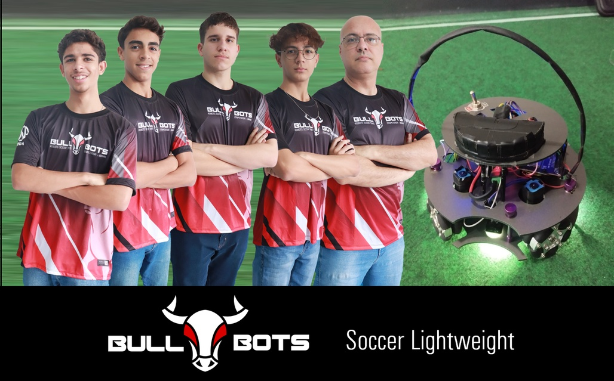

## Members & Roles

*What are the names of the team members and their role(s)?*

Davi (programmer), Yuri (Leader and constructions), João Marcelo (soldering and energy), Gustavo (soldering and energy).

## Meeting Frequency

*How often did your team meet?
(e.g. 90 minutes once per week or a day every weekend.)*

2 days per week.

## Meeting Place

*Where did you meet to work on your robot?
(e.g. a robotics room at school, at some other place, one of your homes, school library etc.)*

Davi's house

## Start Date

*When did your team start working on this year's robot?*

April

## Past Competitions

*Which RoboCupJunior competitions have you competed in and in which leagues?*

Brazil CBR National 2024: LightWeight league

## Mentor Contribution

*Which parts of your work received the most contribution from your mentor?*

Components recommendation, soldagem and basic code language

## Workload Management

*How did you manage the workload?*

WhatsApp and gmail

## AI Tools

*Which AI tools did you use?*

none

## Robot1 Overall

*Robot 1 Overall View*

## Robot1 Front

*Robot 1 Front view*

## Robot1 Back

*Robot 1 Back view*

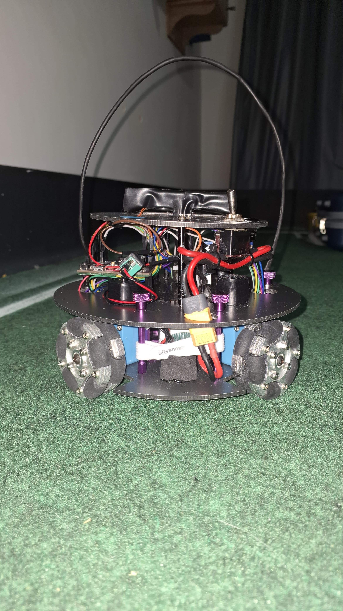

## Robot1 Top

*Robot 1 Top View*

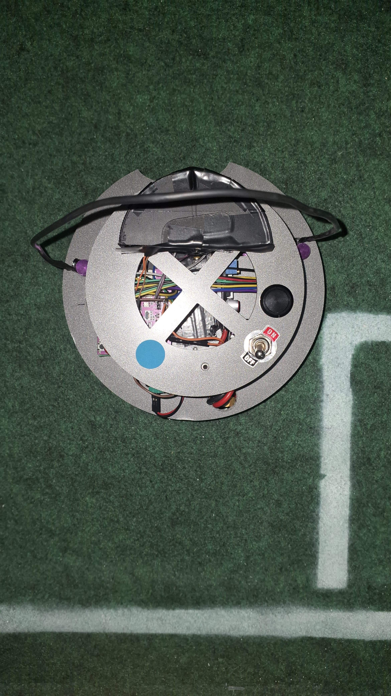

## Robot1 Bottom

*Robot 1 Bottom View*

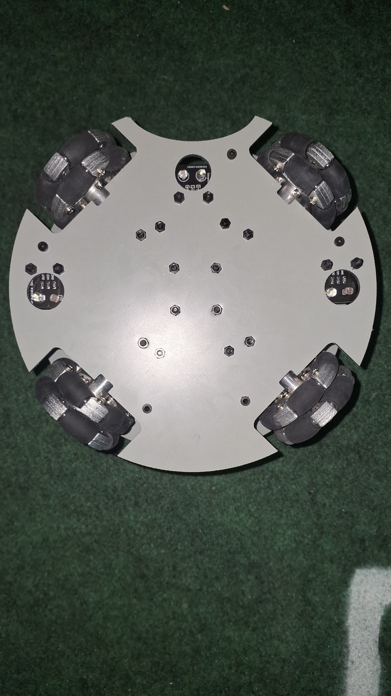

## Robot1 Right

*Robot 1 Right View*

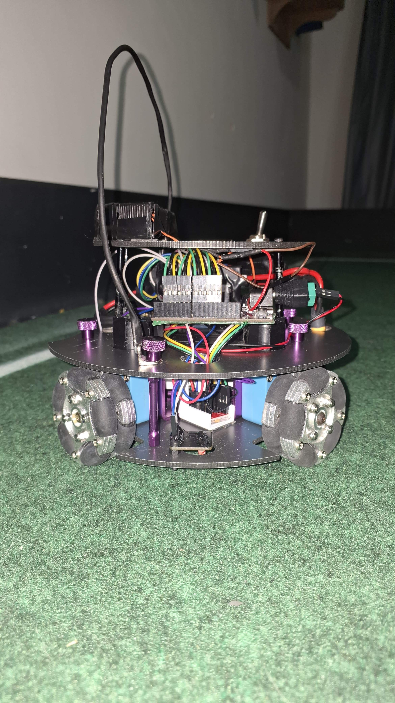

## Robot1 Left

*Robot 1 Left View*

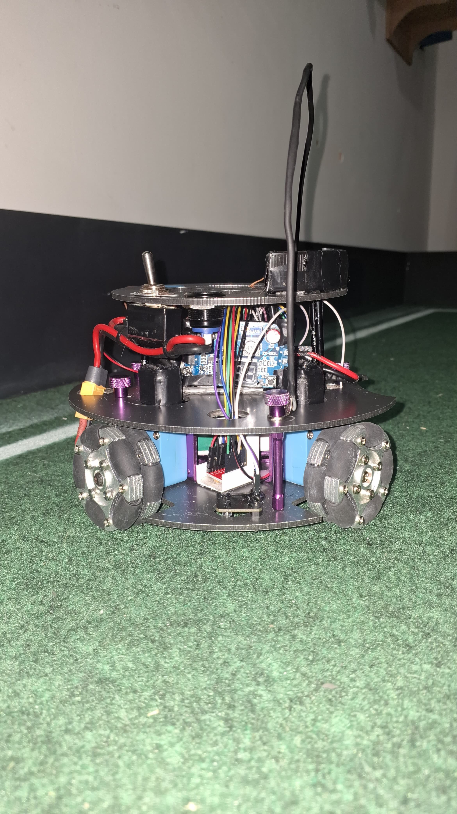

## Positioning & Movement

*How do you find your position inside the field and how do you use that position to move your robots around?*

Compass sensor, we use a compass to show were the goal is

## Robot2 Overall

*Robot 2 Overall View*

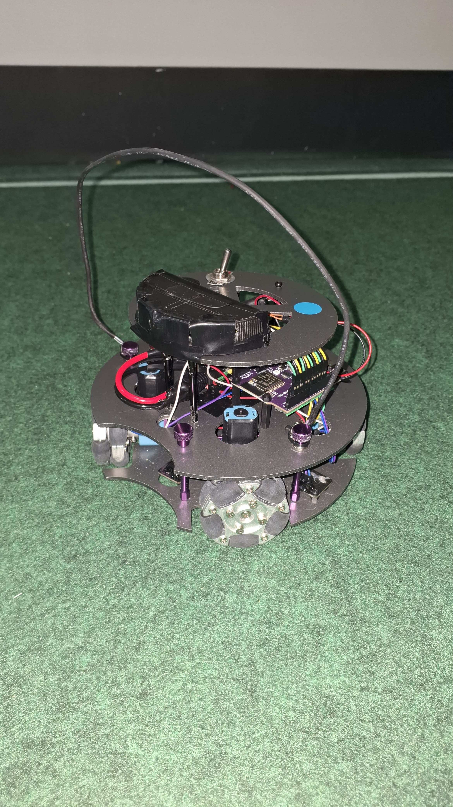

## Robot2 Front

*Robot 2 Front view*

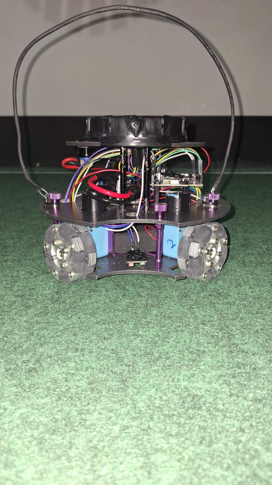

## Robot2 Back

*Robot 2 Back view*

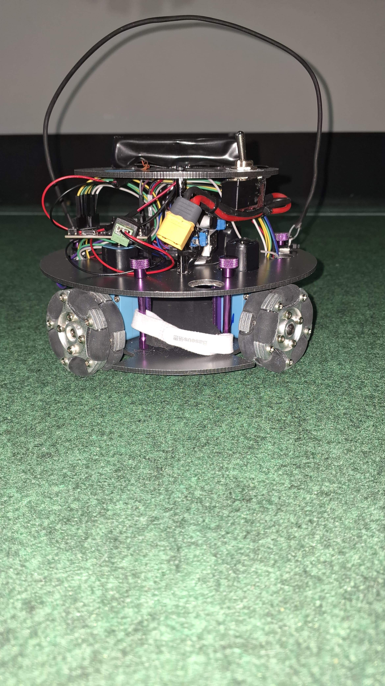

## Robot2 Top

*Robot 2 Top View*

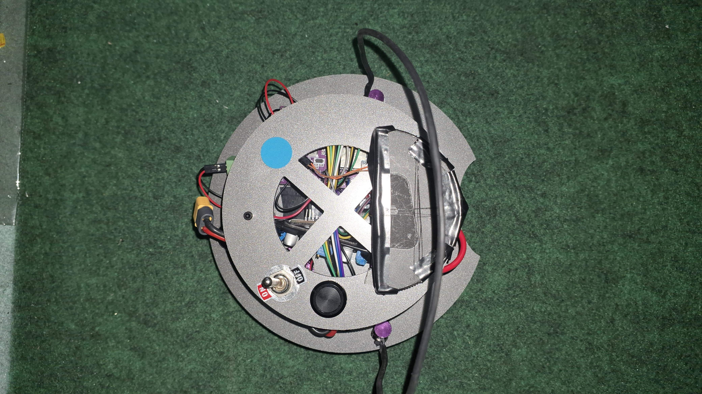

## Robot2 Bottom

*Robot 2 Bottom View*

## Robot2 Right

*Robot 2 Right View*

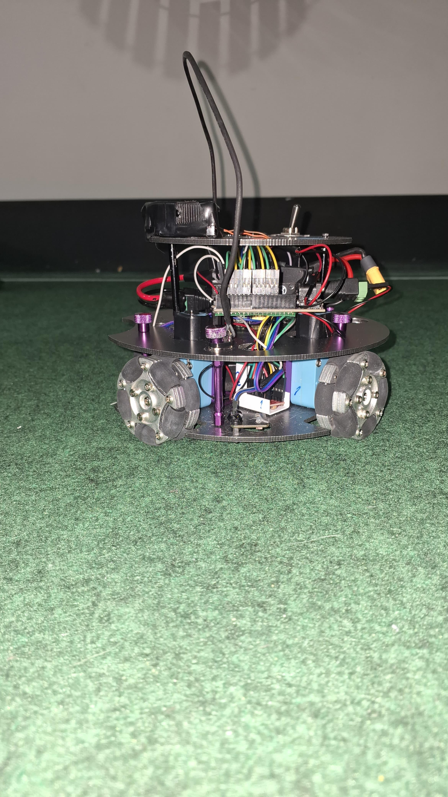

## Robot2 Left

*Robot 2 Left View*

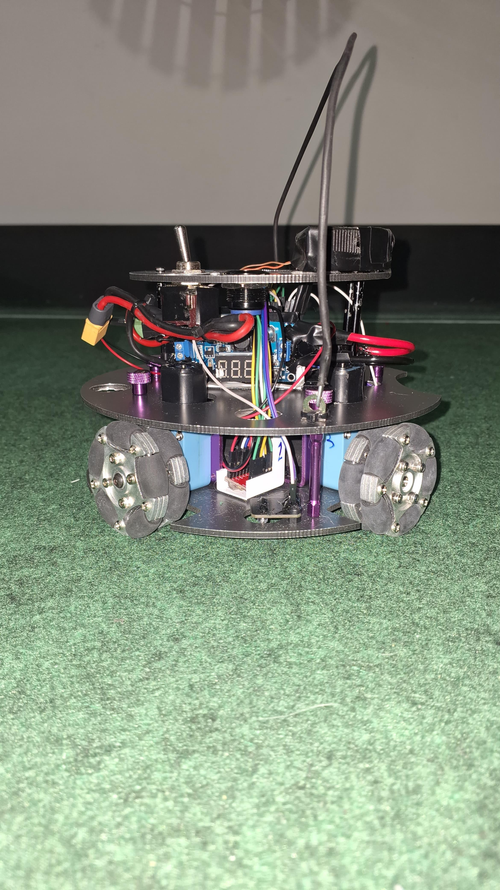

## Mechanical Design

*How did you design the mechanical parts of your robots?*

We made drawings on paper of the structure, drew it in Corel Draw with the teacher, sent it for laser cutting;

## Build Method

*How did you build your design?*

we use drill, hot glue, screws, power modules and solder

## Motors & Reason

*How many motors have you used and why?*

we are using 4 motors, we opted for this number to make the movement more fluid

## Kicker Design

*If your robot has a kicker, explain how you designed and built the mechanics of the kicker*

no kicker

## Dribbler Design

*If your robot has a dribbler, explain how you designed and built the mechanics of the dribbler.*

no dribbler

## CAD Files

*CAD design files*

we dont have

## Mechanical Innovation

*Mechanical Innovation*

on the CBR 2024 we used only 3 wheels and for the 2025 season we improve to 4 wheels

## Mechanical Photos

*Photos of your mechanical designs highlights*

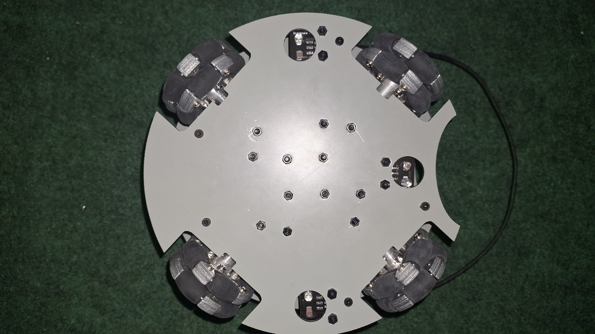

## Electronics Block Diagram

*Provide us with a block diagram of your robot's electronics*

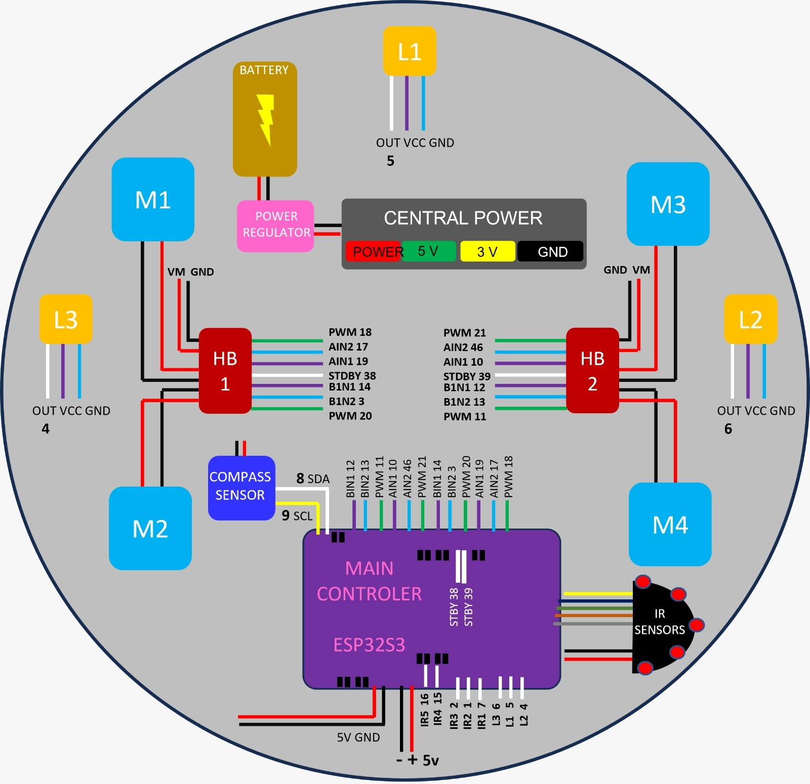

## Power Circuit

*How does your power circuits work?*

our robot has a 12V battery and has a regulator to use only 10V for or motors and or board ESP32S3 Dev Module

## Motor Drive Circuit

*How do you drive your motors? Explain the circuits you use for that*

we use a TB6612FNG board to control the motors

## Microcontroller & Reason

*What kind of micro controller or board do you use for your robot? Why did you decide to use this part for your robot? If you have more than 1 processor, explain each one separately.*

our board is ESP32S3 Dev Module, we decide to use this board because is a technological and fast for programming

## Ball Detection

*How does your ball detection sensors and/or camera[s] work?*

we use a infrared sensor TSSOP4038 to find the ball, he gives us a signal between 4095 and 0, and to have a larger detection we are using five of them

## Line Detection

*How does your line detection circuits work?*

when the sensor that we use (Grayscale Sensor) finds the white line, he goes on the oposite direction of the line

## Navigation/Position Sensors

*What sensors do you use for navigation and how are these sensors connected to your processor? What sensors do you use to find your position in the field? What about the direction your robot faces?*

we use the compass GY-80 to navigation and is connected in the I2C pin on the board

## Kicker Circuit

*How do you drive your kicker system? How does the circuit make the kicker work?*

we dont have kicker

## Dribbler Circuit

*How does your dribbler system work? What components and circuits did you use to drive it?*

we dont have dribbler

## Schematics

*Schematics of your robot*

## PCB

*PCB of your robot*

## Innovation

*Innovations*

the IR sensor that we have (TSSOP4038), because before we use the LEGO IR seeker, and now we are improving for the TSSOP4038

## Circuit Photos

*Photo of your circuit boards highlights*

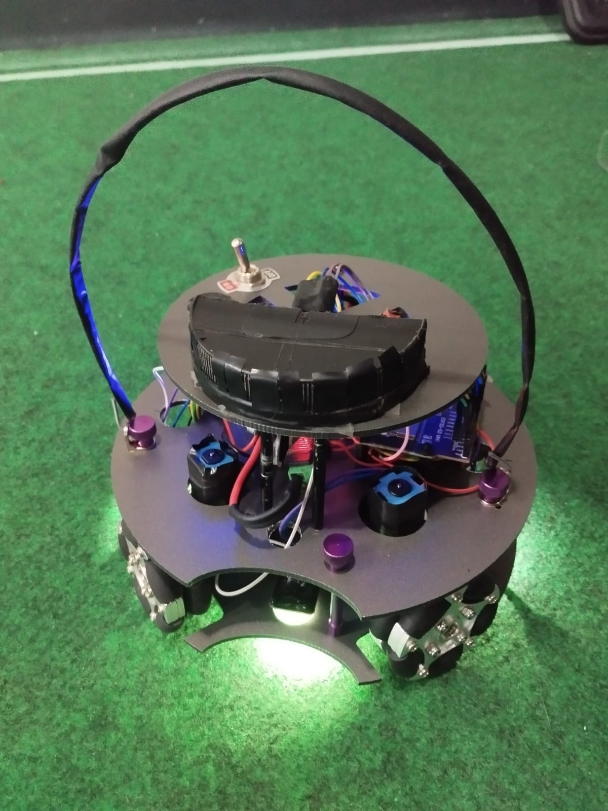

## Motor Control

*How do you use your processor to move your motors?*

with the TB6612FNG we can know the signal and velocity of the motors, and then we can go to the code and tell what to do

## Ball Detection Method

*How do you find where the ball is? How do you read the data from the ball detection sensors or camera?*

we find the ball with ther IR SEEKERS sensors TSSOP4038, after our sensors read the data we go after the ball

## Ball Catch Algorithm

*How does your algorithm work to catch the ball? Is there a difference between your robots in how they move towards the ball? Explain the differences.*

we have a small opening in the front that fits and pushes the ball

## Line Algorithm

*How does your robot find the lines to stay inside the field? What algorithms do you use to avoid going out of bounds?*

we use a Grayscale Sensor to find the white lines, and to avoid the white lines we use a code to go to the oposite direction when the sensors detect the line

## Goal Algorithm

*What algorithms do you use to score goals? How do you use your kicker and dribbler to handle the ball?*

we find the ball, go after her , fits on the small opening in the front and pushes. We doesn't use a kicker or a dribbler yet

## Defense Algorithm

*What algorithms do you use to avoid the opponent team scoring? How do your robots defend your own goal?*

we do not use a algorithms to avoid opponent team scoring

## Robot Communication

*Do your robots communicate with each other? How do you use this communication to your advantage?*

no

## Innovation2

*Innovations*

we dont think like a innovation, but we use functions to improve and facilitate the directions

## GitHub Link

*GitHub link*

https://github.com/DCampinho

## BOM

*Bill of Materials (BOM)*

[https://drive.google.com/open?id=1uqov8V7WXSZwROf3G987VCxNFeEfX6Fy](https://drive.google.com/open?id=1uqov8V7WXSZwROf3G987VCxNFeEfX6Fy)

## Cost

*How much did it cost you to build your robots?*

Robots: 407 US Dollars 
Experiments: 960 US Dollars
Environment: 0 US Dollars

## Funding

*How did you gathered the funds to build the robots?*

100% parents

## Affordability

*How affordable was it to compete in RoboCupJunior Soccer?*

4

## Answer Check

*Have you checked all of your answers?*

Yes!

## Publication Consent

*We publish TDPs and posters during or after the competition as described in the beginning*

Yes, we acknowledge everything submitted in the above form can be published.

## Email Address

*Email Address*

andrique@gmail.com

## TDP File

*TDP File Upload (Not required)*

## Extra Column

*Column 67*

