## Timestamp

*Timestamp*

7/10/2025 5:18:49

## Team Name

*What is your team's name?*

Biotech

## League

*What league do you participate in?*

Lightweight League

## Country

*Where are you from?*

São Paulo, Brazil

## Contact

*If other teams have questions about your robot, now or in the future, what email address(es) can we publish along with this document for people to reach you?

(You can put in multiple email addresses, like multiple team members, an email for the whole team or both. Feel free to share other ways of communication like Discord handles)*

sesibiotech@gmail.com, 
enzmolosigg@gmail.com, 
gomesferpereira08@gmail.com, 
hyvinin@gmail.com, 
viniqpsabino@gmail.com,
biotechsoccer@gmail.com.

## Social Media

*Team Social Media Links (if you have any)*

https://www.instagram.com/sesibiotech/
https://github.com/BiotechSoccer263/Biotech-Soccer

## Team Photo

*Upload a photo of your whole team with your mentor and robots

Note: This is not mandatory and will be published along with your TDP if you choose to upload something*

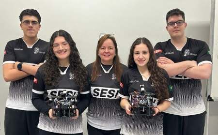

## Members & Roles

*What are the names of the team members and their role(s)?*

• Enzo Momesso Losi Gomes Gutierres: Navigation and ball detection programming, integration of sensors

• Fernanda Pereira Gomes: Electrical circuit design, wiring, and PCB layout

• Hyvinin Ribeiro do Prado: CAD modeling, mechanical assembly, and 3D printing

• Vinicius Marques Sabino: Mechanical prototyping, testing, and optimization

• Ana Maria Papili Pagini: Project management, documentation, and team coordination

## Meeting Frequency

*How often did your team meet?
(e.g. 90 minutes once per week or a day every weekend.)*

We met daily for 300 minutes (5 hours) at school. This routine enabled rapid prototyping, frequent testing, and fast troubleshooting, accelerating our development process.

## Meeting Place

*Where did you meet to work on your robot?
(e.g. a robotics room at school, at some other place, one of your homes, school library etc.)*

We worked in our school’s robotics lab and maker space, which provided access to tools, equipment, and mentor support.

## Start Date

*When did your team start working on this year's robot?*

We started in January, allowing for multiple design iterations, extensive testing, and continuous improvement.

## Past Competitions

*Which RoboCupJunior competitions have you competed in and in which leagues?*

We competed for the first time last year in the Regional and National competitions in Brazil (Lightweight League). These experiences taught us the importance of robust design and thorough documentation, which we applied to this year’s project.

## Mentor Contribution

*Which parts of your work received the most contribution from your mentor?*

Our mentor guided us in learning Fusion 360 and best practices for project management, but all modeling, design, and technical decisions were made by the team. The mentor’s role was to facilitate learning and encourage independent problem-solving.

## Workload Management

*How did you manage the workload?*

We used a Kanban board to track weekly tasks and the Ivy Lee method to prioritize daily goals. GitHub Issues helped us manage code bugs and feature requests. This structured approach ensured clear task division and efficient progress tracking.

## AI Tools

*Which AI tools did you use?*

We used ChatGPT to generate code for sensor integration and to review our line detection algorithms. DeepSeek was used to optimize our CAD designs for weight and strength. These tools helped us quickly prototype, debug, and improve our solutions.

## Robot1 Overall

*Robot 1 Overall View*

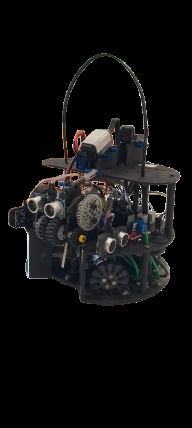

## Robot1 Front

*Robot 1 Front view*

## Robot1 Back

*Robot 1 Back view*

## Robot1 Top

*Robot 1 Top View*

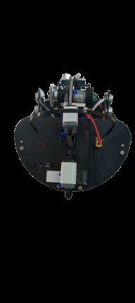

## Robot1 Bottom

*Robot 1 Bottom View*

## Robot1 Right

*Robot 1 Right View*

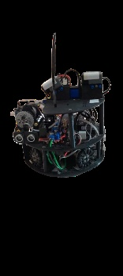

## Robot1 Left

*Robot 1 Left View*

## Positioning & Movement

*How do you find your position inside the field and how do you use that position to move your robots around?*

Our robot uses a HiTechnic Compass to determine orientation in degrees, combined with QRE reflectance sensors and ultrasonic sensors for line and wall detection. At startup, the robot faces the opponent’s goal. Throughout the match, sensor fusion continuously updates the robot’s position and orientation, ensuring accurate movement and alignment with the goal.

## Robot2 Overall

*Robot 2 Overall View*

## Robot2 Front

*Robot 2 Front view*

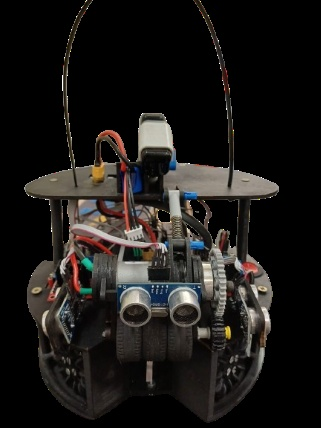

## Robot2 Back

*Robot 2 Back view*

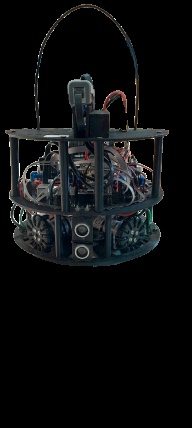

## Robot2 Top

*Robot 2 Top View*

## Robot2 Bottom

*Robot 2 Bottom View*

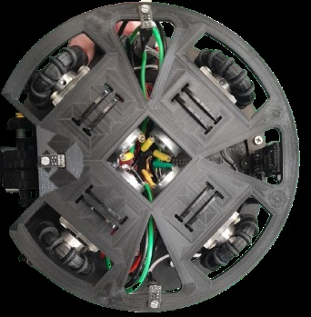

## Robot2 Right

*Robot 2 Right View*

## Robot2 Left

*Robot 2 Left View*

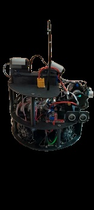

## Mechanical Design

*How did you design the mechanical parts of your robots?*

The mechanical design process involved iterative modeling of multiple chassis geometries using Fusion 360, with each iteration subjected to virtual simulations for collision resistance and mass distribution analysis. The selected configuration features a circular base with precision-engineered cutouts to accommodate the Mega 2560 Pro Mini microcontroller and L298N motor driver, thereby optimizing spatial efficiency and reducing overall weight. The final design emphasizes a low center of gravity to enhance stability and incorporates modular access points to facilitate rapid maintenance and component replacement. Polylactic acid (PLA) was selected for the primary structure due to its favorable strength-to-weight ratio, while medium-density fiberboard (MDF) was utilized in areas requiring increased structural rigidity. For future iterations, we intend to integrate a high-precision digital compass and advanced long-range infrared sensors to improve both ball localization and goal detection accuracy.

## Build Method

*How did you build your design?*

We designed our robot's parts, like the base and dribbler, using Fusion 360. This program really helped us figure out the best shapes and how everything would fit together. For building, we started with a 3D printer to make our first base which was great for quickly testing ideas. Then, for the next versions of the base and other parts, we used a laser cutter on MDF, which gave us really precise pieces. We put everything together with screws and quick connectors, so it's easy to swap parts out if we need to during a competition. After some initial testing, we even went back into Fusion 360 to tweak the dribbler's mount to reduce wobbling and get better ball contact.

## Motors & Reason

*How many motors have you used and why?*

We used five 6V gear motors: four for the omni wheels (for omnidirectional movement) and one for the dribbler. After testing both omni and mecanum wheels, we chose omni wheels for their superior maneuverability and lower friction. All part numbers and suppliers are listed in our BOM.

## Kicker Design

*If your robot has a kicker, explain how you designed and built the mechanics of the kicker*

N/A

## Dribbler Design

*If your robot has a dribbler, explain how you designed and built the mechanics of the dribbler.*

The dribbler uses a rubber-coated shaft for maximum grip, driven by a DC motor via PWM. The system is designed to absorb impacts and prevent jamming. We included a current sensor to detect ball contact and adjust speed automatically. The base was built using a laser cutter and MDF boards.

## CAD Files

*CAD design files*

https://github.com/BiotechSoccer263/Biotech-Soccer

## Mechanical Innovation

*Mechanical Innovation*

Our modular design allows the dribbler or wheels to be swapped in under two minutes. The IR sensor mount is adjustable for easy calibration on different fields. The dribbler’s current sensor enables automatic speed adjustment for optimal ball control.

## Mechanical Photos

*Photos of your mechanical designs highlights*

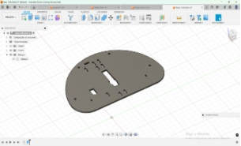
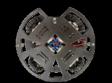
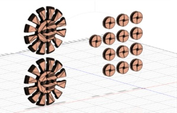
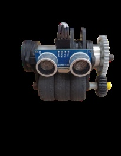

## Electronics Block Diagram

*Provide us with a block diagram of your robot's electronics*

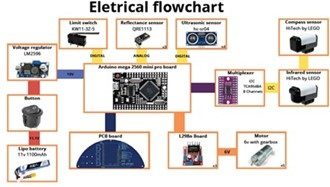

## Power Circuit

*How does your power circuits work?*

We use an 11.1V LiPo battery, regulated to 10V for the Arduino and directly powering the motor drivers. Sensitive sensors are powered through a 5V linear regulator for stability.

## Motor Drive Circuit

*How do you drive your motors? Explain the circuits you use for that*

We use two L298N boards for the drive motors and a third for the dribbler, each controlled via PWM from the Arduino. Each motor is controlled via three pins: two for direction and one for speed (PWM).

## Microcontroller & Reason

*What kind of micro controller or board do you use for your robot? Why did you decide to use this part for your robot? If you have more than 1 processor, explain each one separately.*

We chose the Mega Pro Mini 2560 for its processing power, memory, and compact size, allowing for efficient wiring and expansion. Its many ports support all our sensors and actuators.

## Ball Detection

*How does your ball detection sensors and/or camera[s] work?*

To detect the ball’s position and distance, our robot uses the LEGO HiTechnic Infrared Sensor, which is capable of identifying both the direction (on a scale from 1 to 9) and the strength of infrared signals emitted by the IR ball. The sensor employs five detectors to determine the signal’s origin and intensity, enabling the robot to accurately locate and track the ball. We read the HiTechnic IR sensor data via the I2C protocol and apply a moving average filter in our code to minimize noise. The processed direction values are then converted to angles, allowing the robot to continuously adjust its path in real time for effective ball following.

## Line Detection

*How does your line detection circuits work?*

We use three QRE reflectance sensors, strategically placed on the robot, to detect the field lines. These sensors are calibrated before each match for greater accuracy and are connected to the analog ports, with power supplied by the 5V and GND lines.

## Navigation/Position Sensors

*What sensors do you use for navigation and how are these sensors connected to your processor? What sensors do you use to find your position in the field? What about the direction your robot faces?*

To measure the distance from the robot to the field walls, we use HC-SR04 ultrasonic sensors, which are connected to the digital ports. For goal orientation, we rely on the LEGO HiTechnic Compass Sensor, which helps the robot determine the direction of the opponent’s goal. Additionally, a limit switch is installed to detect when the robot has possession of the ball and to help control its movement for precise positioning. The compass sensor is connected to the Mega Pro Mini 2560 board using six wires: SDA, SCL, two GND, 5V, and 3.3V.

## Kicker Circuit

*How do you drive your kicker system? How does the circuit make the kicker work?*

N/A

## Dribbler Circuit

*How does your dribbler system work? What components and circuits did you use to drive it?*

We designed a dribbler system to help the robot capture and maintain control of the ball while moving, allowing it to perform passes, dribbles, shots, and both offensive and defensive maneuvers with greater precision. The dribbler also prevents the ball from rolling away or being easily taken by opponents. It is powered by a motor connected to the L298N board, which drives a gear system to keep the ball securely in place. When the robot approaches the opponent’s goal, the motor reverses direction, releasing the ball to attempt a goal.

## Schematics

*Schematics of your robot*

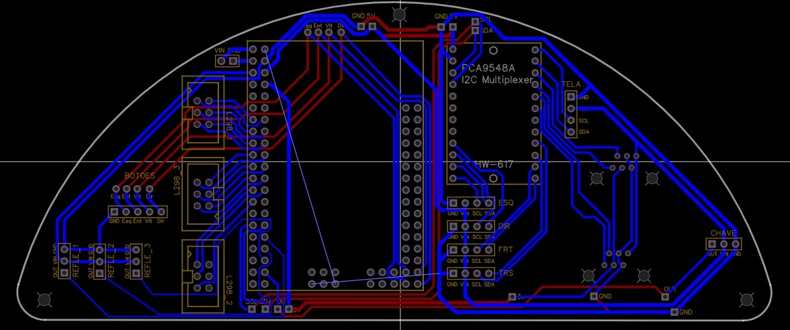

## PCB

*PCB of your robot*

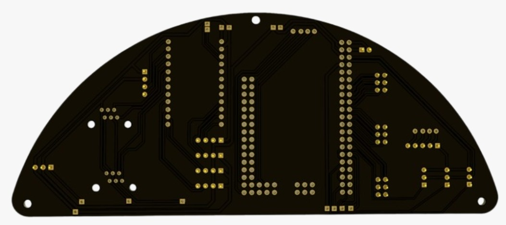
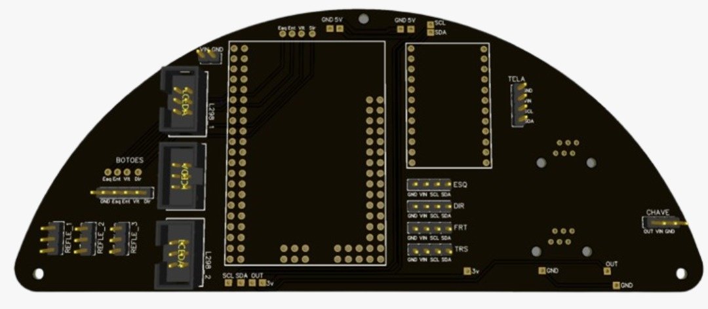

## Innovation

*Innovations*

We are most proud of our custom-designed Printed Circuit Board (PCB). This PCB significantly streamlines component replacement and establishes highly efficient and reliable interconnections among all sensors. The result is a remarkably stable signal integrity, substantially reducing the risk of failures or performance variations typically associated with soldering inconsistencies or unstable connections.

## Circuit Photos

*Photo of your circuit boards highlights*

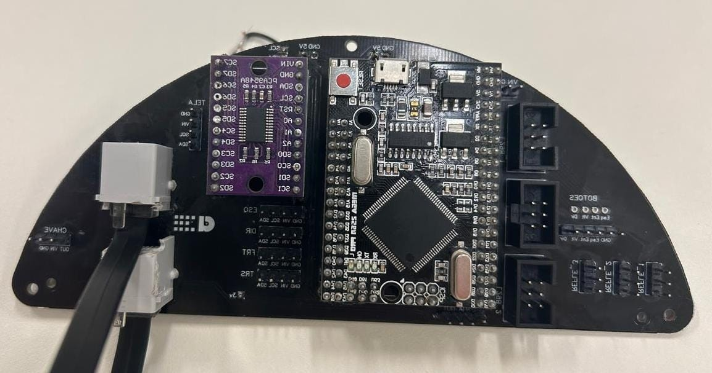

## Motor Control

*How do you use your processor to move your motors?*

Our control architecture is centered on the Arduino Mega 2560 Pro Mini microcontroller, which interfaces with two L298N dual H-bridge motor driver modules to manage the robot’s drive system. Each DC motor is connected to the L298N driver via three dedicated control lines: two digital input pins (IN1 and IN2) that determine the rotation direction by setting the H-bridge logic states, and one enable pin (EN) that modulates the motor’s speed and power delivery through Pulse Width Modulation (PWM) signals generated by the microcontroller. This configuration allows for precise, real-time control of both the direction and velocity of each drive motor, enabling complex movement patterns and responsive navigation on the field.

## Ball Detection Method

*How do you find where the ball is? How do you read the data from the ball detection sensors or camera?*

Our robot employs an infrared sensor specifically designed to detect the modulated IR signals emitted by the competition ball. The sensor outputs numerical values corresponding to the ball’s direction relative to the robot. Data acquisition is handled via the I2C communication protocol, with the microcontroller addressing the sensor’s unique I2C address to initiate data transfer. The sensor transmits the direction data in two bytes (low and high), which are programmatically combined to yield the final directional value. A dedicated software library streamlines this process, managing both the I2C communication and the conversion of raw sensor data into actionable directional information for real-time navigation and ball tracking.

## Ball Catch Algorithm

*How does your algorithm work to catch the ball? Is there a difference between your robots in how they move towards the ball? Explain the differences.*

In our control algorithm, once the ball’s direction is detected, the robot dynamically adjusts its orientation to face the ball, optimizing its trajectory to guide the ball into the dribbler mechanism. Successful ball capture is confirmed through the activation of a limit switch positioned within the dribbler assembly. The movement logic is implemented using straightforward conditional statements rather than advanced differential drive algorithms, ensuring the robot consistently advances directly toward the ball and thereby maximizing the likelihood of a successful capture. And don't have difference in our robots.

## Line Algorithm

*How does your robot find the lines to stay inside the field? What algorithms do you use to avoid going out of bounds?*

Our robot utilizes three reflectance sensors, each providing discrete analog values to the microcontroller. These readings enable the system to distinguish between the field surface and boundary lines based on reflectivity. When a sensor detects a value within the calibrated range for white (typically between 45 and 200), the control algorithm triggers a corrective maneuver—reversing or altering the robot’s previous movement—to realign its trajectory and ensure it remains within the designated playing area.

## Goal Algorithm

*What algorithms do you use to score goals? How do you use your kicker and dribbler to handle the ball?*

To execute goal-scoring maneuvers, our control logic first verifies that the robot is optimally positioned—either centered on the field or maintaining an unobstructed line of sight to the goal—and within a predefined minimum shooting distance. Once these criteria are satisfied, the robot accelerates toward the goal at maximum speed, continuously monitoring for the detection of the white goal line or the expiration of a preset time interval. Upon reaching this threshold, the system initiates a coordinated action: the robot delivers an additional forward impulse while simultaneously reversing the dribbler mechanism. This synchronized movement propels the ball with increased force and precision toward the goal, maximizing scoring accuracy.

## Defense Algorithm

*What algorithms do you use to avoid the opponent team scoring? How do your robots defend your own goal?*

When operating in defender mode, our robot protects the goal area by positioning itself facing the ball, with the dribbler oriented toward it. This setup prevents the opposing attacker from advancing or attempting a shot on goal.
If the defender manages to take possession of the ball from the opponent, it drives the ball toward the opponent's side of the field, strategically setting it up for the attacking robot to continue the play.

## Robot Communication

*Do your robots communicate with each other? How do you use this communication to your advantage?*

Our robots do not communicate directly with each other. Instead, each one is assigned specific roles and limitations, ensuring that they operate within their designated functions. This approach promotes better harmony between the robots and allows the game to progress in a more coordinated and efficient manner.

## Innovation2

*Innovations*

While we are proud of the overall functionality of our codebase, the most distinguished feature is the goal-attempt algorithm implemented for the attacking robot. This routine autonomously advances the robot to a predefined minimum shooting distance, continuously monitoring its heading at 100-millisecond intervals. If any deviation from the intended trajectory is detected—caused by external impacts or wheel slippage—the algorithm automatically applies corrective adjustments to realign the robot. This closed-loop feedback mechanism significantly enhances directional accuracy and substantially increases the probability of a successful goal attempt.

## GitHub Link

*GitHub link*

https://github.com/BiotechSoccer263/Biotech-Soccer

## BOM

*Bill of Materials (BOM)*

[https://drive.google.com/open?id=1uPgJfhQHjTlcmnuj0BXZxQtkU9zQLm8c](https://drive.google.com/open?id=1uPgJfhQHjTlcmnuj0BXZxQtkU9zQLm8c)

## Cost

*How much did it cost you to build your robots?*

•	Robots (components currently in use): 3369,95 BRL
•	Experiments (failed constructions, broken hardware, etc.): 4391,20 BRL
•	Environment (pitches, balls, etc.): 8000 BRL
•	Exchange rate: 5,59 BRL = 1 USD

## Funding

*How did you gathered the funds to build the robots?*

100% funded by our school, which enabled us to focus on learning and innovation.

## Affordability

*How affordable was it to compete in RoboCupJunior Soccer?*

8

## Answer Check

*Have you checked all of your answers?*

Yes!

## Publication Consent

*We publish TDPs and posters during or after the competition as described in the beginning*

Yes, we acknowledge everything submitted in the above form can be published.

## Email Address

*Email Address*

sesibiotech@gmail.com

## TDP File

*TDP File Upload (Not required)*

## Extra Column

*Column 67*

