## Timestamp

*Timestamp*

7/14/2025 0:27:26

## Team Name

*What is your team's name?*

Gloves

## League

*What league do you participate in?*

Open League

## Country

*Where are you from?*

Singapore

## Contact

*If other teams have questions about your robot, now or in the future, what email address(es) can we publish along with this document for people to reach you?

(You can put in multiple email addresses, like multiple team members, an email for the whole team or both. Feel free to share other ways of communication like Discord handles)*

gloves25brazil@gmail.com

## Social Media

*Team Social Media Links (if you have any)*

## Team Photo

*Upload a photo of your whole team with your mentor and robots

Note: This is not mandatory and will be published along with your TDP if you choose to upload something*

## Members & Roles

*What are the names of the team members and their role(s)?*

Ong Jiunn Xiang: Electrical and Mechanical Design and Procurement
Peng Ruijia: Control Software, Systems Integration, and Game Logic
Andrew Gan: Computer Vision, Bot Communications and Game Logic
Tan Min Sen: Logistics Support

## Meeting Frequency

*How often did your team meet?
(e.g. 90 minutes once per week or a day every weekend.)*

Average of 3 days a week during our after-school hours (average 5 hours per day)  During peak periods, we sometimes meet every day.

## Meeting Place

*Where did you meet to work on your robot?
(e.g. a robotics room at school, at some other place, one of your homes, school library etc.)*

Our robotics room in school.

## Start Date

*When did your team start working on this year's robot?*

September 2024, for our national competition (RoboCup Singapore). Created new designs for our robot after our national competition in April.

## Past Competitions

*Which RoboCupJunior competitions have you competed in and in which leagues?*

Singapore Open 2025: Open League

## Mentor Contribution

*Which parts of your work received the most contribution from your mentor?*

N/A - we did not have a coach this year.

## Workload Management

*How did you manage the workload?*

We have a team WhatsApp chat for daily communication and most online discussions, as well as a shared Google Document containing all our notes, pointers, schedule, and timelines. We also have a GitHub repository for sharing and collaborating on code.

## AI Tools

*Which AI tools did you use?*

Sometimes for debugging, we make use of generative AI like ChatGPT and Gemini to give us ideas on what could be the issue – especially when none of us had any further ideas to investigate. We obtained mixed results, sometimes the AI suggestions would be useful or would inspire us in a direction that led to finding out the problem, but sometimes the suggestions were completely off track too.

## Robot1 Overall

*Robot 1 Overall View*

## Robot1 Front

*Robot 1 Front view*

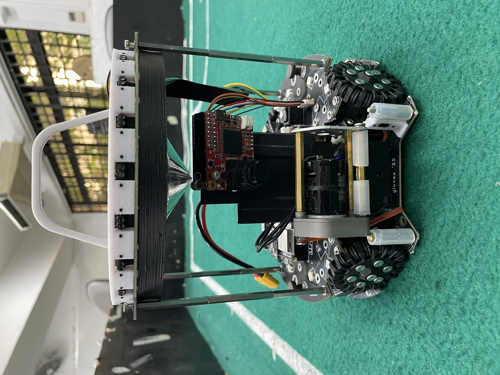

## Robot1 Back

*Robot 1 Back view*

## Robot1 Top

*Robot 1 Top View*

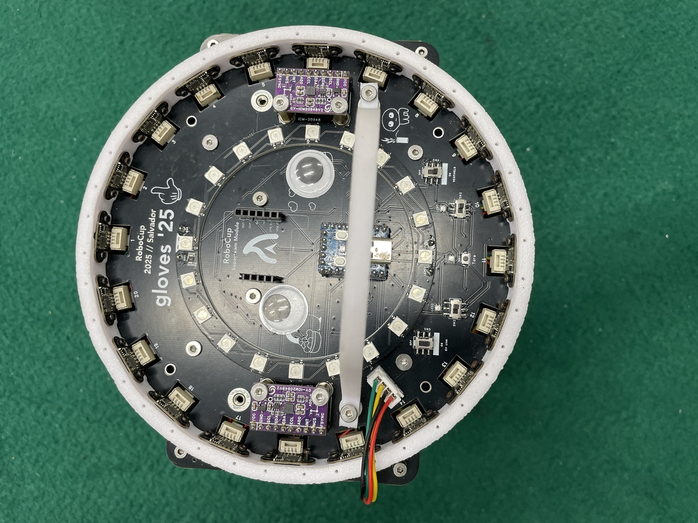

## Robot1 Bottom

*Robot 1 Bottom View*

## Robot1 Right

*Robot 1 Right View*

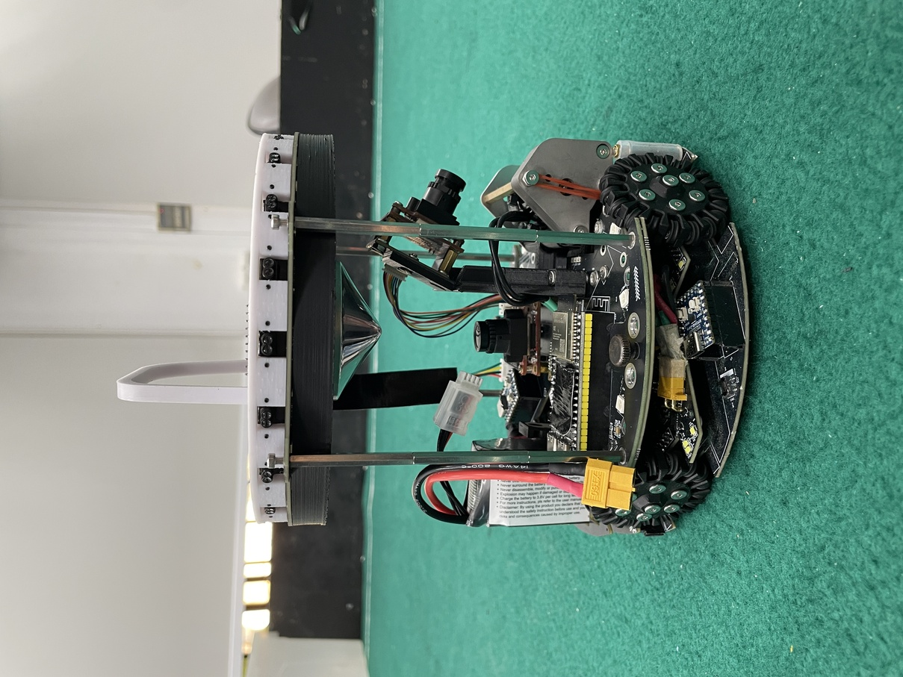

## Robot1 Left

*Robot 1 Left View*

## Positioning & Movement

*How do you find your position inside the field and how do you use that position to move your robots around?*

Our localisation subsystem is managed on our top plate, consisting of 20 LiDARs and 2 IMUs. This allows our robot to obtain its exact position and orientation on the field from the sensor data. Firstly, the absolute distance measurements from our ring of 20 LiDARs are converted into relative coordinates in our robot’s frame of reference. Next, we make use of a convex hull and rotating calipers algorithm to fit a rectangle around the data points obtained to find the walls of the field. Scaling this to the known actual field dimensions, we can convert the coordinates of our fitted rectangle back into the frame of reference of the field, to find the absolute position and heading of our robot. Coupled with the change in heading obtained from the IMUs, our novel LiDAR ring design allows our robot to know its location and direction at any point of the field, amidst any obstacles. 

Our robot makes use of a target coordinate movement system, and as our robot is able to obtain highly accurate localisation no matter its heading, we can achieve effective boundary control. Hence, we made use of this key ability to utilise more complex scoring methods, such as dribbling the ball along the side of the field, with the robot facing the boundaries, to limit view of the ball from other sides of the field.

## Robot2 Overall

*Robot 2 Overall View*

## Robot2 Front

*Robot 2 Front view*

## Robot2 Back

*Robot 2 Back view*

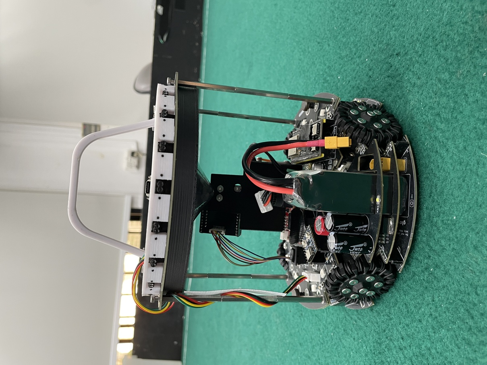

## Robot2 Top

*Robot 2 Top View*

## Robot2 Bottom

*Robot 2 Bottom View*

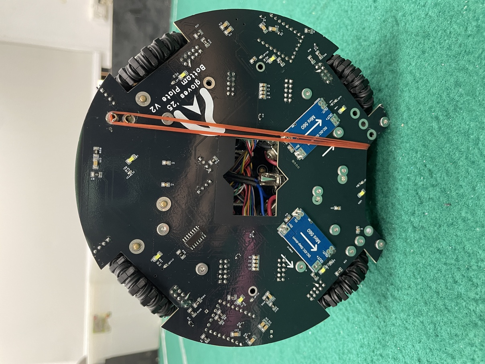

## Robot2 Right

*Robot 2 Right View*

## Robot2 Left

*Robot 2 Left View*

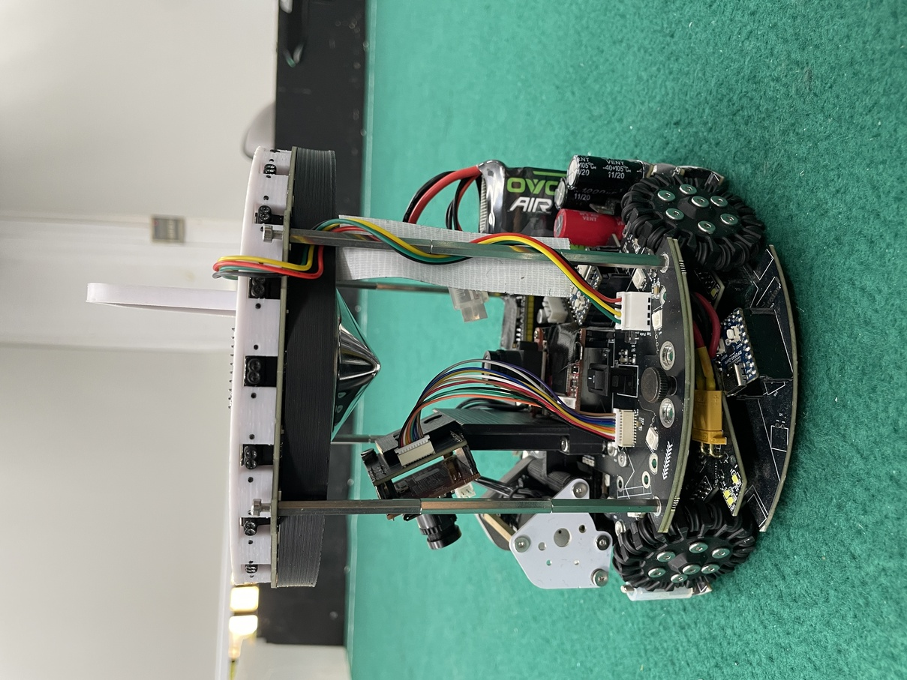

## Mechanical Design

*How did you design the mechanical parts of your robots?*

For our CAD models we used onshape (an online CAD designer). We CAD’ed out our pcb outlines and then imported the DXF drawing into EasyEDA Pro, to design the electrical circuits and PCBs. We tried to make our robot as compact and low as possible to reduce the centre of gravity and prevent the bot from tilting during movement. This led to some minor adjustments being needed along the way to make space for certain parts.

## Build Method

*How did you build your design?*

We used a drill press and a drill to drill some of the stuff, and also an electrical screwdriver which proved really helpful in saving the time needed to screw in screws. We had PCB and CNC machining services from JLCPCB since the price was very cheap.

## Motors & Reason

*How many motors have you used and why?*

We used 4 BE-3561 motors as we intended to have enough drivebase power not to be pushed around. The motors for the drivebase are arranged 90 degrees apart (in the conventional way) as that allows for simple, direct, and balanced movement control. On top of this, we decided to custom make our own wheels to achieve higher grip than the traditional GTF robot wheels. Our wheels ended up being higher friction than GTF robot wheels, while being lower cost, although it did take many iterations to get right. The older iterations aren’t far off, but just suffer from difficulty in assembly and shorter lifespan, so we currently use a mix of them.

## Kicker Design

*If your robot has a kicker, explain how you designed and built the mechanics of the kicker*

We use a xl6019e boost converter chip to boost the 12V power from the LiPo battery to 48V, which we discharge through a 50 ohm current limiting resistor into ~2000uF of capacitance. We chose this value by trying out a range of up to around 5-10KuF and found that the kick strength for our solenoid remained approximately constant at 2KuF. We use a mosfet to switch the connection of the charged capacitors with the solenoid. This does come with issues as sustained activation of the mosfet can lead to our 50 ohm resistor heating up a lot and sometimes even desoldering itself, so we have to be careful to not kick too often.

## Dribbler Design

*If your robot has a dribbler, explain how you designed and built the mechanics of the dribbler.*

Initially, we were going to use a smaller motor as we thought all we needed was speed and that the torque required was negligible, but after experimenting we realised this was not the case. We then tried be3561 motors which worked quite well for nationals, but even those were quite inefficient and burnt up a lot, melting our plastic gears too. For internationals we switched to a motor by Chihai (CHR-370SD) which was more efficient, and also used metal gears to prevent the need to repeatedly replace our dribbler.

## CAD Files

*CAD design files*

https://github.com/JiunnXiang/gloves-25-hardware

## Mechanical Innovation

*Mechanical Innovation*

We are most proud of the dribbler and omniwheels. The dribbler took a lot of trial and error to become so compact and resilient, and to be effective in capturing the ball and retaining possession of the ball. Our custom made omniwheels are also able to achieve better friction than the average GTF robots wheels, with our final models being quite resilient to damage as well, we have had very few damages throughout our testing and national competition periods.

Another interesting, mechanical design was our quick release top plate. During our national competition, we found that it was difficult to repair or replace parts on the bottom part of our robot due to the presence of the top plate, and ended up having to remove the top plate whenever we wanted to fix something and then putting the top plate back afterwards, which was overly time-consuming. Hence, we created a quick-release mechanism in our new robot design. The top plate would be attached through standoffs to two mini side plates. These mini side plates were then screwed into our middle plate through two larger hand screws (which could be screwed in by hand). While still maintaining structural rigidity of our robot, this quick release mechanism allows us to quickly hand-screw off and on our top plate within seconds, making repair of our robot parts like dribbler and front camera much faster, since we are no longer limited in space due to the presence of the top plate and can make use of tools like electric screwdrivers instead of small hex keys to remove or attach our parts.

## Mechanical Photos

*Photos of your mechanical designs highlights*

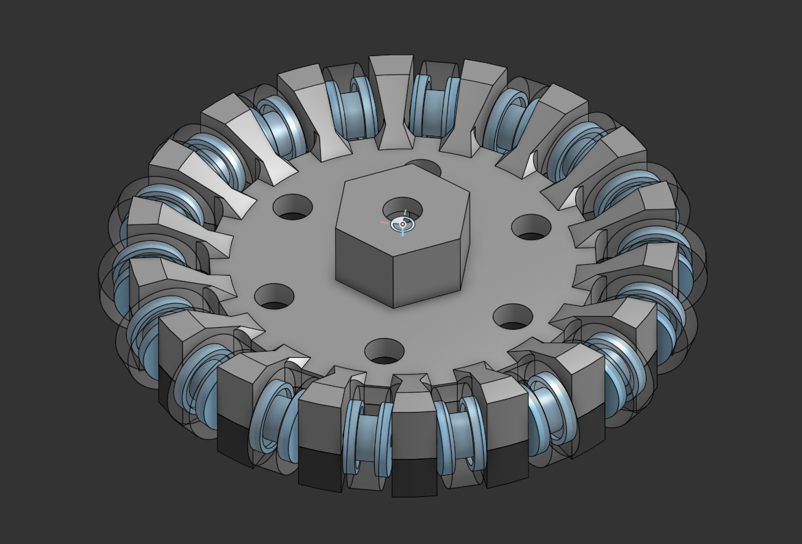

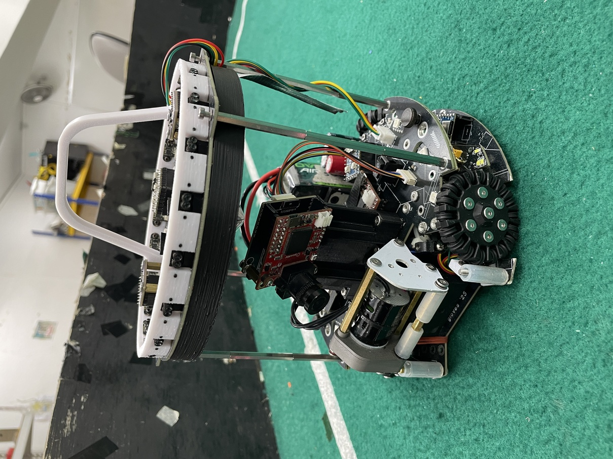
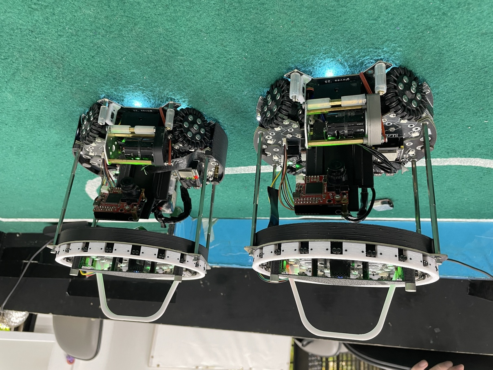

## Electronics Block Diagram

*Provide us with a block diagram of your robot's electronics*

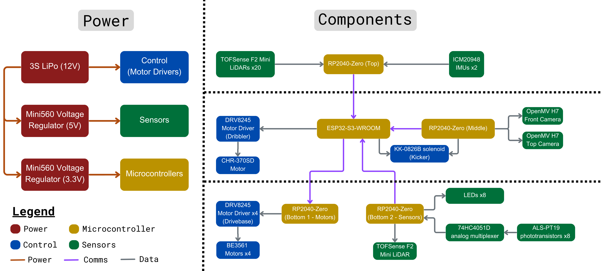

## Power Circuit

*How does your power circuits work?*

Our robots use a 3S LiPo battery for power. The 12V power from the LiPo powers our motor drivers and motors (both drivebase and dribbler), and is boosted to 48V for our kicker. The 12V power also goes through a 5V and 3V3 buck converter: the 5V is mainly used for powering LEDs and sensors, while the 3V3 is used for pullups and for our microcontrollers.

## Motor Drive Circuit

*How do you drive your motors? Explain the circuits you use for that*

We made custom motor drivers with the DRV824X series chips to drive our motors. It communicates via daisy chained SPI to a RP2040-Zero microcontroller so as to take up less GPIO pins. Some bulk capacitance is added to our motor driver board to prevent brownouts.

## Microcontroller & Reason

*What kind of micro controller or board do you use for your robot? Why did you decide to use this part for your robot? If you have more than 1 processor, explain each one separately.*

Our robot makes use of a total of five microcontrollers – four RP2040-Zeros and one ESP32-S3-WROOM. Full details are provided in the attached file.

## Ball Detection

*How does your ball detection sensors and/or camera[s] work?*

We use machine vision through two OpenMV H7 cameras to detect the ball. The first camera is placed at the centre of the robot, facing upwards at a distortion-free mirror, with a curve equation calculated such that the entire field can be reflected off the mirror into the field of view of the camera, and each unit of length on the field subtends the same angle of vision. The second camera is placed at the front of the robot pointing forwards, for an additional direct view of the front area. While the placement of this second camera and our dribbler would block some vision from our first camera, the second camera will be able to cover up the blind spots.

## Line Detection

*How does your line detection circuits work?*

Our robot has 8 ALS-PT19 phototransistors, each beside an LED, that measure the amount of reflected light, which will be higher when it is on a white line, as that is more reflective than the rest of the green-coloured field. The 8 phototransistors are connected to a 74HC4051D analog multiplexer, which is connected to a RP2040-Zero microcontroller on our bottom plate through one ADC pin and three digital pins. The three digital pins are used for selecting the 1 specific channel out of 8 on the multiplexer to read, using a bitmask-like method: expressing the numbers 0 to 7 in binary form, and pulling the respective digital pin HIGH if the bit is 1, and LOW if the bit is 0. The respective analog value is read from each phototransistor, and an experimentally determined threshold is used for determining if the value corresponds to one on or off the white line. 
Originally, the previous version of our robot had 32 such phototransistors connected to 4 analog multiplexers. However, we realised that our robot is able to get accurate absolute positioning using our top plate LiDAR ring, and thus do not require extensive line detection to stay within bounds. Hence, we downscaled the number of phototransistors to just 8, which is sufficient for our usage.

## Navigation/Position Sensors

*What sensors do you use for navigation and how are these sensors connected to your processor? What sensors do you use to find your position in the field? What about the direction your robot faces?*

Our robot uses 20 LiDARs placed in a ring on our top plate, as well as 2 ICM-20948 IMUs for localisation. These sensors are connected to the top plate RP2040-Zero microcontroller for data receiving and processing. 
The LiDARs are connected to the RP2040 through two sets of (software) I2C buses, where the microcontroller reads the distance values from each LiDAR synchronously. The IMUs are connected to the RP2040 through two SPI buses, where the microcontroller derives the yaw angle using a 6-axis quaternion. 
The LiDAR sensors are used for finding the position of our robot on the field. Firstly, the absolute distance measurements from our ring of 20 LiDARs are converted into relative coordinates in our robot’s frame of reference. Next, we make use of a convex hull and rotating calipers algorithm to fit a rectangle around the data points obtained to find the walls of the field. Scaling this to the known actual field dimensions, we can convert the coordinates of our fitted rectangle back into the frame of reference of the field, to find the absolute position and heading of our robot. 
The same algorithm above also provides us with the heading of our robot, as it involves rotating the fitted rectangle to the standard cartesian axes of the field’s frame of reference. As such, we calculate a weighted average between this angle and the yaw angle obtained from the IMU for our robot’s final heading (with the IMU’s data being weighted at 99%). Originally, we pressed a tare button to set the value of the IMU reading when the robot was placed facing forward on the field as the offset. However, we realised that it was an unnecessary step as we could just use the change in IMU angle along with our previous known angle to find our robot’s new current angle. Even if the previous angle was inaccurate, for example having a default value of 0 on startup even if the robot was not facing completely forwards, the heading obtained from the localisation algorithm above using the LiDARs will slowly nudge the heading in the correct direction. Thus, with this system, we do not need to calibrate our IMUs as only the change in angle is used and not the absolute value of the angle itself.

## Kicker Circuit

*How do you drive your kicker system? How does the circuit make the kicker work?*

Our kicker is controlled by our ESP32-S3-WROOM microcontroller through a digital pin, by pulling it high and low with a short delay of around 200 milliseconds in between. 

For the kicker, we use a xl6019e boost converter chip to boost the 12V power from the LiPo battery to 48V, which we discharge through a 50 ohm current limiting resistor into ~2000uF of capacitance. We chose this value by trying out a range of up to around 5-10KuF and found that the kick strength for our solenoid remained approximately constant at 2KuF. We use a mosfet to switch the connection of the charged capacitors with the solenoid. This does come with issues as sustained activation of the mosfet can lead to our 50 ohm resistor heating up a lot and sometimes even desoldering itself, so we have to be careful to not kick too often. Hence, we implemented in software a minimum 2 second gap between kicks.

## Dribbler Circuit

*How does your dribbler system work? What components and circuits did you use to drive it?*

Our dribbler system consists of a CHR-370SD motor, also controlled using our custom motor drivers with the DRV824X series chips. Our main ESP32-S3-WROOM microcontroller uses SPI communication to set the motor driver into PWM mode, then uses analogwrite to generate a PWM signal on two digital pins to control the motor in each direction.

## Schematics

*Schematics of your robot*

[https://drive.google.com/open?id=1L2FCr9samnS1RS86B3ip2Uom5gt2mjga](https://drive.google.com/open?id=1L2FCr9samnS1RS86B3ip2Uom5gt2mjga)
[https://drive.google.com/open?id=1r4ldDEDQIXaFmpSBRt-TSSWZoa4b0I4v](https://drive.google.com/open?id=1r4ldDEDQIXaFmpSBRt-TSSWZoa4b0I4v)
[https://drive.google.com/open?id=1-VMmAosNmqXP6hIafz9QtEPfpBB5XThN](https://drive.google.com/open?id=1-VMmAosNmqXP6hIafz9QtEPfpBB5XThN)
[https://drive.google.com/open?id=1r9yYuQ48sPpa3nWvoqVef-C0-HMvxh74](https://drive.google.com/open?id=1r9yYuQ48sPpa3nWvoqVef-C0-HMvxh74)

## PCB

*PCB of your robot*

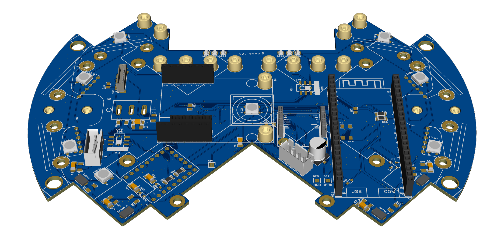

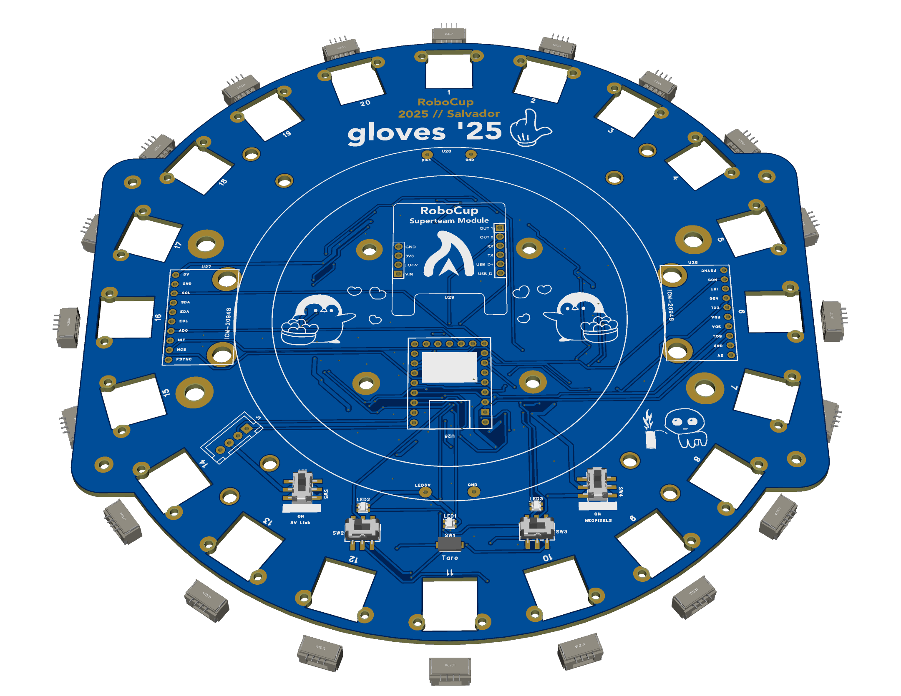

## Innovation

*Innovations*

We are most proud of our kicker circuit. 
We use a xl6019e boost converter chip to boost the 12V power from the LiPo battery to 48V, which we discharge through a 50 ohm current limiting resistor into ~2000uF of capacitance. We chose this value by trying out a range of up to around 5-10KuF and found that the kick strength for our solenoid remained approximately constant at 2KuF. We use a mosfet to switch the connection of the charged capacitors with the solenoid. This does come with issues as sustained activation of the mosfet can lead to our 50 ohm resistor heating up a lot and sometimes even desoldering itself, so we have to be careful to not kick too often.

## Circuit Photos

*Photo of your circuit boards highlights*

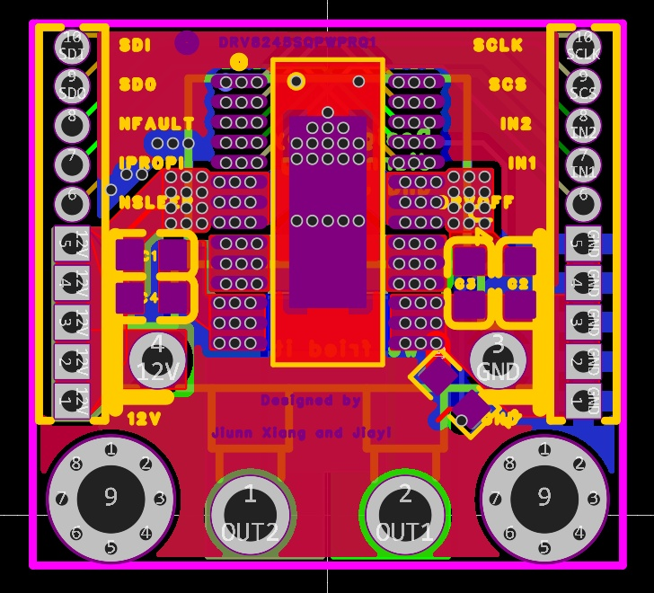
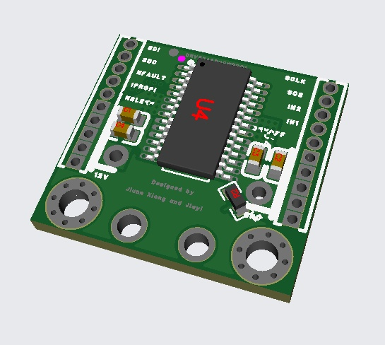

## Motor Control

*How do you use your processor to move your motors?*

Details in attached file

## Ball Detection Method

*How do you find where the ball is? How do you read the data from the ball detection sensors or camera?*

Details in attached file

## Ball Catch Algorithm

*How does your algorithm work to catch the ball? Is there a difference between your robots in how they move towards the ball? Explain the differences.*

Details in attached file

## Line Algorithm

*How does your robot find the lines to stay inside the field? What algorithms do you use to avoid going out of bounds?*

Details in attached file

## Goal Algorithm

*What algorithms do you use to score goals? How do you use your kicker and dribbler to handle the ball?*

Details in attached file

## Defense Algorithm

*What algorithms do you use to avoid the opponent team scoring? How do your robots defend your own goal?*

Details in attached file

## Robot Communication

*Do your robots communicate with each other? How do you use this communication to your advantage?*

Details in attached file

## Innovation2

*Innovations*

Details in attached file

## GitHub Link

*GitHub link*

https://github.com/mango-milkshake/RCJ-Soccer-Open-2025

## BOM

*Bill of Materials (BOM)*

[https://drive.google.com/open?id=1sw1y8FcUqjMUjJ8V6CesMRYzPxjVMTot](https://drive.google.com/open?id=1sw1y8FcUqjMUjJ8V6CesMRYzPxjVMTot)

## Cost

*How much did it cost you to build your robots?*

Robots (cost of components): 750 USD
Experiments (testing, failed experiments): 400 USD
Environment (tools like soldering iron etc): 100 USD
Currency used in calculations was USD as most parts and tools were bought in this currency. 
Exchange rate: 1 SGD = 0.78 USD

## Funding

*How did you gathered the funds to build the robots?*

100% school

## Affordability

*How affordable was it to compete in RoboCupJunior Soccer?*

3

## Answer Check

*Have you checked all of your answers?*

Yes!

## Publication Consent

*We publish TDPs and posters during or after the competition as described in the beginning*

Yes, we acknowledge everything submitted in the above form can be published.

## Email Address

*Email Address*

pengrj2@gmail.com

## TDP File

*TDP File Upload (Not required)*

[https://drive.google.com/open?id=1wje4N5XsUnaigXpab1tNndpZ4eeXmmRw](https://drive.google.com/open?id=1wje4N5XsUnaigXpab1tNndpZ4eeXmmRw)

## Extra Column

*Column 67*

