## Timestamp

*Timestamp*

7/12/2025 21:38:13

## Team Name

*What is your team's name?*

Hyperion

## League

*What league do you participate in?*

Lightweight League

## Country

*Where are you from?*

Australia

## Contact

*If other teams have questions about your robot, now or in the future, what email address(es) can we publish along with this document for people to reach you?

(You can put in multiple email addresses, like multiple team members, an email for the whole team or both. Feel free to share other ways of communication like Discord handles)*

Email: matthew.charles.adams@gmail.com (Matthew Adams)
Email: sam.garg2101@gmail.com / Discord: fitzsywastaken (Sam Garg)
Email: thomasm_01@outlook.com (Thomas McCabe)

## Social Media

*Team Social Media Links (if you have any)*

Not Applicable.

## Team Photo

*Upload a photo of your whole team with your mentor and robots

Note: This is not mandatory and will be published along with your TDP if you choose to upload something*

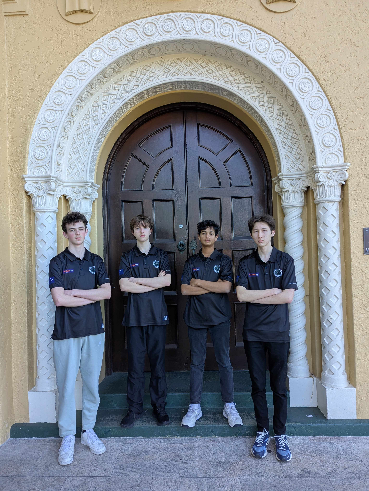

## Members & Roles

*What are the names of the team members and their role(s)?*

Matthew Adams: Hardware & Electrical
Luke Atherton: Hardware
Sam Garg: Software & Strategy
Thomas McCabe: Software

## Meeting Frequency

*How often did your team meet?
(e.g. 90 minutes once per week or a day every weekend.)*

5 to 7.5 hrs, 2 to 3 days a week. (Total 15 to 22.5 hours)

## Meeting Place

*Where did you meet to work on your robot?
(e.g. a robotics room at school, at some other place, one of your homes, school library etc.)*

At our school's robotics room.

## Start Date

*When did your team start working on this year's robot?*

Our team started working on this year’s robot very late last year, starting ideation and the design process in late December 2024.

## Past Competitions

*Which RoboCupJunior competitions have you competed in and in which leagues?*

RCJA Onstage Challenge (2021) – Matthew & Sam 

RCJA Secondary Rescue Challenge (2022) – Matthew, Sam and Thomas 

RCJA Secondary Rescue Challenge (2023) – Thomas 

RCJA Open Rescue Challenge (2022) – Luke 

RCJA Soccer Standard League (2023) – Matthew, Sam, Luke 

RCJA Soccer Standard League (2024) - Thomas 

RCJA Lightweight Soccer League (2024) – Matthew, Sam, Luke

## Mentor Contribution

*Which parts of your work received the most contribution from your mentor?*

Some parts of the software that have required more work and help from our mentor are our light sensor library. The bit shifting inside our light sensor library was confusing, and therefore we reached out to our mentor to help us understand how this worked. 

From a hardware and electrical perspective, there was some contribution from our mentors. Mentors assisted in the operation of 3D printers and our CNC machine for manufacturing custom designed parts. Additionally, the PCB design was difficult, with many different layouts that could have been considered, and therefore, we asked our mentor for advice on the possible placement of components. Additionally, before ordering our PCB’s they would check to ensure there were no major errors.

## Workload Management

*How did you manage the workload?*

We printed out an excel document that we stuck against the wall near our desk, which included the major deadlines that we needed to meet. Some examples include the robot orbiting, the robot defending, the camera working, the TSSPs working, etc. Also, we communicated through a WhatsApp group and used GitHub for easier collaboration.

## AI Tools

*Which AI tools did you use?*

We used AI (ChatGPT) to assist in this technical document and improve our formatting, not only this, but we used within our website to make it look more professional and provide some suggestions to make it look good. In addition, we also used it to find some simple issues in the code and used it as a second eye when debugging some things inside the code, however it was not used often and was only used when needed from a software perspective.

## Robot1 Overall

*Robot 1 Overall View*

## Robot1 Front

*Robot 1 Front view*

## Robot1 Back

*Robot 1 Back view*

## Robot1 Top

*Robot 1 Top View*

## Robot1 Bottom

*Robot 1 Bottom View*

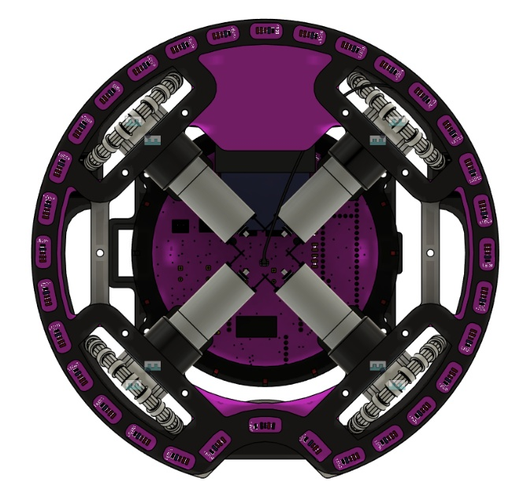

## Robot1 Right

*Robot 1 Right View*

## Robot1 Left

*Robot 1 Left View*

## Positioning & Movement

*How do you find your position inside the field and how do you use that position to move your robots around?*

We determine our position on the field using the OpenMV H7 Plus camera, which also provides information about our distance from the goal. This data allows us to switch between goal tracking and facing forward during regular movement with the attacker. Our positioning system also helps us adjust our vertical placement on the field when defending.

## Robot2 Overall

*Robot 2 Overall View*

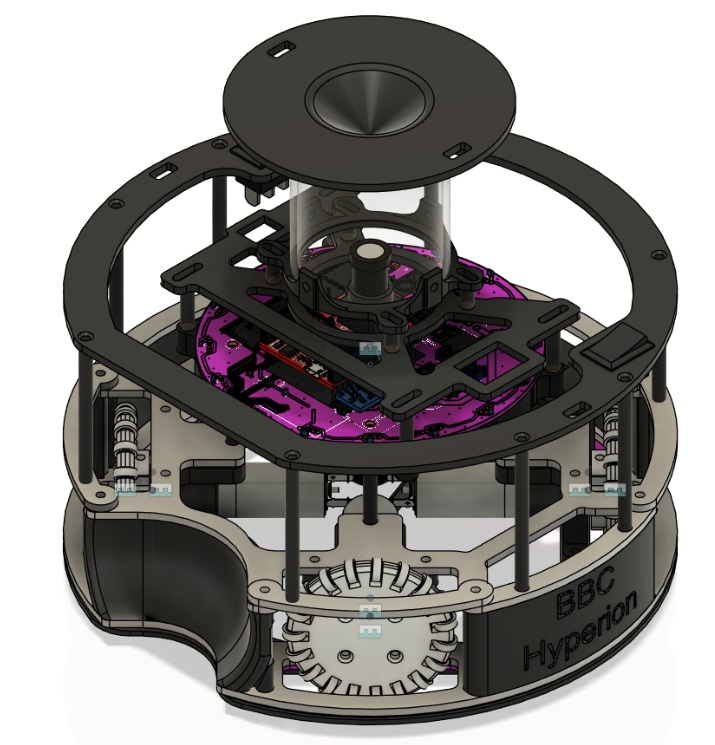

## Robot2 Front

*Robot 2 Front view*

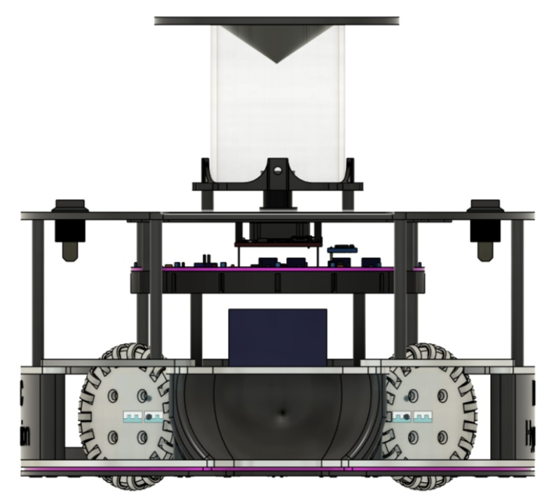

## Robot2 Back

*Robot 2 Back view*

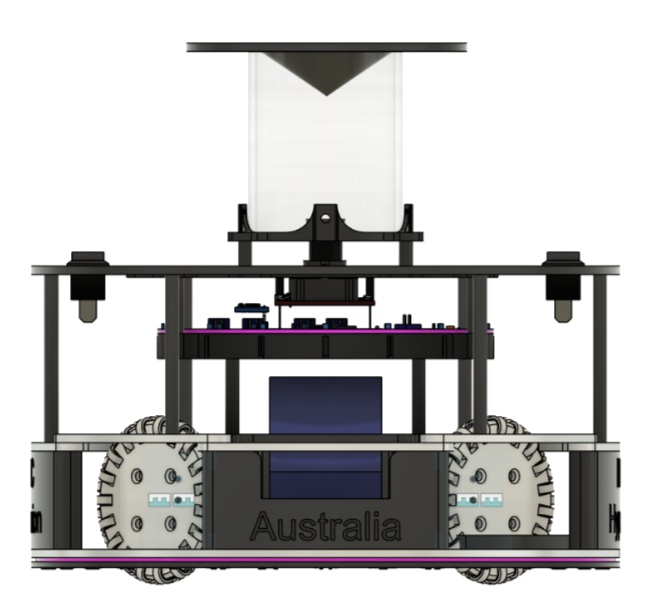

## Robot2 Top

*Robot 2 Top View*

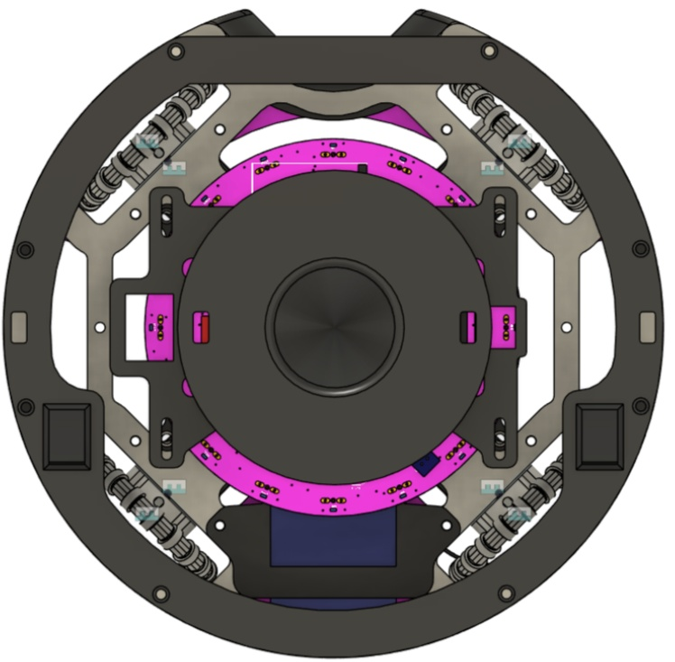

## Robot2 Bottom

*Robot 2 Bottom View*

## Robot2 Right

*Robot 2 Right View*

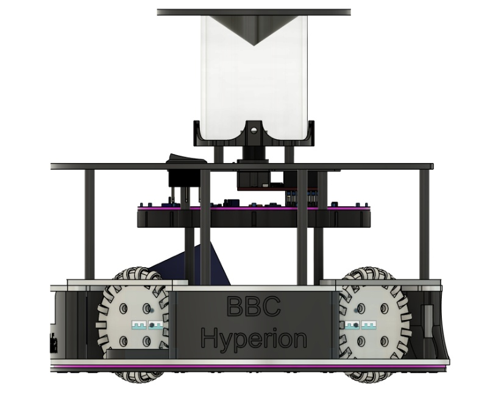

## Robot2 Left

*Robot 2 Left View*

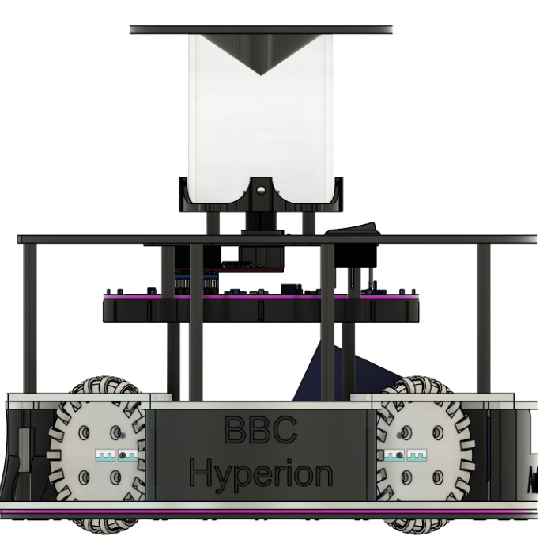

## Mechanical Design

*How did you design the mechanical parts of your robots?*

The CAD program Autodesk Fusion 360 was used to make the design. During the design process, size, weight and accessibility to important components were considered. For example, the microcontrollers, camera, fuses and batteries were key things that were considered.

Some things that we did have to change after our initial design, was the way the mirror was mounted for optimal 360 view of the field. This meant that instead of using standoffs and a plate, we used an acrylic tube to limit blocking the image on the camera.

## Build Method

*How did you build your design?*

The machinery used to make and manufacture our design was the Bambu Lab 3D printer with PLA and ABS filament, as well as a CNC miller with 3mm thick aluminum. We order PCBs from the company JLCPCB. The components of these boards are ordered from a variety of websites and companies, but we try and order them from Digikey, making them our main website for ordering components. A change we had to make was where the battery was for easy access and secure fitting, as well as where the wheels were positioned to detect the line early.

## Motors & Reason

*How many motors have you used and why?*

This part is for describing how many motors your team used and why you chose this many motors for your robots’ movement. If you have built your own wheels, it’s also recommended to explain why and how you designed the wheels. Please mention any part numbers of parts you used here as well as in the Bill of Materials (BOM) form. 

We use 4 motors for increased power and speed, and to improve balance and control for full 360-degree movement of the robot. For this 360-degree movement to occur, we made omnidirectional wheels, so the robot rolls flawlessly around the field. The wheel frame is made from ABS filament, while the rollers are made from silicone with a metal core. These wheels are positioned around a metal wire to keep them in place.

## Kicker Design

*If your robot has a kicker, explain how you designed and built the mechanics of the kicker*

Not Applicable

## Dribbler Design

*If your robot has a dribbler, explain how you designed and built the mechanics of the dribbler.*

Not Applicable

## CAD Files

*CAD design files*

https://github.com/SamGargRobotics/Hyperion2025/tree/main/Hardware/CAD%20Files

## Mechanical Innovation

*Mechanical Innovation*

The part of the mechanical system that we are most proud of is the speed and smoothness of the movement, due to the position of the wheels and their design, as well as the motor choice. Another mechanical system we are proud of is the mirror system, particularly the use of an acrylic tube, which eliminates the blind spots created when using standoffs, allowing for constant, consistent, 360-degree goal vision.

## Mechanical Photos

*Photos of your mechanical designs highlights*

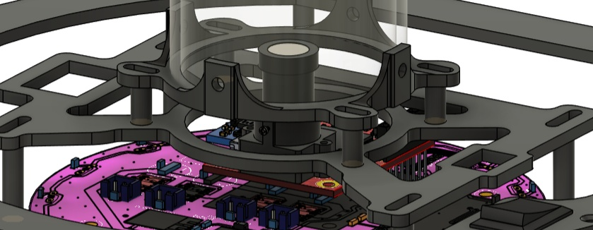
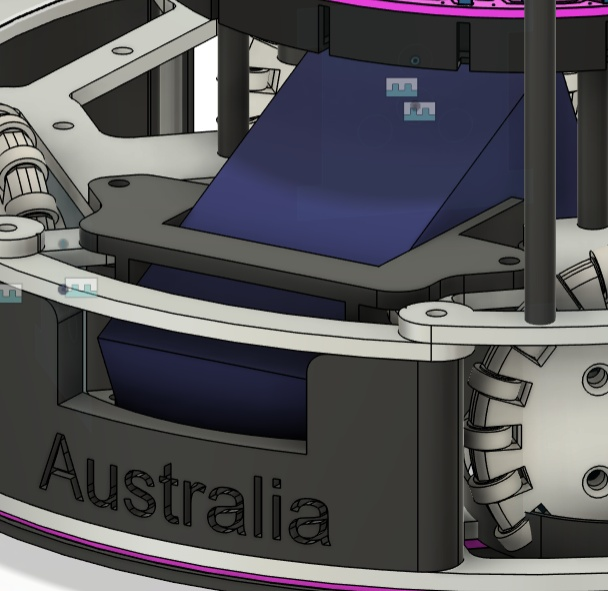

## Electronics Block Diagram

*Provide us with a block diagram of your robot's electronics*

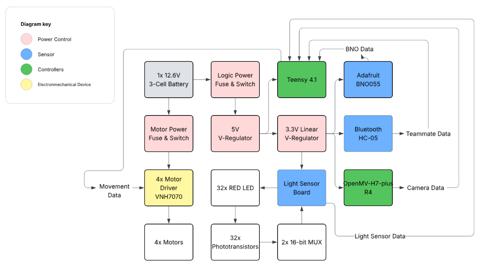

## Power Circuit

*How does your power circuits work?*

Our robot uses 1 12.6V 1300mA battery for our motors and motor controllers, which gets regulated through a linear 5V regulator for the Teensy 4.1, and then it goes through a 3.3V linear regulator for the OpenMV, TSSP’s, HC05, BNO005, and Light sensor board via a FFC connector.

## Motor Drive Circuit

*How do you drive your motors? Explain the circuits you use for that*

We use VNH7070s as our motor controllers, which are powered by 12.6V. They then connect to the motors via JST connectors. The motor controllers are controlled by the Teensy with PWM and Enable A and B signals. PWM signals allow us to have fast yet controlled and accurate movement with the robot.

## Microcontroller & Reason

*What kind of micro controller or board do you use for your robot? Why did you decide to use this part for your robot? If you have more than 1 processor, explain each one separately.*

Last year, we used an Arduino Mega, which was 16 MHz and chunky. This year, we use a Teensy 4.1 as our only microcontroller. This was chosen due to its size, ARM Cortex-M7 processor at 600MHz, and four times larger flash memory than the 4.0, which was commonly used with past teams.

## Ball Detection

*How does your ball detection sensors and/or camera[s] work?*

We use 16 Tssp58038 sensors in a circle for a full 360-degree detection. These sensors are powered via 3.3V with resistors for protection of the sensors. The signal outputs are directly connected to the teensy pins.

## Line Detection

*How does your line detection circuits work?*

We use a separate PCB for our line detection. This PCB is powered with 3.3V transferred through an FFC Connector from the main board. This PCB contains 32 Red LEDs and 32 photo transistors. Each LED and photo transistor is accompanied by resistors and 0.1uf caps to smooth out signals and to prevent breaking the fragile components. The signals are transferred to 2 16-bit Multiplexers (MUX) 1 for the right side of the board and 1 for the left. These Multiplexers are used for easy reading of many sensors. The outputs from the Multiplexers are transferred through the FFC to the main board, then transferred to the Teensy.

## Navigation/Position Sensors

*What sensors do you use for navigation and how are these sensors connected to your processor? What sensors do you use to find your position in the field? What about the direction your robot faces?*

We use an OpenMV-H7-plus R4 to calculate where the goals are and a BNO055 to calculate the direction in which the robot faces. The OpenMV and BNO055 are powered with 3.3V and are connected to the Teensy via UART connection (UART is RX and TX).

## Kicker Circuit

*How do you drive your kicker system? How does the circuit make the kicker work?*

Not Applicable

## Dribbler Circuit

*How does your dribbler system work? What components and circuits did you use to drive it?*

Not Applicable

## Schematics

*Schematics of your robot*

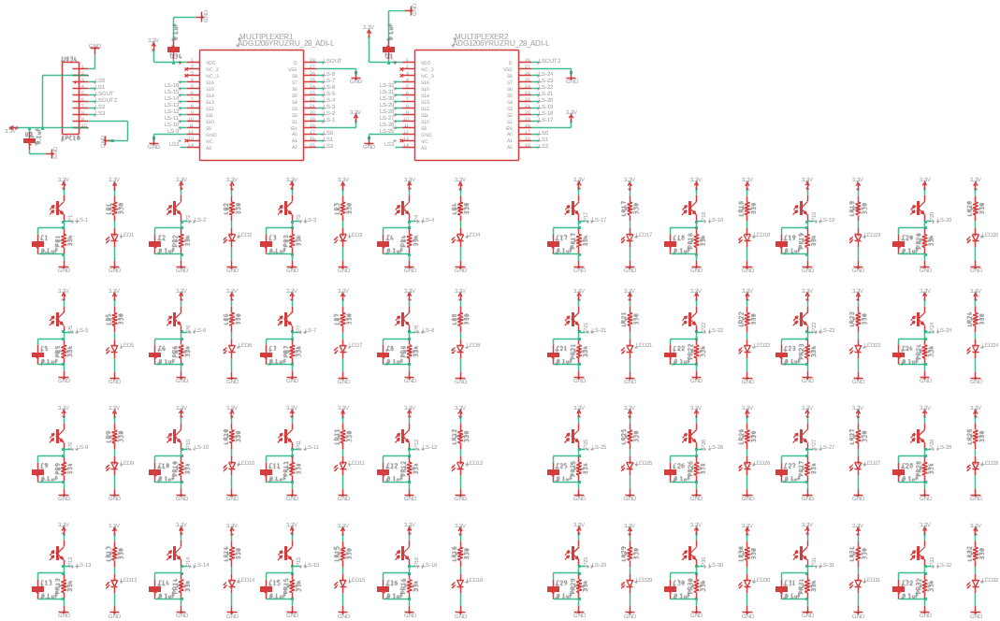
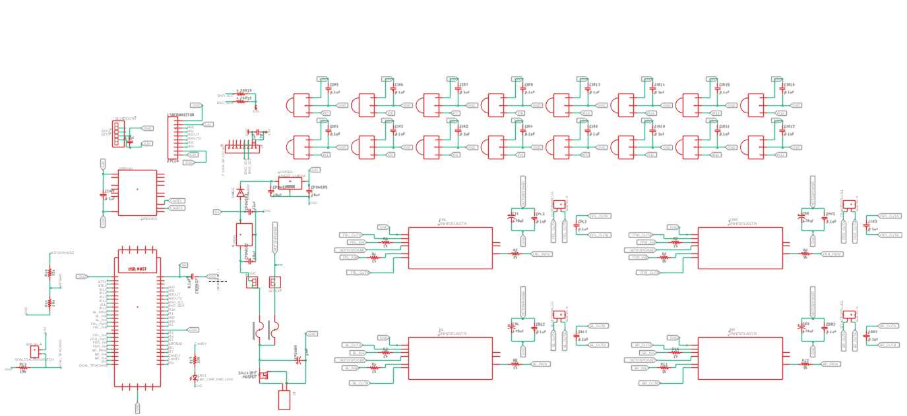

## PCB

*PCB of your robot*

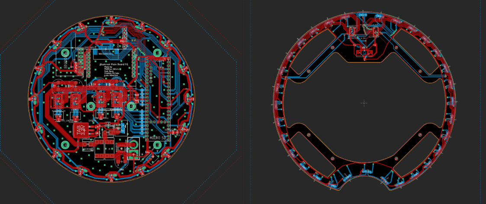

## Innovation

*Innovations*

The parts of our electronics that we are proud of are the design of the PCB. For example, the routing for the motor controllers was difficult and time-consuming because we needed to try and fit 100 mil width traces to reduce resistance in the circuit and have the motor controllers be in an easy-to-access position for easy repair if the motors come unplugged or damaged. Additionally, the motor controllers had to connect to the teensy so space for all the traces had to be considered.

## Circuit Photos

*Photo of your circuit boards highlights*

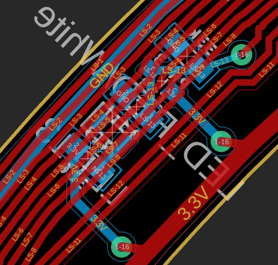
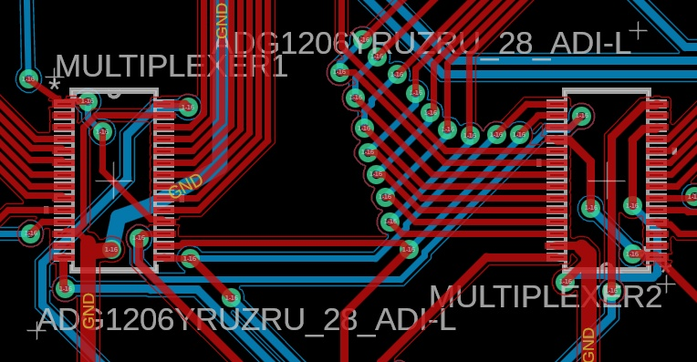

## Motor Control

*How do you use your processor to move your motors?*

The drive system is responsible for translating directional movement and rotation commands into specific speeds for each of the robot’s four motors. When the system is initialized, the relevant pins for motor control are set to output mode, preparing them to receive PWM signals for speed and digital signals for direction. During operation, the system receives a target movement speed, an angle, and an optional rotational correction. The angle is internally shifted to align with the robot’s orientation system, and for each motor, a calculation determines how much it should contribute to the desired direction. This is done by projecting the movement vector onto the motor’s relative orientation using a cosine function, then scaling it by the given speed and adding the rotation correction. After computing motor values, the system checks for any that exceed the maximum allowable PWM value of 255. If any do, all are scaled down proportionally to preserve movement accuracy. If debugging is enabled, the calculated values for each motor are printed to the serial monitor. Finally, each motor receives its speed through a PWM signal and is assigned a forward or reverse direction based on whether its calculated value is positive or negative. This system enables smooth, omnidirectional movement with integrated rotational control.

## Ball Detection Method

*How do you find where the ball is? How do you read the data from the ball detection sensors or camera?*

The TSSP5038 library is used to determine the direction and strength of the IR-emitting ball by reading each sensor (TSSP) 255 times per cycle. Each read returns either HIGH or LOW, producing a final value between 0 (never saw the ball) and 255 (saw the ball every time). A reading of 255 is extremely rare and typically indicates a faulty sensor. In such cases, the reading is temporarily replaced with the average of the two adjacent sensors to maintain functionality, although clusters of broken sensors cannot be corrected and require hardware replacement. Once all readings are gathered, the four highest values are selected and multiplied by their respective X and Y coordinates on a unit circle. The sum of these results gives an X and Y vector, which is then passed through the atan2 function to determine the ball’s angle. Ball strength is calculated using a weighted average: (Top1 × 3 + Top2 × 2 + Top3 × 1 + Top4 × 1) ÷ 7. If this strength value is greater than 0, the ball is considered detected and likely present on the field.

## Ball Catch Algorithm

*How does your algorithm work to catch the ball? Is there a difference between your robots in how they move towards the ball? Explain the differences.*

Our robots rely on data from the TSSP sensors and their corresponding libraries to calculate the direction of the IR-emitting ball. Interestingly, both robots use similar movement strategies to approach the ball, but their underlying logic differs based on their roles—attacker or defender. In attack mode, the robot plugs the calculated ball direction into a specifically tuned exponential function. This function outputs a direction that guides the robot smoothly toward the ball. Once the ball is caught, the robot uses the x and y coordinates of the goal—provided by the onboard camera—to calculate the angle to the goal, allowing the robot to face it accurately for a shot. 

On the other hand, the defender employs a different algorithm that uses PID control combined with vector mathematics. This method helps the robot determine both the direction and the precise speed required to intercept or track the ball efficiently. It uses both vertical and horizontal PID values to stabilize and fine-tune its positioning. While the attacker turns to face the goal, the defender, by contrast, faces away from it, using calculated angles from specific algorithms to better anticipate ball movement and protect the goal area.

## Line Algorithm

*How does your robot find the lines to stay inside the field? What algorithms do you use to avoid going out of bounds?*

To locate the line, we use a method called clustering. This involves breaking up sections of the light board that read above a certain threshold and marking them as white. Clusters are then formed by identifying continuous sections of these white values — a cluster starts when a white-marked index is found and ends when the next index is no longer marked. The centre point of each cluster is calculated, and the average of all cluster centres gives us the direction of the line. We then send over the direction opposite to this line to guide the robot away from it. 

We use the clustering method because it effectively identifies the location of the line while filtering out sensor values that are outliers. It’s a simple yet robust approach to line detection that avoids excessive complexity and special-case handling.

## Goal Algorithm

*What algorithms do you use to score goals? How do you use your kicker and dribbler to handle the ball?*

Our robot does not use a dedicated dribbler or kicker mechanism; instead, we rely on strategic movement and accurate positioning to score goals. The primary tools we use are a camera for goal tracking and TSSP sensors to detect the direction and strength of the IR-emitting ball. The camera helps identify the position of the goals, allowing the robot to orient itself relative to the goal. Meanwhile, the TSSPs provide real-time data on the ball's direction, which we use in conjunction with our movement direction calculation algorithm. 

This algorithm adjusts the robot’s heading based on the ball’s position, allowing it to approach from an optimal angle rather than charging directly. This helps us keep the ball between the robot and the goal, which is crucial for accurate and consistent goal scoring. Additionally, the robot orbits the ball when it’s not directly aligned with the goal, moving in an arc to realign both itself and the ball towards the target. This orbiting motion helps maintain control and positioning until a clear shot path is available. Together, these methods simulate the role of a dribbler by keeping the ball close through intelligent movement and allow us to effectively score without the need for a mechanical kicker.

## Defense Algorithm

*What algorithms do you use to avoid the opponent team scoring? How do your robots defend your own goal?*

Our robots primarily rely on defensive positioning rather than directly preventing opponent shots. We calculate the distance from our goal using pixel-based x and y offsets detected by the camera. By applying the Pythagorean theorem, we compute the goal distance in pixels. Based on this, we use two tuned PID controllers—one vertical and one horizontal. The vertical PID handles the robot’s movement forward and backward based on how far it is from the goal. The horizontal PID adjusts side-to-side movement based on the ball's lateral position; if the ball is to the left, the robot moves left, and vice versa. To achieve a combined response, we use vector math to blend the two PID outputs using Pythagorean and tangent calculations. This results in a final direction and speed vector that ensures the robot moves efficiently to block or intercept threats while staying optimally positioned in front of the goal.

## Robot Communication

*Do your robots communicate with each other? How do you use this communication to your advantage?*

We use an HC-05 Bluetooth module to enable communication between the robots. Through this connection, the robots share ball direction and strength data, as well as their current logic state—whether they are attacking or defending. The ball strength values play a key role in determining each robot's role. By comparing these values, the robot with the stronger ball signal is assigned the attacker role, while the other switches to defence. This ensures coordinated and dynamic role switching based on real-time ball visibility.

## Innovation2

*Innovations*

One of the innovations we are most proud of is the integration of the camera into our main.cpp, which plays a vital role in our robot’s performance. This system allows us to track the goal with high precision, significantly improving our attacker’s accuracy when aiming shots. For the defender, the camera ensures the robot can correctly orient itself away from the goal while maintaining an optimal distance to block incoming shots effectively. Additionally, the camera helps us determine our position on the field, which enables us to implement more advanced strategies. For example, we can decide when to switch between goal-tracking mode and regular BNO-based correction, ensuring our robots respond more intelligently during gameplay and increasing our chances of winning.

## GitHub Link

*GitHub link*

Our GitHub Link is here: https://github.com/SamGargRobotics/Hyperion2025/tree/main/Software

## BOM

*Bill of Materials (BOM)*

[https://drive.google.com/open?id=1pIbcVkXokxuHcKBte3-nEanknFgKTQcQ](https://drive.google.com/open?id=1pIbcVkXokxuHcKBte3-nEanknFgKTQcQ)

## Cost

*How much did it cost you to build your robots?*

Robots (cost of the two current robots): 1781 Australian Dollars 

Experiments and Spares (failed builds, broken hardware, additional spare components and parts): 660 Australian Dollars 

Environment (fields, balls, tools): 0 Australian Dollars (no environment cost as environment was re-used from school teams from previous years) 

1 Australian Dollar = 0.66 USD

## Funding

*How did you gathered the funds to build the robots?*

As we are part of our school’s co-curricular robotics program, we receive all of our funding from our school. We didn’t receive any direct sponsorships or funding from parents, so 100% of our funds to build our robots were from our school.

## Affordability

*How affordable was it to compete in RoboCupJunior Soccer?*

4

## Answer Check

*Have you checked all of your answers?*

Yes!

## Publication Consent

*We publish TDPs and posters during or after the competition as described in the beginning*

Yes, we acknowledge everything submitted in the above form can be published.

## Email Address

*Email Address*

thomasm_01@outlook.com

## TDP File

*TDP File Upload (Not required)*

## Extra Column

*Column 67*

