## Timestamp

*Timestamp*

7/12/2025 18:24:25

## Team Name

*What is your team's name?*

Lovbot Dynamics

## League

*What league do you participate in?*

Lightweight League

## Country

*Where are you from?*

Vancouver, Canada

## Contact

*If other teams have questions about your robot, now or in the future, what email address(es) can we publish along with this document for people to reach you?

(You can put in multiple email addresses, like multiple team members, an email for the whole team or both. Feel free to share other ways of communication like Discord handles)*

henry01pd2028@outlook.com

## Social Media

*Team Social Media Links (if you have any)*

N/A

## Team Photo

*Upload a photo of your whole team with your mentor and robots

Note: This is not mandatory and will be published along with your TDP if you choose to upload something*

## Members & Roles

*What are the names of the team members and their role(s)?*

Henry Zhou: Hardware Manager & Defence Programmer
Ethan Xie: Documentation & Offence Programmer

## Meeting Frequency

*How often did your team meet?
(e.g. 90 minutes once per week or a day every weekend.)*

10 hours per week

## Meeting Place

*Where did you meet to work on your robot?
(e.g. a robotics room at school, at some other place, one of your homes, school library etc.)*

Robotics club office

## Start Date

*When did your team start working on this year's robot?*

September 2024

## Past Competitions

*Which RoboCupJunior competitions have you competed in and in which leagues?*

Kelowna Western Canada 2024 LWL
Kelowna Western Canada 2025 LWL
Super regional Americas 2025 LWL

## Mentor Contribution

*Which parts of your work received the most contribution from your mentor?*

The blocking logic had been proven to be impossible to perfect, because of the myriad amount of cases and complexity of interference with the rest of the code, so our mentor helped us refine the code and improve it to the best we could.

## Workload Management

*How did you manage the workload?*

We documented all our changes of each workday on a google doc and made sure to have new goals we want to accomplish each week.

## AI Tools

*Which AI tools did you use?*

ChatGPT and deepseek is used for debugging and refining mathematical calculations, or simply just to make the code neater. For example, our speed calculation based on various analog readings are calculated and combined using a function that AI helped develop.

## Robot1 Overall

*Robot 1 Overall View*

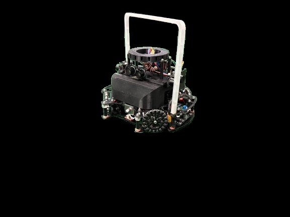

## Robot1 Front

*Robot 1 Front view*

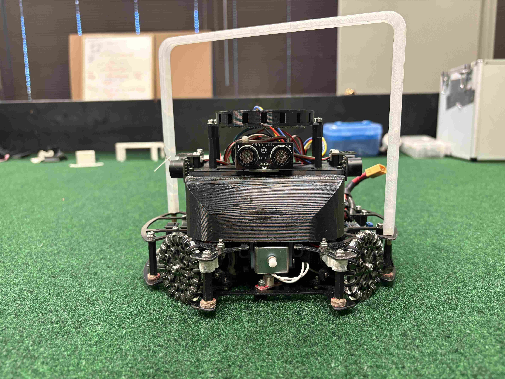

## Robot1 Back

*Robot 1 Back view*

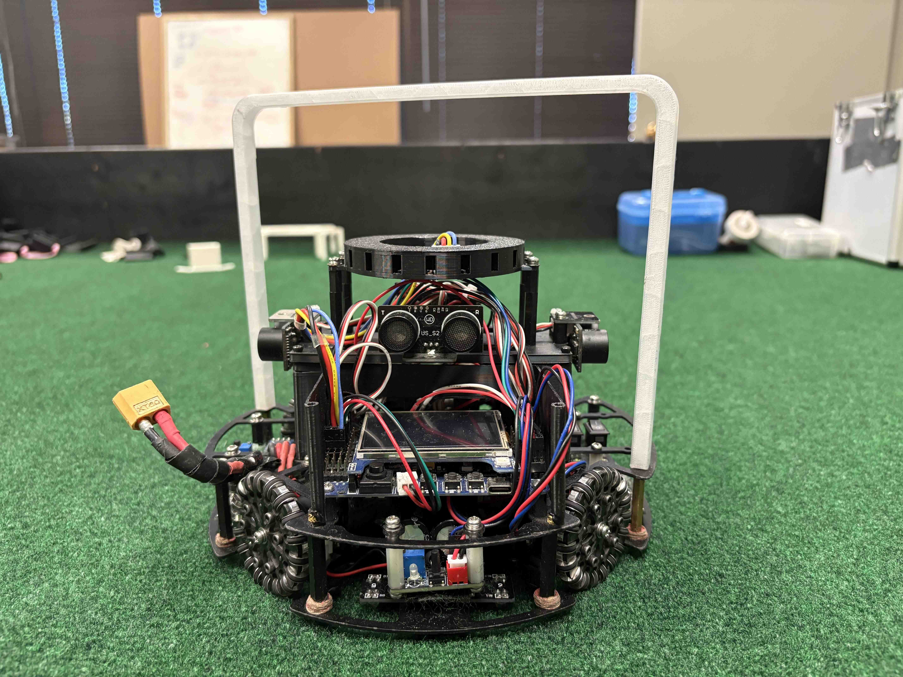

## Robot1 Top

*Robot 1 Top View*

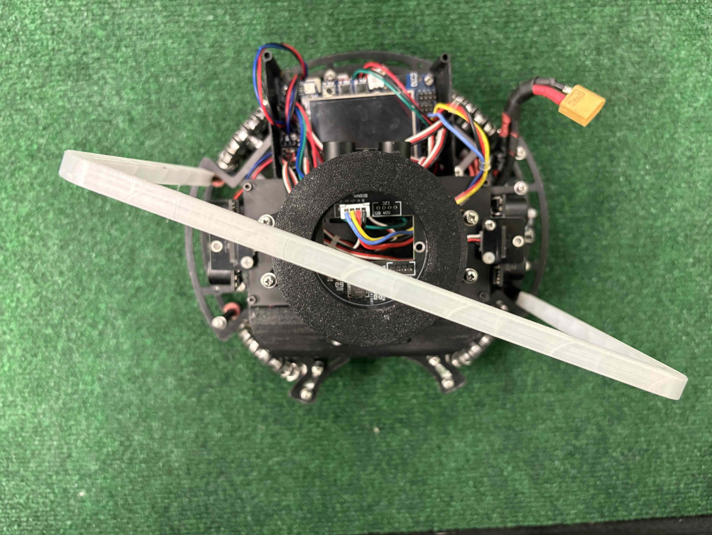

## Robot1 Bottom

*Robot 1 Bottom View*

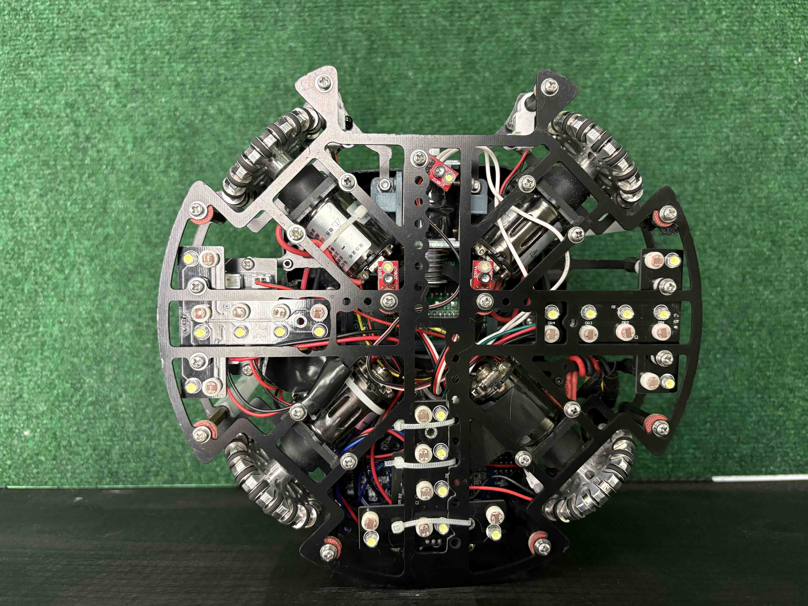

## Robot1 Right

*Robot 1 Right View*

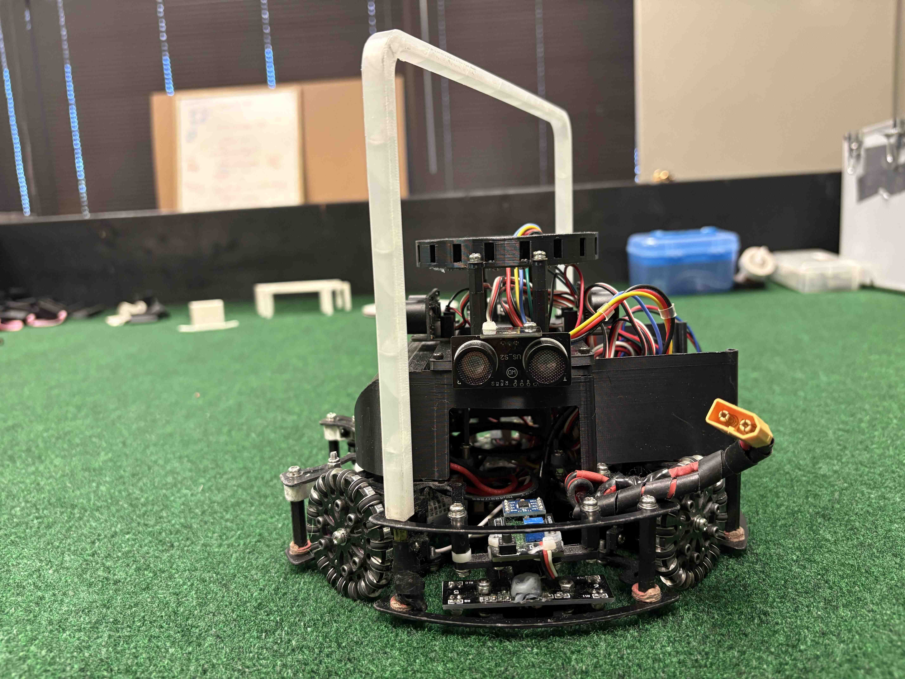

## Robot1 Left

*Robot 1 Left View*

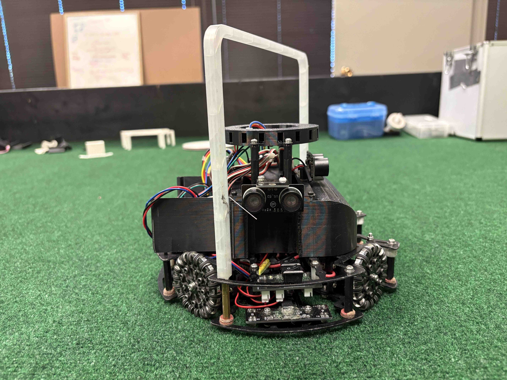

## Positioning & Movement

*How do you find your position inside the field and how do you use that position to move your robots around?*

We use ultrasonic values to calculate the coordinates the robot is on the field whenever it is unblocked and slow down when the robot is close to the wall.

## Robot2 Overall

*Robot 2 Overall View*

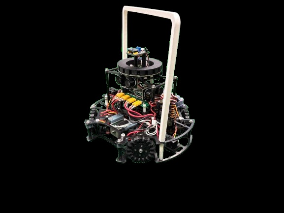

## Robot2 Front

*Robot 2 Front view*

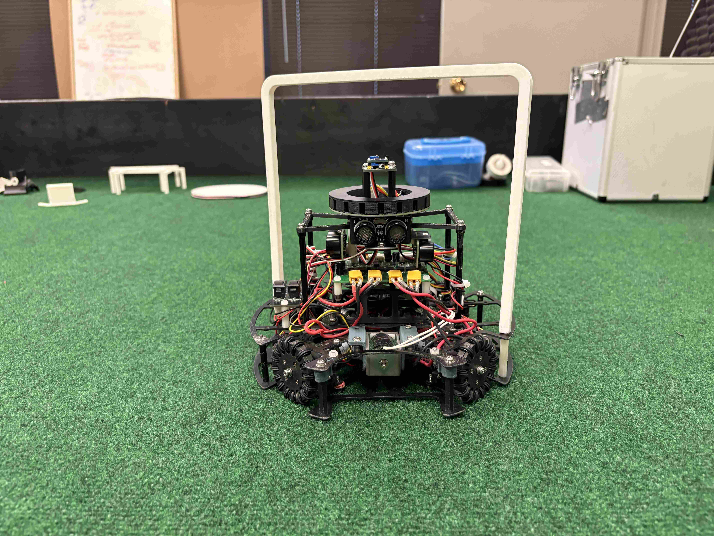

## Robot2 Back

*Robot 2 Back view*

## Robot2 Top

*Robot 2 Top View*

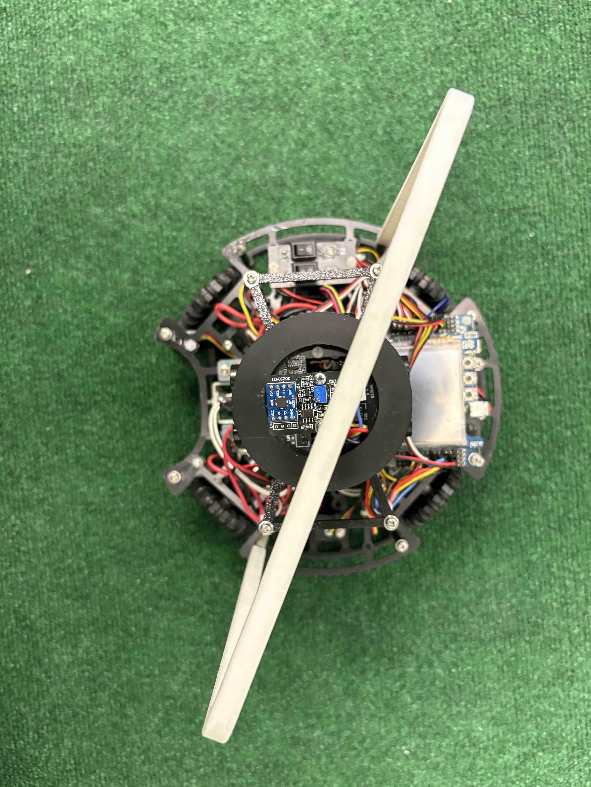

## Robot2 Bottom

*Robot 2 Bottom View*

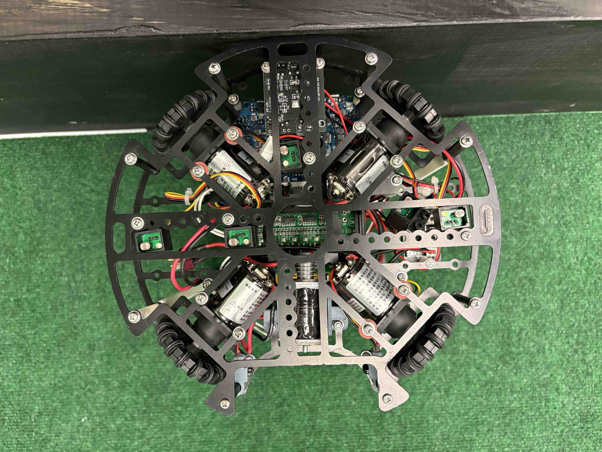

## Robot2 Right

*Robot 2 Right View*

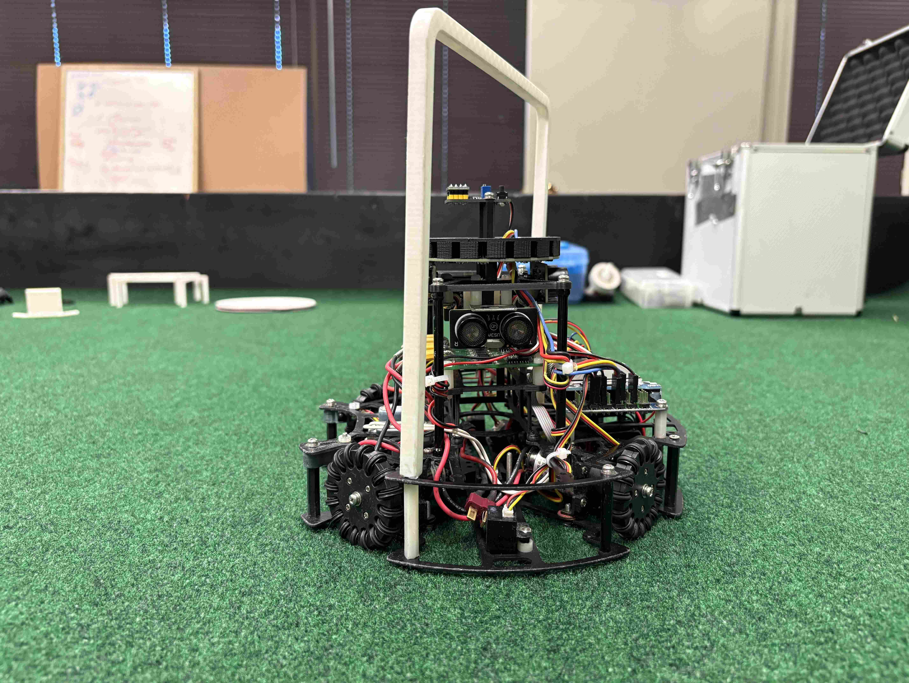

## Robot2 Left

*Robot 2 Left View*

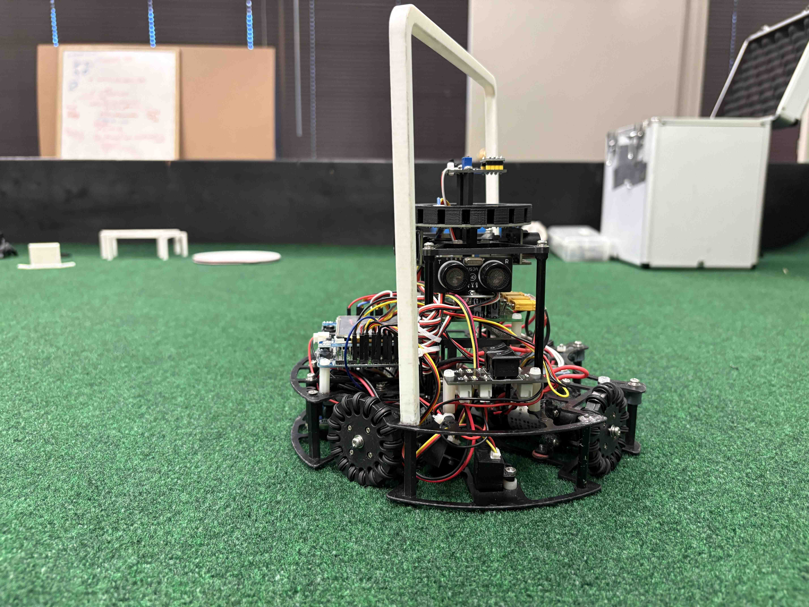

## Mechanical Design

*How did you design the mechanical parts of your robots?*

We used solidworks to design the robot and make sure that the screw holes fits and that there are enough wire room. We also considered designated spots for ultrasonic and grayscale so that no part of the robot will block those pivotal sensors. The design still has flaws in that many parts can collide and potentially break, which means that the parts needs to be more separated.

## Build Method

*How did you build your design?*

The primary machine we used is the 3D printer, which printed the chassis, mold for IR sensor and the protective shields. Our parts are cut by our own CNC machines and the program we use is bambu labs. The chassis is cut so that it saves as much weight as possible while being strong enough to hold everything together. The ultrasonic position is awkward as it can sometimes see the IR ball and provide an inaccurate value.

## Motors & Reason

*How many motors have you used and why?*

We use 4 omniwheels because they allow for full 360-degree movement, making our robot extremely agile and responsive on the field. The wheels are placed 90 degrees apart in a symmetrical X-configuration, which enables the robot to move smoothly in any direction—forward, backward, sideways, diagonally, or even rotate in place—without changing its orientation. To build each omniwheel, we designed and 3D printed two interlocking parts, then inserted mini rollers into the gaps. These rollers are secured using metal wire, creating a durable and lightweight design. This custom wheel system gives us precise and flexible control, especially during fast-paced maneuvers and directional shifts during gameplay.

## Kicker Design

*If your robot has a kicker, explain how you designed and built the mechanics of the kicker*

Our robot's kicker is powered by a capacitor-based system designed to deliver a quick and powerful strike. The capacitor is connected to the 12V battery and gradually stores electrical energy. Once fully charged, the circuit boosts the voltage from 12V to 48V, allowing the capacitor to release a high-energy pulse when triggered. This sudden discharge powers the kicker mechanism, delivering a strong and rapid motion ideal for launching the ball with speed and accuracy.

## Dribbler Design

*If your robot has a dribbler, explain how you designed and built the mechanics of the dribbler.*

We don't have dribbler.

## CAD Files

*CAD design files*

## Mechanical Innovation

*Mechanical Innovation*

We are most proud of our customizable and flexible chassis design, which allows for a wide range of hardware configurations. The chassis features numerous mounting points and screw holes, giving us the ability to easily adjust component placement, swap out parts, or add new modules without redesigning the entire frame. We use three separate chassis units, each carefully designed to maximize the strength-to-weight ratio, ensuring durability while keeping the robot lightweight and agile. This modular approach not only improves performance but also makes maintenance and upgrades much faster and more efficient during testing and competition.

## Mechanical Photos

*Photos of your mechanical designs highlights*

## Electronics Block Diagram

*Provide us with a block diagram of your robot's electronics*

## Power Circuit

*How does your power circuits work?*

Our robot is powered by a 12V battery pack that supplies energy directly to the motor drivers. To power the microcontroller and sensors, we use a buck converter to efficiently step down the voltage from 12V to 5V, ensuring stable and reliable operation. This approach minimizes heat loss compared to linear regulators and maximizes battery life. The power circuit is designed to deliver clean, consistent voltage levels tailored to each subsystem’s needs, supporting both high-current motors and sensitive electronics without interference.

## Motor Drive Circuit

*How do you drive your motors? Explain the circuits you use for that*

We drive our 4 DC motors using 1 four-channel motor driver modules, each capable of independently controlling 4 motors. The motor drivers receive 12V power directly from the battery and logic signals from our microcontroller. For each motor, we use two digital pins to set the direction and one PWM pin to control the speed. The microcontroller sends these signals, and the motor drivers adjust the power delivered to the motors accordingly. This setup allows precise and reliable control of all motors while keeping high current away from the microcontroller.

## Microcontroller & Reason

*What kind of micro controller or board do you use for your robot? Why did you decide to use this part for your robot? If you have more than 1 processor, explain each one separately.*

We use a Cortex-M4 microcontroller for our robot because it offers a large number of analog input ports, which are essential for reading multiple sensors simultaneously. Additionally, it features an efficient built-in voltage regulator that steps down our 12V battery supply to a stable 5V, simplifying our power design and improving overall energy efficiency.

## Ball Detection

*How does your ball detection sensors and/or camera[s] work?*

Our ball detection system uses a circular IR sensor with 18 individual ports. To improve accuracy and prevent signal interference between these ports, we designed and attached a custom mold on top of the sensor that clearly separates each port. This separation ensures precise detection of the ball’s position by isolating the signals from each sensor segment.

## Line Detection

*How does your line detection circuits work?*

We use grayscale sensors that output analog signals corresponding to the reflectance of the surface beneath them. These signals are sent to the microcontroller, which interprets the values to determine if the robot is over the white line or the surrounding surface. By comparing the sensor readings to a preset threshold, the robot can accurately detect and follow lines on the field.

## Navigation/Position Sensors

*What sensors do you use for navigation and how are these sensors connected to your processor? What sensors do you use to find your position in the field? What about the direction your robot faces?*

For navigation, we primarily use ultrasonic sensors, which sends signal to our microcontroller. The sensors updates the coordinates whenever it is in an unblocked position, providing useful information in where the robot is on the field. The direction the robot faces is always controlled at around 0 degrees using MPU sensor.

## Kicker Circuit

*How do you drive your kicker system? How does the circuit make the kicker work?*

Our kicker system is powered by a capacitor connected to the 12V battery, which stores electrical energy over time. The circuit boosts this input voltage to 48V, allowing the capacitor to release a powerful burst of energy when triggered. This high-voltage pulse drives the kicker mechanism, enabling it to deliver a fast and forceful strike.

## Dribbler Circuit

*How does your dribbler system work? What components and circuits did you use to drive it?*

N/A

## Schematics

*Schematics of your robot*

## PCB

*PCB of your robot*

## Innovation

*Innovations*

Our main electronic innovation is the design of a T-shaped grayscale sensor array, where we combine 6 individual grayscale sensors on each side of the robot. This configuration significantly widens our field of view, allowing the robot to detect lines and edges over a broader area. Despite the increased coverage, the design maintains high consistency and accuracy in sensor readings by carefully calibrating and aligning the sensors. This innovative approach improves line detection reliability and helps the robot better navigate complex courses with greater precision.

## Circuit Photos

*Photo of your circuit boards highlights*

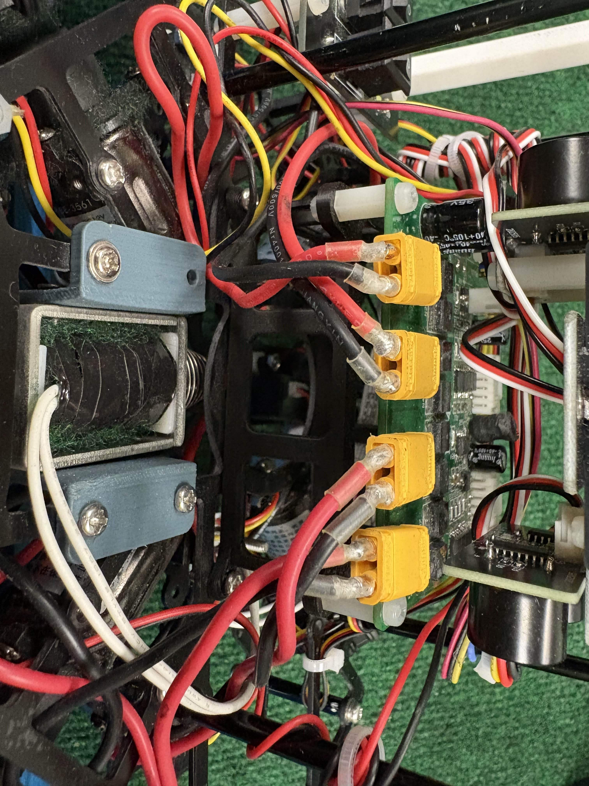

## Motor Control

*How do you use your processor to move your motors?*

The microcontroller sends control  PWM signals to the motor driver modules, which then switch high current from the battery to the motors. This setup allows the microcontroller to safely regulate motor speed and direction without handling the high current directly.

## Ball Detection Method

*How do you find where the ball is? How do you read the data from the ball detection sensors or camera?*

Our IR sensor reads 18 separate values, each corresponding to a specific port arranged around the sensor. These readings provide up to 18 possible ball angles, ranging from 0° to 340°, allowing us to accurately determine the ball’s direction relative to the robot. We process these analog values directly from the sensor without using a camera, enabling fast and reliable ball tracking.

## Ball Catch Algorithm

*How does your algorithm work to catch the ball? Is there a difference between your robots in how they move towards the ball? Explain the differences.*

For the attack robot, the robot calculates an offset based on the distance of ball with the robot, which is between 0~90 degrees. This is then either added or subtracted from ballAngle to constantly decide the direction it should go towards.

For the defense robot, instead of catching the ball, the robot constantly shift left and right, acting like a goalie. The difference is simple, the direction on the attacking bot is not constrained while the defense robot is constrained to either moving left or right to follow the ball on the X axis.

## Line Algorithm

*How does your robot find the lines to stay inside the field? What algorithms do you use to avoid going out of bounds?*

This is achieved by our new system of dynamic repel feature, which divides the field into 3 zones using ultrasonic thresholds. Safe zone means that the robot can move freely in the zone, buffer zone meaning that the robot should slow down, while repel zone meaning that the robot should immediately repel the opposite direction to where it is heading at that time, making it avoid going out.

## Goal Algorithm

*What algorithms do you use to score goals? How do you use your kicker and dribbler to handle the ball?*

For our attacking robot, we incorporated kicker functions and a function to aim towards goal, which drastically increases the chance of scoring. The kicker is used either to move the ball forward to apply pressure, or simply just a shooting attempt.

## Defense Algorithm

*What algorithms do you use to avoid the opponent team scoring? How do your robots defend your own goal?*

Our defense robot uses a real-time blocking algorithm to continuously track and intercept the opponent’s shots. It positions itself strategically between the ball and our goal to minimize scoring opportunities. Additionally, the defense bot is equipped with a kicker mechanism that can clear the ball away from our side of the field, helping to relieve pressure and regain control during critical moments.

## Robot Communication

*Do your robots communicate with each other? How do you use this communication to your advantage?*

## Innovation2

*Innovations*

This year, we heavily rely on our ultrasonic to prevent our robots from going out of their designated areas instead of grayscale sensors (explained in previous parts). This change is made because it is almost impossible for the robot to react on high speed to white line. Instead using ultrasonic sensors, we have a buffer zone to slow down the robot before getting close to the wall, making it harder to go out. This is also used on the defense bot but the zone is around the goal white line.

## GitHub Link

*GitHub link*

## BOM

*Bill of Materials (BOM)*

[https://drive.google.com/open?id=1L2FYRb3xst9gL2TcR4oYC9vXm8d_Tzjr](https://drive.google.com/open?id=1L2FYRb3xst9gL2TcR4oYC9vXm8d_Tzjr)

## Cost

*How much did it cost you to build your robots?*

Robots (cost of components that are in your robots right now): 1000 Euro each
Experiments (failed builds, broken hardware etc.): 1750 Euro 
Environment (fields, balls, etc.) : 150 Euro

1 Euro = 1.14USD

## Funding

*How did you gathered the funds to build the robots?*

80% parents 20% school

## Affordability

*How affordable was it to compete in RoboCupJunior Soccer?*

6

## Answer Check

*Have you checked all of your answers?*

Yes!

## Publication Consent

*We publish TDPs and posters during or after the competition as described in the beginning*

Yes, we acknowledge everything submitted in the above form can be published.

## Email Address

*Email Address*

henry.zhou28@stgeorges.bc.ca

## TDP File

*TDP File Upload (Not required)*

## Extra Column

*Column 67*

