## Timestamp

*Timestamp*

7/13/2025 15:29:45

## Team Name

*What is your team's name?*

MegaHertz

## League

*What league do you participate in?*

Open League

## Country

*Where are you from?*

Italy

## Contact

*If other teams have questions about your robot, now or in the future, what email address(es) can we publish along with this document for people to reach you?

(You can put in multiple email addresses, like multiple team members, an email for the whole team or both. Feel free to share other ways of communication like Discord handles)*

giuliano.mariniello@edu.cobianchi.it

## Social Media

*Team Social Media Links (if you have any)*


## Team Photo

*Upload a photo of your whole team with your mentor and robots

Note: This is not mandatory and will be published along with your TDP if you choose to upload something*

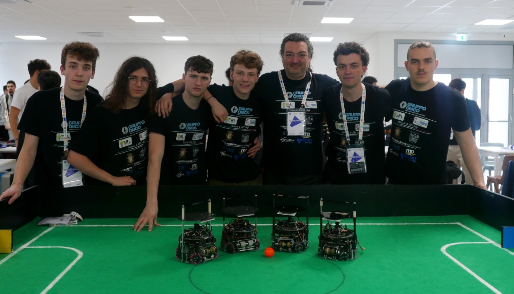

## Members & Roles

*What are the names of the team members and their role(s)?*

Giuliano Mariniello: Software developer and team leader
Luca Colombo: Software and camera development
Pietro Cova: Hardware and PCB design
Stefano Lupato: Software

## Meeting Frequency

*How often did your team meet?
(e.g. 90 minutes once per week or a day every weekend.)*

During our academic term, we met for a total of 15 hours per week, distributed across three weekly sessions.

## Meeting Place

*Where did you meet to work on your robot?
(e.g. a robotics room at school, at some other place, one of your homes, school library etc.)*

We worked primarily in the school's robotics laboratory and occasionally in Pietro Cova's garage for additional collaboration and testing.

## Start Date

*When did your team start working on this year's robot?*

October 2024

## Past Competitions

*Which RoboCupJunior competitions have you competed in and in which leagues?*

Italian Open 2024: 2v2 Socccer Open
RoboCup Eindhoven 2024: 2v2 Soccer Open
Italian Open 2025 : 2v2 Soccer Open
European Championship 2025: 2v2 Soccer Open

## Mentor Contribution

*Which parts of your work received the most contribution from your mentor?*

Budget and traveling organization

## Workload Management

*How did you manage the workload?*

We coordinated our work through a WhatsApp group, which we used to organize meetings and delegate tasks. For version control and code comparison, we utilized GitHub. The robot’s mechanical design was developed collaboratively within our shared Fusion 360 team. Additionally, we used a shared Google Drive to store all documentation, posters, and research materials.

## AI Tools

*Which AI tools did you use?*

We used ChatGPT primarily to support our coding efforts when we encountered challenges. While its answers were not always directly applicable, the tool often helped us better understand the core of the problem and guided us toward effective solutions.

## Robot1 Overall

*Robot 1 Overall View*

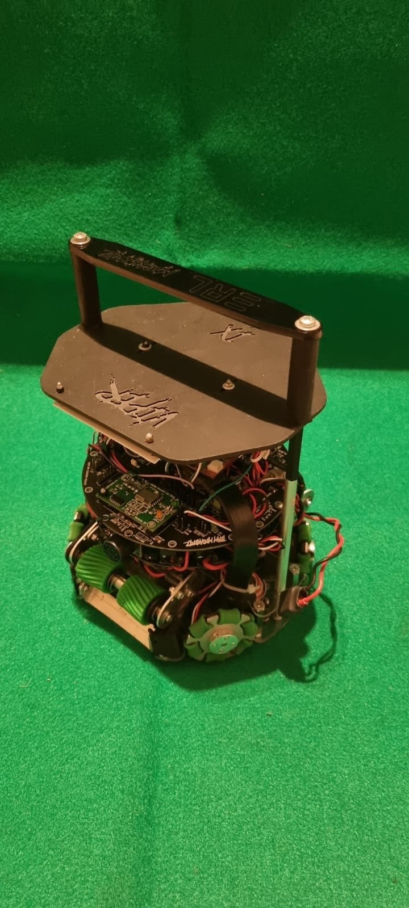

## Robot1 Front

*Robot 1 Front view*


## Robot1 Back

*Robot 1 Back view*

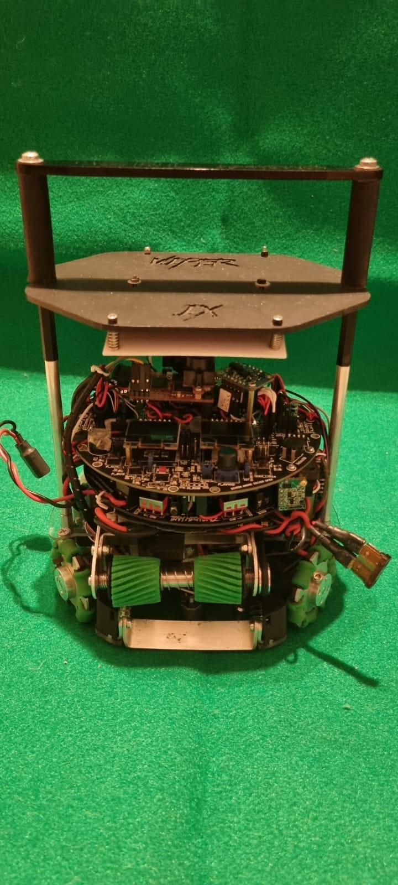

## Robot1 Top

*Robot 1 Top View*


## Robot1 Bottom

*Robot 1 Bottom View*


## Robot1 Right

*Robot 1 Right View*


## Robot1 Left

*Robot 1 Left View*


## Positioning & Movement

*How do you find your position inside the field and how do you use that position to move your robots around?*

To localize our robots on the field, we use two complementary methods based on fuzzy logic.

The first method uses the OpenMV H7 camera with an omnidirectional mirror to detect both goals. Because of mirror distortion, we divide the field into 12 sectors and categorize the robot’s position accordingly. This visual input provides a quick and lightweight way to estimate location.

The second method uses four Time-of-Flight (ToF) sensors arranged in a cross pattern. By comparing distances to the field’s borders, we again estimate the robot’s sector using predefined fuzzy logic rules.

We also tested a combined method that merges data from both the camera and the ToF sensors to compute the robot’s exact X and Y coordinates using trigonometry. However, the computational load was too high for our 8-bit processor, causing delays. As a result, we kept the simpler fuzzy logic approach.

This localization is mainly used when the robot loses sight of the ball and helps maintain proper positioning in both offensive and defensive scenarios.

## Robot2 Overall

*Robot 2 Overall View*


## Robot2 Front

*Robot 2 Front view*


## Robot2 Back

*Robot 2 Back view*

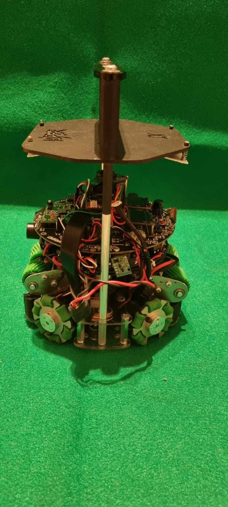

## Robot2 Top

*Robot 2 Top View*


## Robot2 Bottom

*Robot 2 Bottom View*


## Robot2 Right

*Robot 2 Right View*


## Robot2 Left

*Robot 2 Left View*


## Mechanical Design

*How did you design the mechanical parts of your robots?*

Our mechanical design this year draws inspiration from Small Size League (SSL) teams and top-performing robots from the previous season. One of our key innovations was changing the motor mounting angle from 45° to 55°, which enabled a larger and more efficient dribbler, greatly enhancing our ball control.

We completely redesigned our omniwheels to provide better traction and stability. Using Autodesk Fusion 360, we modeled and simulated our mechanical components, allowing us to test different configurations, verify tolerances, and iterate rapidly based on real-world feedback.

Special attention was given to the omnidirectional vision system. We optimized the mirror shape and camera placement to maximize visibility while reducing distortion. The lower chassis was also redesigned with strategic cuts near the motor mounts to introduce controlled flex, acting as passive suspension and improving grip under high-speed conditions.

Several hardware upgrades were made over last year’s design. We re-cast the dribbler rollers, widened the chassis for improved stability and internal space, and lowered the robot’s profile to enhance the camera’s field of view.

A major mechanical improvement was the integration of a brushless motor in the rear dribbler. This enabled the "Rabona" maneuver—a quick spin that lets the robot shoot or pass from the rear, creating new strategic opportunities during matches.

Overall, our mechanical design focused on improving control, efficiency, and adaptability on the field through a process of simulation, prototyping, and continuous refinement.

## Build Method

*How did you build your design?*

To build our robot, we combined in-house manufacturing with select external fabrication services. Most structural parts were made using our 3D printers, CNC milling machine, and laser cutter. The main chassis was milled from polycarbonate sheets for strength, while plexiglass was laser-cut for lightweight components like handles.

Initially, our wheels were made entirely of PLA, but they proved too fragile. After some trial and error, we redesigned them with a metal core—milled in-house—which greatly improved their durability and performance.

For rubber elements such as wheel treads and dribbler rollers, we designed custom 3D-printed molds and cast the parts using a two-component silicone. This allowed us to fine-tune grip and softness.

More complex metal components, like the dribbler frame, were fabricated with the help of local partners. One sponsor, OMCD, manufactured our mirrors and other precision parts.

Most of our PCBs were assembled through a trusted local supplier, with some boards produced by international services like JLCPCB to ensure fast delivery and consistent quality.

Our mechanical and electronic designs were created with manufacturability in mind from the start, which minimized rework and ensured a smooth assembly process.

## Motors & Reason

*How many motors have you used and why?*

Each of our robots uses four 12V Maxon DC motors rated at 500 RPM to achieve full omnidirectional movement. We chose a four-wheel drive system over the more common three-wheel setup for increased power, traction, and maneuverability. This configuration offers improved stability and reduces strain on each motor, enhancing durability and responsiveness during fast gameplay.

The motors were selected for their reliability, high torque, and smooth performance, which are essential for accurate movement and quick directional changes.

Our omniwheels are fully custom-built using a hybrid design. Each wheel features a PLA plastic core and a milled aluminum shell for optimal strength-to-weight balance. They incorporate six hourglass-shaped silicone rollers, cast in-house using custom molds, providing 12 points of contact per wheel for smooth and precise movement.

This wheel and drive system is the result of two years of development and testing, and it plays a key role in giving our robots the agility and control needed to perform at a high level in competitive matches.

## Kicker Design

*If your robot has a kicker, explain how you designed and built the mechanics of the kicker*

Our robot features an electromagnetic kicker system designed to deliver quick and powerful shots. The core of the mechanism is a hand-wound electromagnetic coil, which acts as a solenoid. Inside the coil is an iron rod (also referred to as a plunger), which is accelerated forward when the coil is energized. This movement is driven by the magnetic field generated by the coil, propelling the rod with enough force to kick the ball.

Attached to the tip of the rod is a small impact plate that directly transfers the momentum to the ball, launching it forward. This setup allows for compact, high-speed kicks that are essential in fast-paced gameplay scenarios such as shooting on goal, or clearing the ball from defense.

To ensure the kicker resets quickly and doesn’t interfere with the dribbler system, a spring is integrated behind the rod to return it to its resting position immediately after activation. This spring is fixed to the middle chassis at the other side.

## Dribbler Design

*If your robot has a dribbler, explain how you designed and built the mechanics of the dribbler.*

Our dribbler system features two degrees of freedom to adapt dynamically during gameplay. The first allows vertical movement (Z-axis), while the second lets each roller shift slightly along the X-axis for better ball contact. A set of pre-tensioned springs maintains the default position, providing passive compliance when interacting with the ball or uneven surfaces.

The rollers are custom-cast using two-component silicone in 3D-printed PLA molds, allowing us to fine-tune their softness and shape for optimal grip. The front dribbler is powered by a DC motor, while the rear uses a brushless motor. Both drive the rollers through a belt-and-pulley system designed to slip under excessive load, protecting the motors from damage.

The entire assembly is mounted on a custom metal chassis, adjustable in height to accommodate different field types. This robust, flexible design ensures consistent ball control and durability, supporting both offensive handling and defensive interception.

## CAD Files

*CAD design files*


## Mechanical Innovation

*Mechanical Innovation*

This year, we’re especially proud of several key mechanical advancements that mark a major improvement from previous designs. The most significant change is a complete structural redesign—resulting in a more compact, accessible, and balanced robot. Optimized internal layout improved weight distribution, stability, and ease of maintenance.

A major innovation was our switch to a 55-degree symmetrical wheel configuration. This allowed for a wider and more efficient dribbler system with greater ball contact and control, especially in tight situations. The new layout also freed up internal space for larger, more capable components without compromising maneuverability.

We also developed custom hybrid omniwheels, solving past reliability issues. These wheels combine CNC-milled aluminum cores with hand-cast silicone rollers, fully manufactured in-house. The result is significantly improved durability, precision, and field performance.

Each improvement reflects our growing technical skill, and our commitment to continuous innovation—both in robot performance and team development.

## Mechanical Photos

*Photos of your mechanical designs highlights*

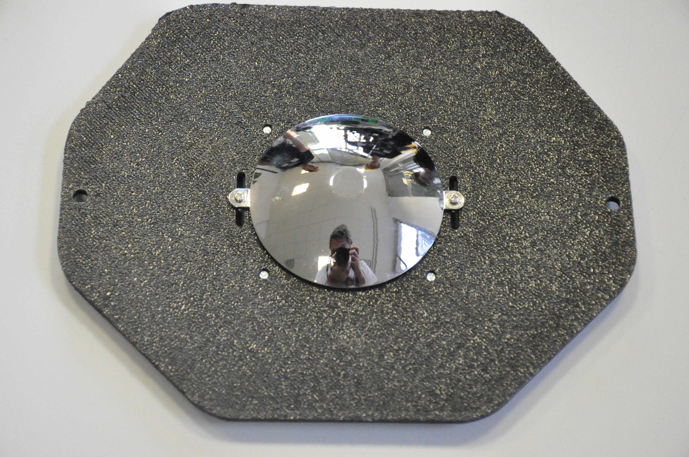
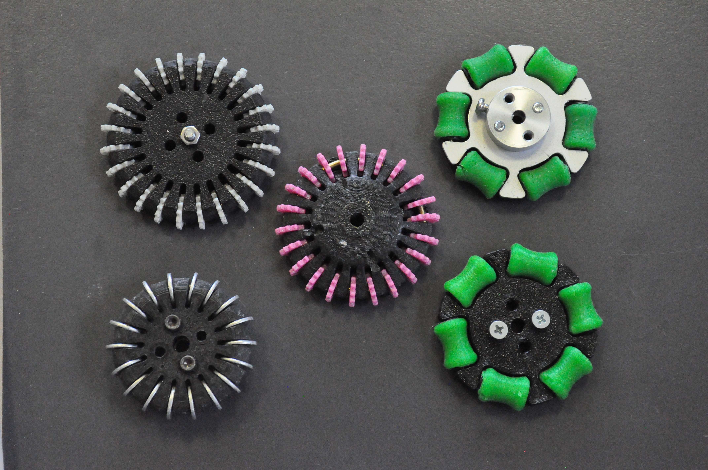
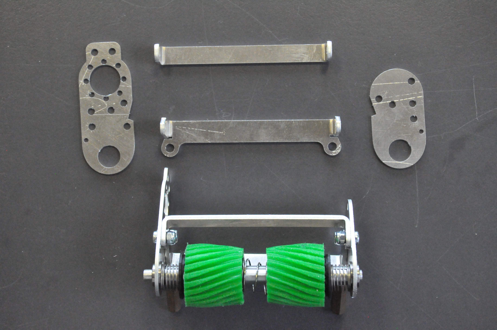
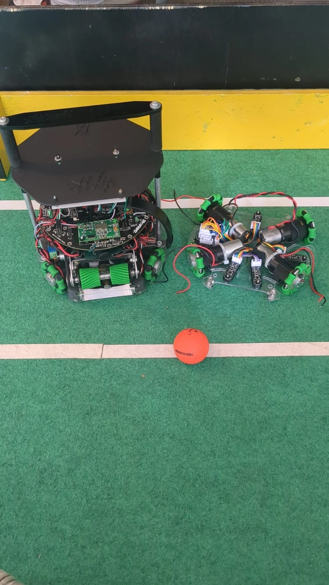

## Electronics Block Diagram

*Provide us with a block diagram of your robot's electronics*

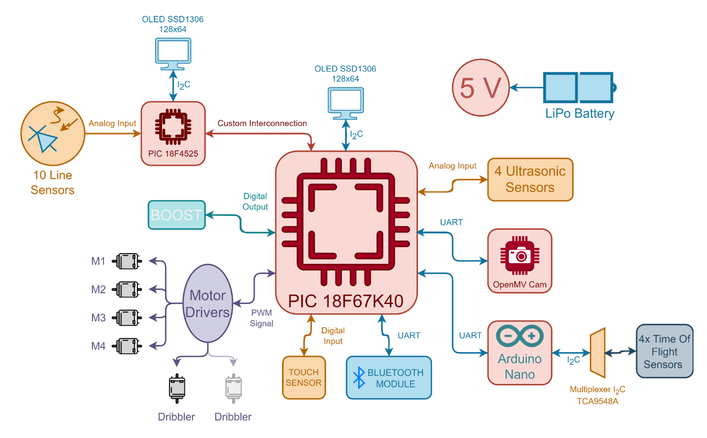

## Power Circuit

*How does your power circuits work?*

Our robot is powered by a 3-cell 11.1V LiPo battery pack, which serves as the primary power source for all subsystems. From this battery, we derive four distinct voltage levels to meet the requirements of different components while ensuring efficiency and reliability.

The unregulated 11.1V is used directly to power the motors and high-current circuits, delivering the full capacity of the battery to ensure strong and responsive movement.

A stable 5V supply powers the mainboard logic, OpenMV camera, and most of the sensors. This voltage is generated through a custom-designed switching regulator on the power board, chosen for its high efficiency and minimal heat output.

We also use a 3.3V level to power components such as the ToF sensors and certain communication interfaces. This voltage is obtained using a standard linear regulator, such as the L7803, which is suitable due to the low current demand of these components.

Finally, a 48V level is required to charge the capacitors used in the electromagnetic kicker system. This voltage is generated by a dedicated step-up converter built onto a separate PCB that manages the kicker functionality independently.

All power stages are designed with stability, safety, and modularity in mind, allowing us to isolate, monitor, and troubleshoot individual sections with ease.

## Motor Drive Circuit

*How do you drive your motors? Explain the circuits you use for that*

```
In order to drive our motors, we use an H-bridge circuit for each individual motor. This setup allows us to control the direction of rotation by adjusting the polarity of the voltage applied to the motor terminals. In addition to direction control, each motor receives a dedicated PWM signal, which regulates the motor's angular velocity. This combination enables precise omnidirectional movement, which is essential for our robot’s mobility system.

Each H-bridge circuit is custom-built using the L6207 driver from STMicroelectronics. This integrated driver offers dual full-bridge control and is well-suited for our high-efficiency DC motors. For current monitoring and safety, every motor circuit includes its own current-sensing resistor. This allows us to implement overcurrent protection by shutting down the motor driver in case of a short circuit or excessive load, preserving both the motor and the control electronics.

Control signals to each motor consist of three inputs: two digital bits to set the direction and one PWM signal connected to the enable pin of the L6207. This setup gives us fine control over each motor’s behavior and ensures reliable and responsive movement under varying conditions on the field.

## Microcontroller & Reason

*What kind of micro controller or board do you use for your robot? Why did you decide to use this part for your robot? If you have more than 1 processor, explain each one separately.*

We use a PIC18F67K40 microcontroller as the main processor on our robot. This 8-bit microcontroller is cost-effective, reliable, and well-suited for custom PCB design, which makes it ideal for our project constraints. While its computational power is limited compared to higher-end processors, it offers all the essential functionalities required for our control system, including multiple I/O ports, analog inputs, and serial communication interfaces.

To offload specific time-critical tasks, we added a second microcontroller on the mainboard. This secondary processor is dedicated solely to reading the line sensors in real time. By isolating this function, we ensure that the main processor remains responsive and is not slowed down by the constant polling of sensor data. When a line is detected, the secondary processor transmits the information to the main controller through parallel communication, allowing for immediate response.

The main processor is programmed in C for better readability and modularity, while the secondary processor is programmed in assembly language to achieve maximum execution speed and minimize latency in line detection. This dual-processor architecture allows us to maintain a responsive control system even within the constraints of 8-bit hardware.

## Ball Detection

*How does your ball detection sensors and/or camera[s] work?*

Our ball detection system is based on the OpenMV H7 Plus camera module, which features a 32-bit STM32 processor and runs MicroPython. This allows us to perform onboard image processing directly on the camera without overloading the main control unit.

The camera uses color thresholding and shape detection algorithms to identify the ball within its field of view. By processing the image frames in real time, the OpenMV can detect the ball’s position relative to the robot and calculate both direction and approximate distance.

Once the ball is detected, the camera formats the relevant data into a packet and transmits it to the main board via a UART connection. The main processor is configured to respond through an interrupt-based system, immediately reading and interpreting the incoming data. This ensures minimal delay between detection and robot response, allowing for quick adjustments in movement and orientation.

This setup provides a lightweight and efficient ball detection solution that integrates seamlessly with the rest of the robot’s control architecture.

## Line Detection

*How does your line detection circuits work?*

Our line detection system is based on custom-made sensor boards using a phototransistor and infrared LED pair. Each sensor emits a beam of infrared light onto the field surface. When this light reflects back, the phototransistor generates a voltage signal proportional to the intensity of the reflected light. This allows us to distinguish between the dark playing field and the white boundary lines.

Each sensor module includes two LED-phototransistor pairs for increased accuracy and stability in detection. Our robots are equipped with a total of five such sensors, which gives us sufficient coverage to detect line crossings while maintaining a balance between information quality and processing load.

All sensor outputs are connected to the analog-to-digital converter (ADC) inputs of a dedicated secondary microcontroller. This processor is tasked solely with handling the line detection readings. By isolating this function, we prevent unnecessary load on the main controller. The secondary processor processes the analog values in real time and, when a line is detected, it sends the relevant data to the main processor via parallel communication for immediate response.

This approach ensures responsive and reliable line detection without compromising the performance of the robot’s primary control tasks.

## Navigation/Position Sensors

*What sensors do you use for navigation and how are these sensors connected to your processor? What sensors do you use to find your position in the field? What about the direction your robot faces?*

For navigation and localization on the field, we use a combination of different sensors tailored for performance and efficiency. In addition to the camera, which provides global vision and object tracking, we have four Time-of-Flight (ToF) distance sensors mounted in a cross pattern around the robot. These sensors output an analog voltage ranging from 0 to 3.3V, corresponding to the measured distance. This analog approach allows us to connect the sensors directly to the ADC inputs of our microcontroller, avoiding the overhead of I2C communication, which can be both resource-intensive and less responsive in a multi-sensor configuration.

To determine the orientation of the robot, we use a 9-axis Inertial Measurement Unit (IMU), which combines an accelerometer, gyroscope, and magnetometer. This IMU communicates with the processor via the I2C interface and provides real-time data on the robot's angular position and rotation. The orientation information is critical for maintaining consistent direction and executing complex movement patterns.

Together, these sensors provide the necessary data for field navigation, obstacle awareness, and orientation control, enabling smooth and autonomous robot behavior.

## Kicker Circuit

*How do you drive your kicker system? How does the circuit make the kicker work?*

Our kicker system is driven by a high-power, high-current MOSFET, which is used to discharge a 48V capacitor bank directly into the electromagnetic coil of the kicker. The capacitors are charged by a dedicated step-up circuit, which boosts the voltage from our 11.1V battery to the required 48V level. 

When a kick is triggered, the microcontroller sends a signal to the MOSFET, allowing the stored energy in the capacitors to be rapidly released through the coil. This creates a strong and brief magnetic field that accelerates the kicker shaft forward, transferring kinetic energy to the ball.

We chose to power the coil using capacitors rather than drawing current directly from the battery to protect the battery from high current spikes. Directly discharging such a high load from the battery could cause voltage drops, thermal stress, or even dangerous failures such as circuit damage or battery swelling. Using capacitors also ensures a faster and more consistent response time for the kicker.

The circuit includes safety features such as over-voltage protection and controlled charging of the capacitors to ensure reliability and safety throughout operation.

## Dribbler Circuit

*How does your dribbler system work? What components and circuits did you use to drive it?*

Our dribbler system consists of two independent units: a front dribbler and a rear dribbler, each driven by a different type of motor and control circuit.

The front dribbler is powered by a brushed DC motor and controlled through an H-bridge circuit, identical to the one used for our movement motors. This allows us to precisely control the rotation direction and speed via PWM signals, enabling advanced maneuvers where the dribbler needs to reverse its spin. The H-bridge includes current sensing and shutdown features to protect against short circuits and overheating, ensuring both safety and reliability.

The rear dribbler is powered by a brushless DC motor, which is driven using a commercially available Electronic Speed Controller (ESC). This ESC receives its PWM signal directly from the main board and is powered straight from the battery through the main power switch. This setup ensures a high-performance response, crucial for executing quick maneuvers like our "Rabona" shot, where the ball is kicked from the rear while the robot rapidly turns.

Together, these systems give us full control over both dribblers, allowing them to adapt to different play situations and ball dynamics while maintaining consistent speed and torque

## Schematics

*Schematics of your robot*


## PCB

*PCB of your robot*

[https://drive.google.com/open?id=1JLJh-sFVP8eLPCrRmM_3Lzzi6ruqY2EY](https://drive.google.com/open?id=1JLJh-sFVP8eLPCrRmM_3Lzzi6ruqY2EY)
[https://drive.google.com/open?id=1ffkpyeudlJ7QHl5vWVxdRwTyE3Y011_G](https://drive.google.com/open?id=1ffkpyeudlJ7QHl5vWVxdRwTyE3Y011_G)

## Innovation

*Innovations*

One of the electronic innovations we are most proud of this year is the significant reduction in the size of our custom PCBs. Compared to last year’s design, we were able to optimize the layout and component placement to create a much more compact and efficient board architecture. This improvement has had a direct impact on the accessibility and maintainability of our robots.

By minimizing the board dimensions, we freed up internal space within the chassis, allowing for easier cable management and quicker access to individual components during maintenance or troubleshooting. This also helped lower the robot’s center of gravity, improving its balance and overall performance on the field.

To achieve this, we reviewed each subsystem—such as motor drivers, sensor arrays, and communication modules—and integrated them more tightly while avoiding signal interference. We also transitioned some components to surface-mount versions and carefully routed power and signal traces to improve thermal management and signal integrity.

This compact design was entirely produced in-house, reinforcing our team's ability to iterate quickly and maintain full control over our electronics development. The experience also pushed us to refine our design and manufacturing workflows, laying a strong foundation for future improvements.

## Circuit Photos

*Photo of your circuit boards highlights*

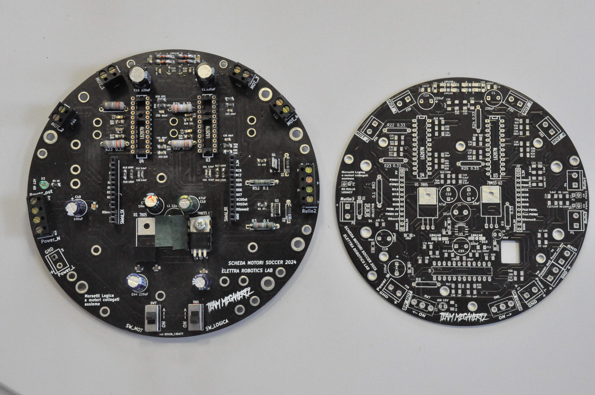
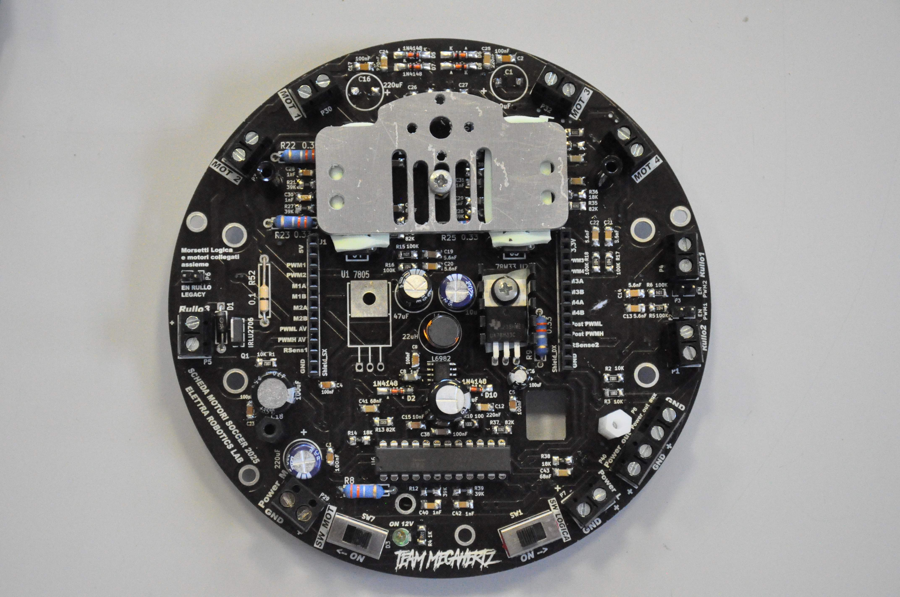

## Motor Control

*How do you use your processor to move your motors?*

We implemented trigonometric equations to calculate the speed and direction of each motor based on the desired movement vector. By knowing the position and angle of each motor, we compute the necessary rotational velocity and direction through a mathematical model. This section is the most computationally intensive part of our code, but it ensures smooth transitions and accurate omnidirectional movement. It is a significant improvement compared to our older implementation, which relied on basic switch-case logic.

In addition, we use a PID control system to constantly adjust motor speeds and minimize error, keeping the robot as close as possible to the desired motion setpoint. Once the calculations are complete, the processor sends the direction and corresponding PWM signal to each motor.

## Ball Detection Method

*How do you find where the ball is? How do you read the data from the ball detection sensors or camera?*

In order to detect the ball, we use trigonometric calculations based on the image frame from our omnidirectional camera. Since we use a mirror-based system, the image is circular and distorted, but we are still able to extract useful data. We first identify the ball as a colored blob and determine its position relative to the center of the frame. The angle between the robot’s front and the ball is calculated from the angle of the blob around the image center, and the distance is estimated based on how far the blob is from that center.

To improve distance estimation accuracy, we use an external Python script during development and calibration. This script allows us to fine-tune the relationship between the blob’s pixel position and the real-world distance to the robot in centimeters. This calibration helps us maintain a more reliable and consistent ball tracking performance.

## Ball Catch Algorithm

*How does your algorithm work to catch the ball? Is there a difference between your robots in how they move towards the ball? Explain the differences.*

Both of our robots use the same movement strategy to approach the ball. We employ a linear control algorithm where the robot’s aggression factor increases as the distance to the ball decreases, allowing for more precise and assertive positioning when close to the target. 

Additionally, since our robots are equipped with dual dribblers—one at the front and one at the rear—they have the flexibility to catch and control the ball from either side. This capability enhances our ball handling and maneuvering options during gameplay.

## Line Algorithm

*How does your robot find the lines to stay inside the field? What algorithms do you use to avoid going out of bounds?*

To ensure our robot stays within the field boundaries, we use a straightforward algorithm based on the readings from multiple line sensors. When one or more sensors detect that the robot is crossing the boundary lines, the system calculates the angle corresponding to the midpoint between the activated sensors. 

Using this angle, the algorithm determines the opposite direction, guiding the robot to move back inside the field. This reactive control effectively keeps the robot within bounds while minimizing complex computations, ensuring reliable in-game positioning.

## Goal Algorithm

*What algorithms do you use to score goals? How do you use your kicker and dribbler to handle the ball?*

Our goal-scoring strategy is based on a series of conditional checks that determine when to activate the kicker or position the robot in front of the goal for an optimal shot. We have developed maneuvering algorithms that rotate the robot toward the goal by calculating the error between the current orientation and the target direction. Once the robot is aligned within an acceptable threshold and maintains a clear line of sight to the goal, it triggers the kicker to shoot.

To increase reliability, especially when the camera’s view is obstructed or struggling to detect the goal, we supplement our system with ToF sensors. These sensors provide additional distance data, allowing the robot to adjust its positioning and maintain effective goal-scoring opportunities even under limited visual conditions.

## Defense Algorithm

*What algorithms do you use to avoid the opponent team scoring? How do your robots defend your own goal?*

We developed a dedicated goalkeeper algorithm to defend our goal effectively. When one robot is attacking, the second robot acts as the goalkeeper, positioning itself along the X-axis to follow the ball’s movements and cover the goal area.

If the opponent team attempts to shoot, the goalkeeper activates its dribbler to spin in the opposite direction, allowing it to sweep the ball away upon contact and prevent a goal.

## Robot Communication

*Do your robots communicate with each other? How do you use this communication to your advantage?*

Our robots communicate with each other via Bluetooth using a UART communication protocol. Before transmitting a stream of essential data, such as their position relative to the ball and goals, as well as their assigned roles, they first exchange a handshake character to establish a reliable connection. 

This communication ensures coordinated behavior between the robots, preventing interference and enabling strategic teamwork during the game.

## Innovation2

*Innovations*

We are particularly proud of our go() function, which enables our robots to move smoothly in any desired direction without relying on predetermined maneuvers. This function uses real-time calculations to dynamically adjust motor speeds and directions, providing greater flexibility and precision in movement.

Additionally, we take pride in the efficient and relatively high-speed communication system between our two robots. This seamless data exchange allows for coordinated teamwork and strategic play, significantly improving our chances of winning games.

## GitHub Link

*GitHub link*


## BOM

*Bill of Materials (BOM)*

[https://drive.google.com/open?id=1kuQKJpc9XGy8GaXX4RHnqWM8JMAh89Bm](https://drive.google.com/open?id=1kuQKJpc9XGy8GaXX4RHnqWM8JMAh89Bm)

## Cost

*How much did it cost you to build your robots?*

Robots (cost of components that are in your robots right now): 1400 Euro each  
Experiments (failed builds, broken hardware, spare parts, etc.): 600 Euro  
Environment (field, tools, equipment like soldering station, oscilloscope, power supply, etc.): 800 Euro  
1 Euro= 1.14 USD

## Funding

*How did you gathered the funds to build the robots?*

30% school
50% sponsors
20% personal savings

## Affordability

*How affordable was it to compete in RoboCupJunior Soccer?*

4

## Answer Check

*Have you checked all of your answers?*

Yes!

## Publication Consent

*We publish TDPs and posters during or after the competition as described in the beginning*

Yes, we acknowledge everything submitted in the above form can be published.

## Email Address

*Email Address*

giulibros@gmail.com

## TDP File

*TDP File Upload (Not required)*


## Extra Column

*Column 67*


