## Timestamp

*Timestamp*

7/9/2025 9:26:40

## Team Name

*What is your team's name?*

Munako Aegis

## League

*What league do you participate in?*

Lightweight League

## Country

*Where are you from?*

Japan

## Contact

*If other teams have questions about your robot, now or in the future, what email address(es) can we publish along with this document for people to reach you?

(You can put in multiple email addresses, like multiple team members, an email for the whole team or both. Feel free to share other ways of communication like Discord handles)*

Team Gmail: munakou.aegis@gmail.com
 Member Discord IDs:
・Yuta Kurisaki: kuri.33
・Koki Suehiro: ssssu6611
・Umi Fujita: ocean191018
・Maiki Kimura: maikii0740

## Social Media

*Team Social Media Links (if you have any)*

youtube:https://www.youtube.com/@munako-aegis 
blog:https://note.com/munakoaegis　　　　　　　　　　　　　　　　　　　　　　　　X:https://x.com/Munako_Aegis

## Team Photo

*Upload a photo of your whole team with your mentor and robots

Note: This is not mandatory and will be published along with your TDP if you choose to upload something*

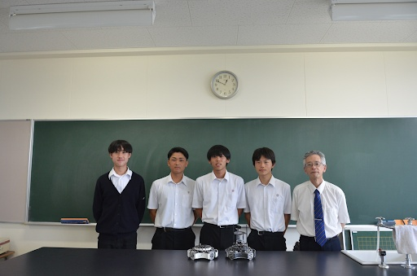

## Members & Roles

*What are the names of the team members and their role(s)?*

Yuta Kurisaki: Programming for the attacker robot
Koki Suehiro: Programming for the goalkeeper robot
Umi Fujita: Robot design
Maiki Kimura: Circuit design

## Meeting Frequency

*How often did your team meet?
(e.g. 90 minutes once per week or a day every weekend.)*

Our team communicates frequently on a daily basis, so we generally do not have regular meeting times.However, about once every six months, we take a coherent time of about three hours. We use this time to discuss the overall direction and issues.

## Meeting Place

*Where did you meet to work on your robot?
(e.g. a robotics room at school, at some other place, one of your homes, school library etc.)*

Physics laboratory in the school

## Start Date

*When did your team start working on this year's robot?*

2024.jun

## Past Competitions

*Which RoboCupJunior competitions have you competed in and in which leagues?*

Japan Open 2024 Soccer Lightweight League
Japan Open 2025 Soccer Lightweight League

## Mentor Contribution

*Which parts of your work received the most contribution from your mentor?*

Many of our team members began participating in activities after entering high school, so they had to develop their technical skills in a short amount of time.Therefore, the key was how much time we could devote to our activities. We continued our activities not only on weekdays but also on weekends.
Since this was a club activity, we had to be accompanied by our advisor at all times. Therefore, he went to great lengths to cut down on his personal time to create an environment in which we could engage in our activities. I believe this kind of support from our advisor contributed greatly to our growth.

## Workload Management

*How did you manage the workload?*

Discord – Note-taking and communication within the team
LINE – Communication between different teams
GitHub – Data and version management
Time Tree – Schedule and planning management

## AI Tools

*Which AI tools did you use?*

We used AI when translating into English.

## Robot1 Overall

*Robot 1 Overall View*

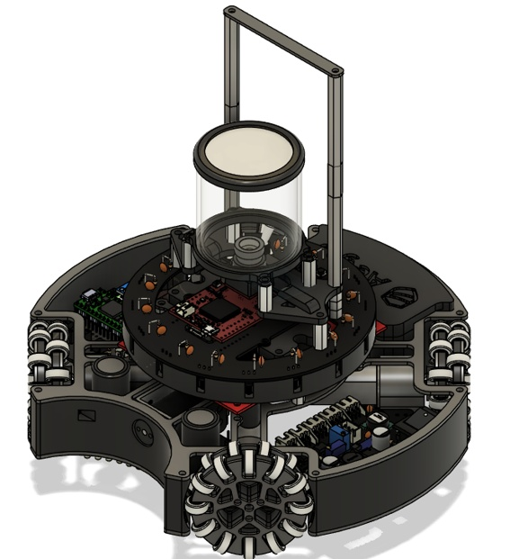

## Robot1 Front

*Robot 1 Front view*

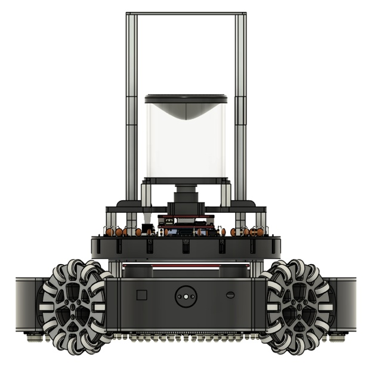

## Robot1 Back

*Robot 1 Back view*

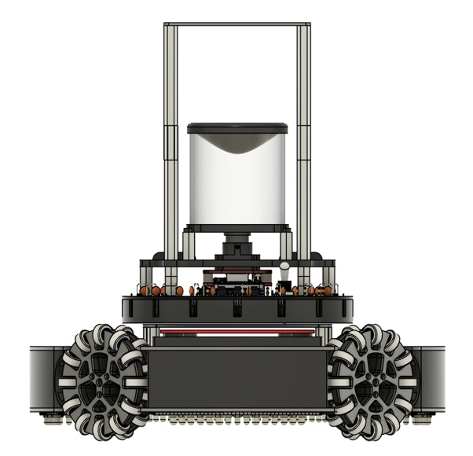

## Robot1 Top

*Robot 1 Top View*

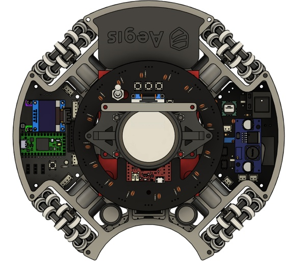

## Robot1 Bottom

*Robot 1 Bottom View*

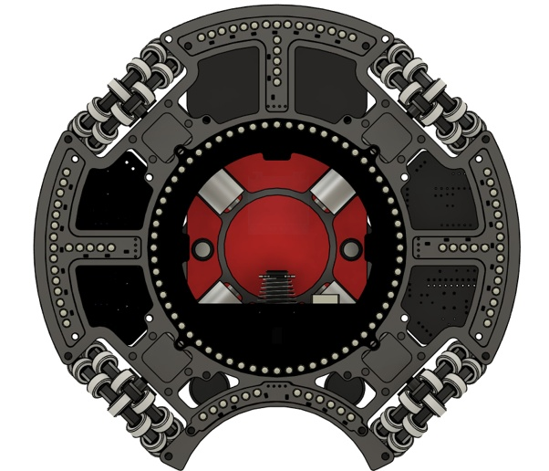

## Robot1 Right

*Robot 1 Right View*

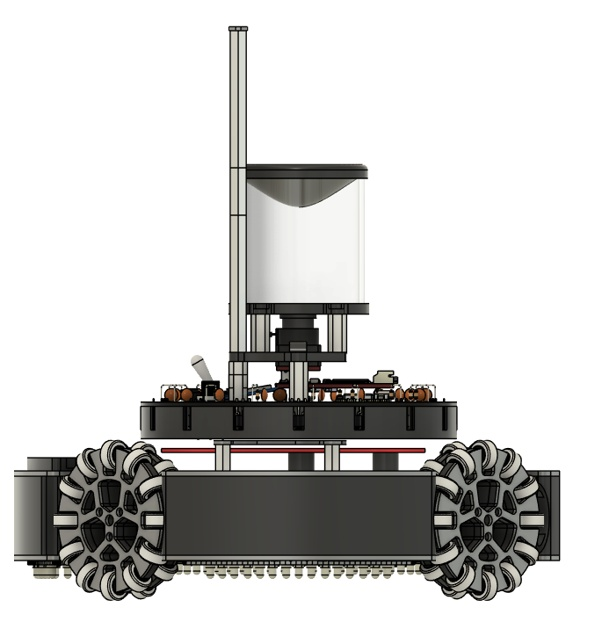

## Robot1 Left

*Robot 1 Left View*

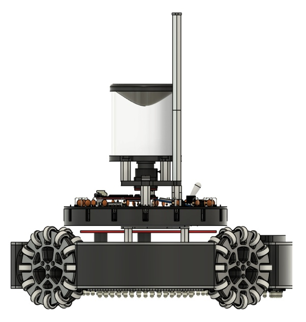

## Positioning & Movement

*How do you find your position inside the field and how do you use that position to move your robots around?*

By using a camera to calculate the direction toward the center of the court, we determine the robot’s approximate position within the field. Also, when the robot steps on the line, it moves toward the center of the court to prevent going out of bounds.

## Robot2 Overall

*Robot 2 Overall View*

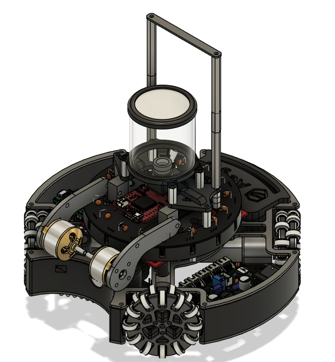

## Robot2 Front

*Robot 2 Front view*

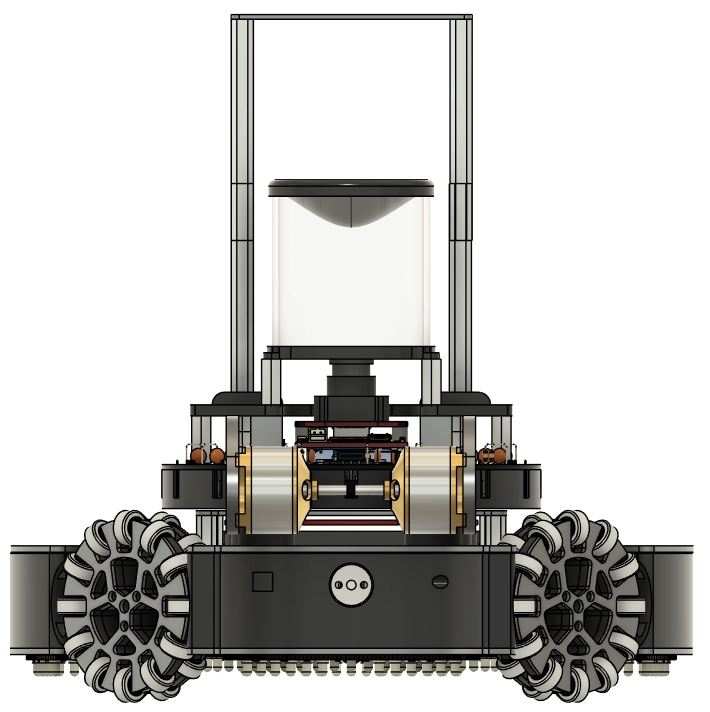

## Robot2 Back

*Robot 2 Back view*

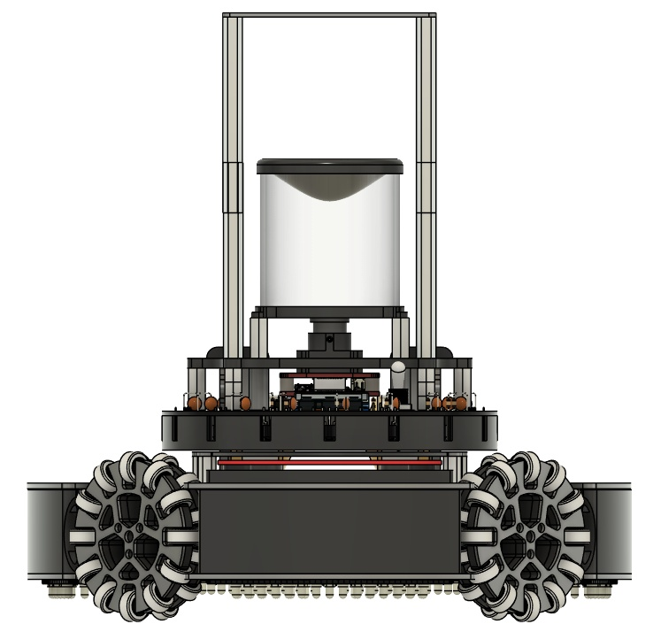

## Robot2 Top

*Robot 2 Top View*

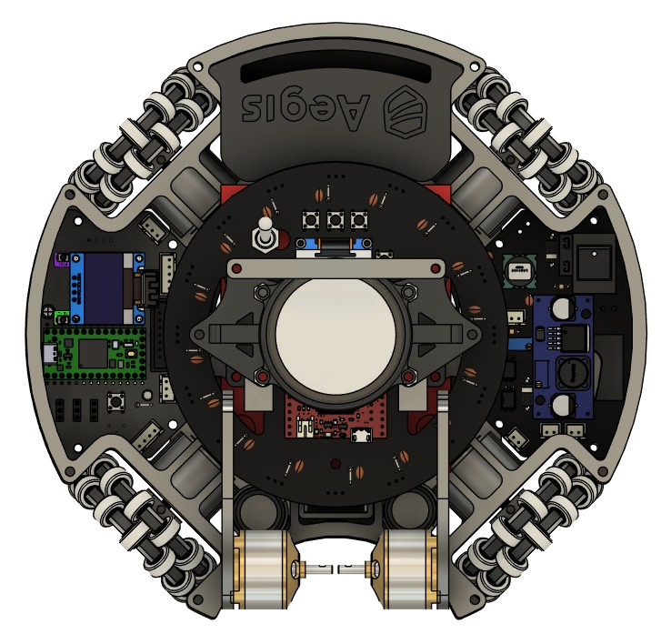

## Robot2 Bottom

*Robot 2 Bottom View*

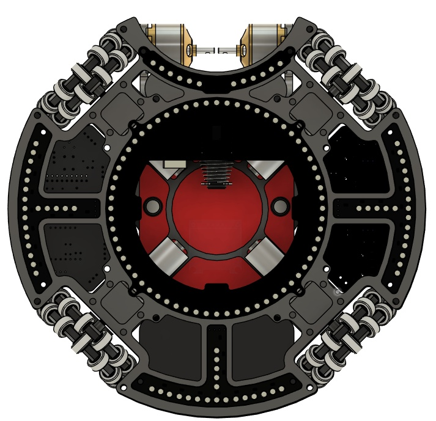

## Robot2 Right

*Robot 2 Right View*

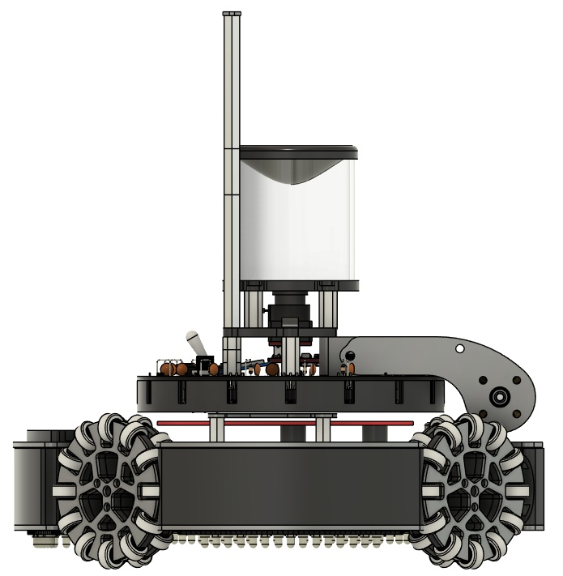

## Robot2 Left

*Robot 2 Left View*

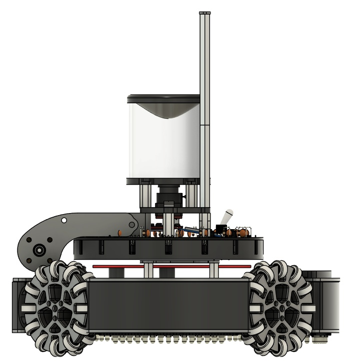

## Mechanical Design

*How did you design the mechanical parts of your robots?*

Autodesk Fusion was used to design the mechanical parts of the robot.
When designing the robot, our focus was on ease of maintenance. We kept the number of screws needed to secure the parts to a minimum, so the robot can be assembled with only a screwdriver. We also considered reducing the number of mechanical parts on the top of the robot to avoid interfering with the ball sensor or camera and hindering operation. To improve the design, we increased the robot's diameter, reduced the number of PCB boards, and made space for them.

## Build Method

*How did you build your design?*

The robot frame is manufactured using the school's CNC milling machine. Additionally, the school's 3D printer is used to produce small parts that are not commercially available. PCB boards are ordered from our sponsor, JLCPCB. The mirror was made by heat-pressing polyvinyl chloride (PVC) into a mold created with a 3D printer. Its field of view was expanded by adjusting the angle of the mirror.

## Motors & Reason

*How many motors have you used and why?*

Our robot has four motors, and each motor has an omni wheel. This lets the robot move in any direction without changing its direction.
By using four motors instead of three, the robot’s total torque increases, and its center of gravity becomes more stable while it is moving.
Also, we use large wheels on the robot so that the line sensor can react well and stay stable anywhere on the field.
We use duralumin for the frame of the omni wheels to make it stronger and more durable.
Moreover the part that connects to the motor is designed to be fixed with just one screw, so we can replace it easily.

## Kicker Design

*If your robot has a kicker, explain how you designed and built the mechanics of the kicker*

A solenoid was installed at half the height of the ball and a homemade attachment was attached to the tip of the shaft to more easily transmit the solenoid's impact to the ball.

## Dribbler Design

*If your robot has a dribbler, explain how you designed and built the mechanics of the dribbler.*

We used a brushless motor for the dribbler. To reduce the number of parts and secure the torque and rotation speed, the dribbler was designed without belts or gears. Additionally, the ball rotates from the top instead of the side, which improves holding power.

## CAD Files

*CAD design files*

https://github.com/MUNAKATA-EPC/Aegis_2025/tree/main/2025/Salvador/TDP/About%20Hardware

## Mechanical Innovation

*Mechanical Innovation*

The robot's sides were 3D-printed, and its frame is made of duralumin, which increases strength and makes mass production and replacement of parts easier. Magnets have been attached to the battery case, making it possible to quickly replace the battery. Additionally, the OLED display enables you to check sensor values in real time.

## Mechanical Photos

*Photos of your mechanical designs highlights*

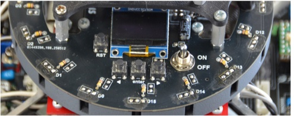
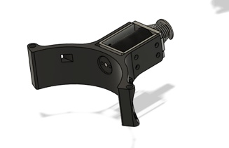
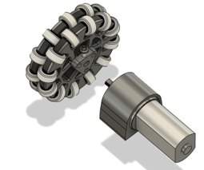
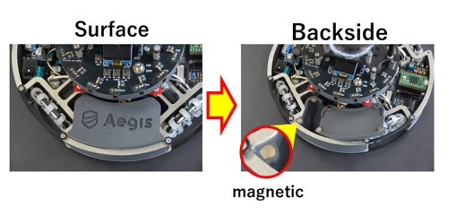

## Electronics Block Diagram

*Provide us with a block diagram of your robot's electronics*

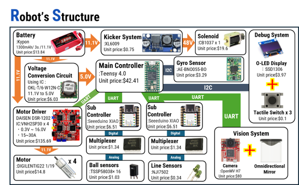

## Power Circuit

*How does your power circuits work?*

We use an 11.1V Li-po battery in our robot, and it powers the motor driver directly. Also, the DC-DC converter lowers the voltage to 5.0V for the microcontroller. Then, the regulator on the microcontroller board lowers it further to 3.3V for the sensors. Furthermore, the voltage is boosted from 11.1V to 48V for the kicker.

## Motor Drive Circuit

*How do you drive your motors? Explain the circuits you use for that*

We use a 4-channel motor controller from Daisen Electronics, and control the motors by UART communication with the main microcontroller.

## Microcontroller & Reason

*What kind of micro controller or board do you use for your robot? Why did you decide to use this part for your robot? If you have more than 1 processor, explain each one separately.*

We use Teency 4.0 as the main microcontroller because it has a fast processing speed, many digital and analog pins, and many serial ports. Also,for the sub microcontroller, we use Seeeduino XIAO because it is small, low cost, and compatible with Arduino. We use OpenMV for the camera because it is easy to install and has high accuracy.

## Ball Detection

*How does your ball detection sensors and/or camera[s] work?*

We use the TSSP58038 for the ball detection sensor, and it reads the same infrared wavelength as the pulse ball. We use OpenMV for the camera. By itself, it can only see 70 degrees, so we added a homemade mirror made of PVC. This lets the camera see from one end of the field to the other.

## Line Detection

*How does your line detection circuits work?*

The sensor detects the line by checking the change in analog values when it passes over a white line.

## Navigation/Position Sensors

*What sensors do you use for navigation and how are these sensors connected to your processor? What sensors do you use to find your position in the field? What about the direction your robot faces?*

Although the exact position is not determined, the robot roughly estimates its location based on the angle of the court.

## Kicker Circuit

*How do you drive your kicker system? How does the circuit make the kicker work?*

We use two FETs to charge a capacitor, and the stored electricity is sent to a solenoid to make it move.

## Dribbler Circuit

*How does your dribbler system work? What components and circuits did you use to drive it?*

We use a commercially available ESC to run the brushless motor for dribbling when the catch sensor detects the ball.

## Schematics

*Schematics of your robot*

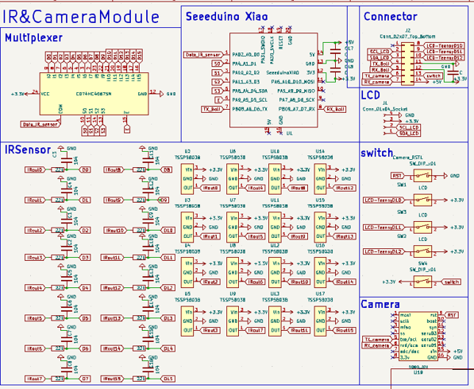
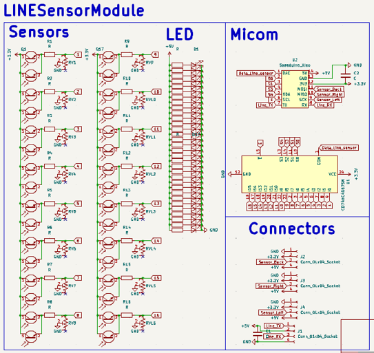
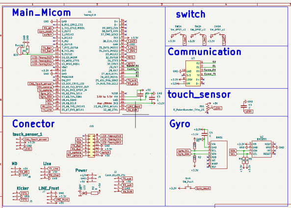
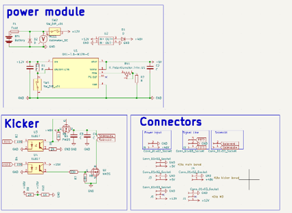
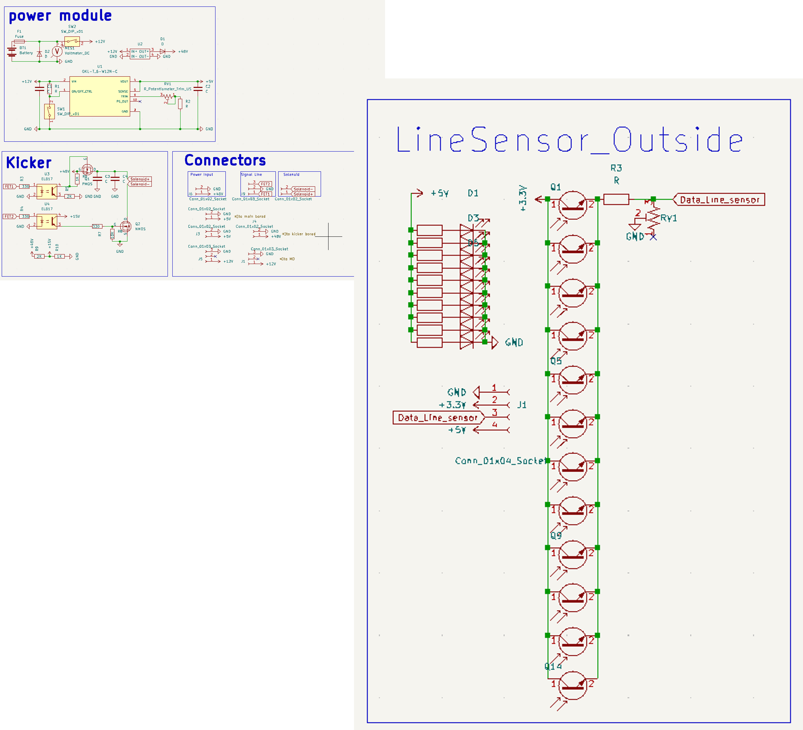

## PCB

*PCB of your robot*

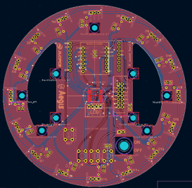
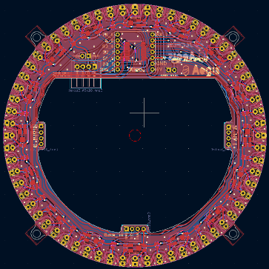
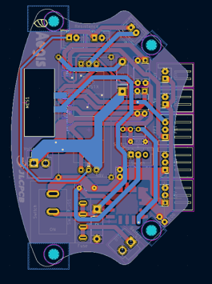
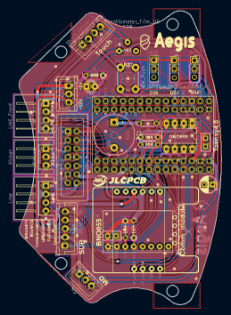
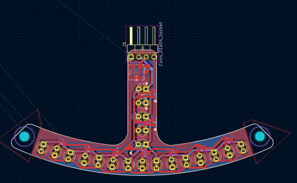

## Innovation

*Innovations*

What we are most proud of is that we were able to design a stable circuit in a limited space. In the past, the kicker board and the power supply board were manufactured separately. There were situations in which the kicker did not operate properly due to poor wiring connections. Combining them into one board eliminated poor contact and improved operational stability. However, combining them into a single board eliminated contact defects and improved operational stability.

## Circuit Photos

*Photo of your circuit boards highlights*

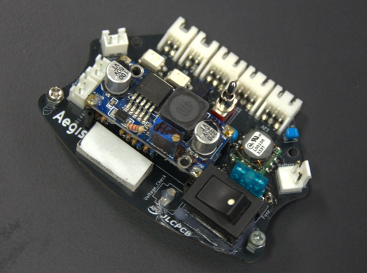
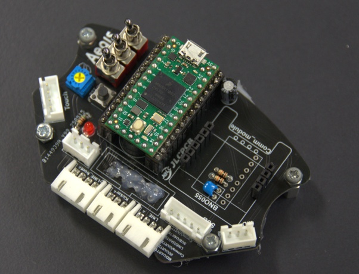
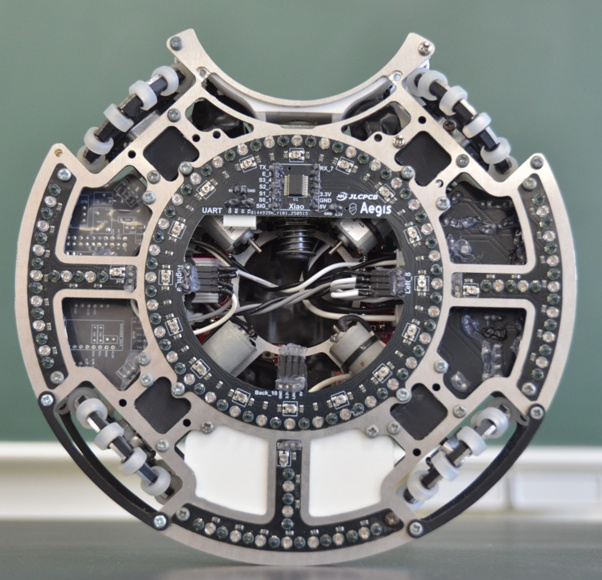
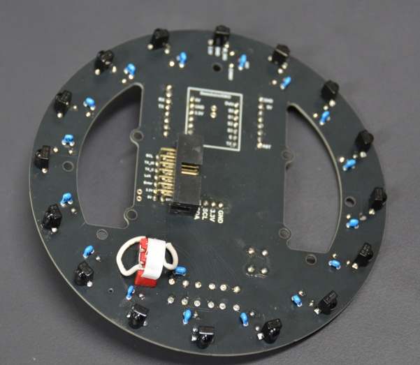

## Motor Control

*How do you use your processor to move your motors?*

Hardware: Teensy 4.0
Programming Language: C/C++
Library: Adafruit BNO055

The motor driver is controlled by sending signals from the Teensy 4.0 via UART communication. Additionally, PD control using a gyro sensor ensures that the robot consistently faces forward or toward the goal. We carefully fine-tuned the values of the P and D components little by little so that the robot could quickly orient itself forward.

For more details, please refer to the flowchart located at 
https://github.com/MUNAKATA-EPC/Aegis_2025/blob/main/2025/Salvador/TDP/About%20Software/gyro%20and%20motor.png on our GitHub.

## Ball Detection Method

*How do you find where the ball is? How do you read the data from the ball detection sensors or camera?*

Hardware: Seeeduino XIAO
programming language: C/C++
library: Not used

We use ball sensors to read analog values and calculate the ball's direction by combining the data from each sensor as vectors. Because the analog values fluctuated greatly, we were unable to calculate the angle accurately. To reduce these fluctuations, we also apply a moving average.
For more details, please refer to 
https://github.com/MUNAKATA-EPC/Aegis_2025/blob/main/2025/Salvador/TDP/About%20Software/IR.png on our GitHub

## Ball Catch Algorithm

*How does your algorithm work to catch the ball? Is there a difference between your robots in how they move towards the ball? Explain the differences.*

The two robots have the roles of attacker and keeper, respectively.
The attacker approaches the ball along the shortest path when the ball is far away. Once it gets closer, it switches its behavior based on the ball’s angle to guide the ball into the ball capture zone. 

On the other hand, the goalkeeper moves by line tracing along the line in front of the goal and is controlled to position itself on the straight line connecting the ball and the center of the goal.

Furthermore, when the ball enters the ball capture zone, the kicker is used to kick the ball. For more details, please refer to
https://github.com/MUNAKATA-EPC/Aegis_2025/blob/main/2025/Salvador/TDP/About%20Software/strategy.png on our GitHub.

## Line Algorithm

*How does your robot find the lines to stay inside the field? What algorithms do you use to avoid going out of bounds?*

Hardware: OpenMV
Programming Language: Python
Library: Not used

Using a camera, the direction toward the center of the court is calculated. When the line sensor detects a line, the robot moves in that direction to prevent going out of bounds. In the unlikely event that the camera does not function properly, the angle of approach to the circular line is calculated, and the robot is controlled to move in the opposite direction of that angle to return inside the court. As a result, the system is designed to prevent out-of-bounds in any situation.
For more details, please refer to the flowchart located at 
https://github.com/MUNAKATA-EPC/Aegis_2025/blob/main/2025/Salvador/TDP/About%20Software/camera.png on our GitHub.

## Goal Algorithm

*What algorithms do you use to score goals? How do you use your kicker and dribbler to handle the ball?*

The robot is equipped with a catch sensor in the ball capture zone. When the ball enters this zone, it turns toward the opponent’s goal direction calculated using a camera and kicks the ball with a kicker. We have designed the robot to be able to equip a dribbler, but it is not used in matches. We have installed the dribbler in preparation for situations where it may be required, such as during the Technical Challenge. The reason we do not use the dribbler during matches is that it can cause the ball to spin backward, which may create a disadvantageous situation during the game.

For more details, please refer to 
https://github.com/MUNAKATA-EPC/Aegis_2025/blob/main/2025/Salvador/TDP/About%20Software/strategy.png on our GitHub.

## Defense Algorithm

*What algorithms do you use to avoid the opponent team scoring? How do your robots defend your own goal?*

The goalkeeper robot smoothly moves along the line in front of the goal and positions itself on the straight line between the goal and the ball.
 For more details, please refer to the flowchart located at 
https://github.com/MUNAKATA-EPC/Aegis_2025/blob/main/2025/Salvador/TDP/About%20Software/strategy.png on our GitHub.

## Robot Communication

*Do your robots communicate with each other? How do you use this communication to your advantage?*

We don't use them.

## Innovation2

*Innovations*

We use a line sensor consisting of 16 sensors evenly arranged in a circular pattern, representing activated sensors using binary notation. By summing all the binary data and sending it to the main processor via serial communication, we can efficiently identify the positions of the activated sensors with a small amount of data.

For more details, please refer to 
https://github.com/MUNAKATA-EPC/Aegis_2025/tree/main/2025/Salvador/TDP/About%20Software/Innovations on our GitHub.

## GitHub Link

*GitHub link*

https://github.com/MUNAKATA-EPC/Aegis_2025

## BOM

*Bill of Materials (BOM)*

[https://drive.google.com/open?id=1u_ukv-OyOJ6ot4UmAVDcgOEOjU9EGZMJ_qIx9dW5Amc](https://drive.google.com/open?id=1u_ukv-OyOJ6ot4UmAVDcgOEOjU9EGZMJ_qIx9dW5Amc)

## Cost

*How much did it cost you to build your robots?*

Since we operate as a school club, we use the club’s tools to build the robot. Also, because we use second-hand robot parts from the club, we have spent very little of our own money. However, we paid personally only when ordering printed circuit boards (PCBs). In total, we placed PCB orders worth approximately $700.

## Funding

*How did you gathered the funds to build the robots?*

90% school
10% parents

## Affordability

*How affordable was it to compete in RoboCupJunior Soccer?*

6

## Answer Check

*Have you checked all of your answers?*

Yes!

## Publication Consent

*We publish TDPs and posters during or after the competition as described in the beginning*

Yes, we acknowledge everything submitted in the above form can be published.

## Email Address

*Email Address*

munakou.aegis@gmail.com

## TDP File

*TDP File Upload (Not required)*

## Extra Column

*Column 67*

