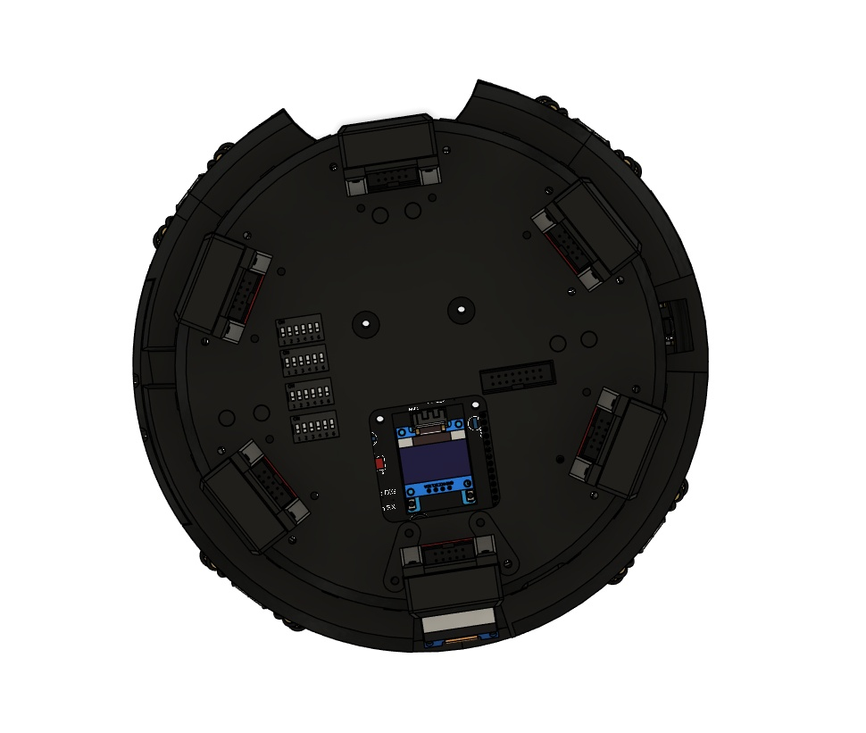
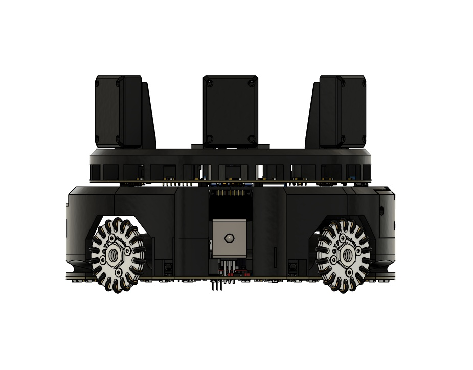
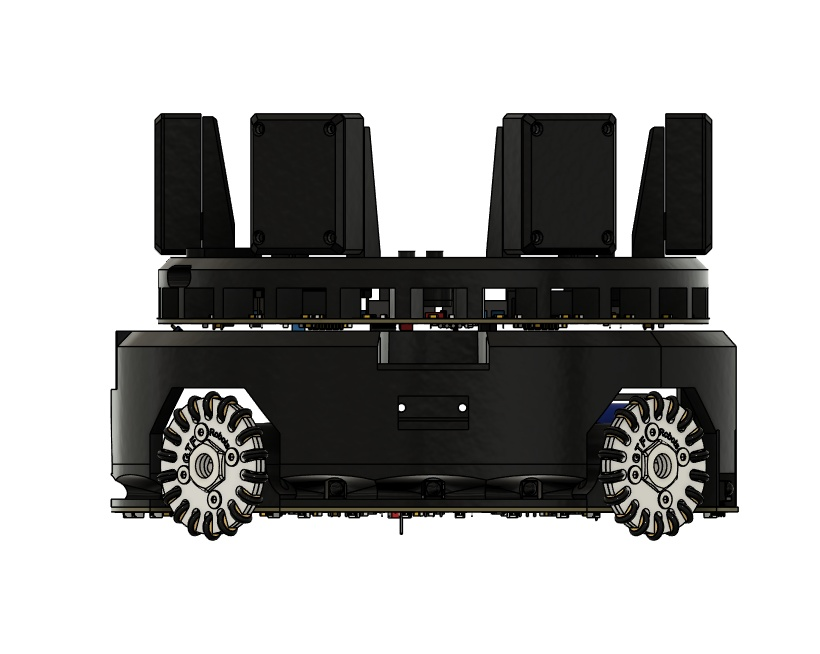
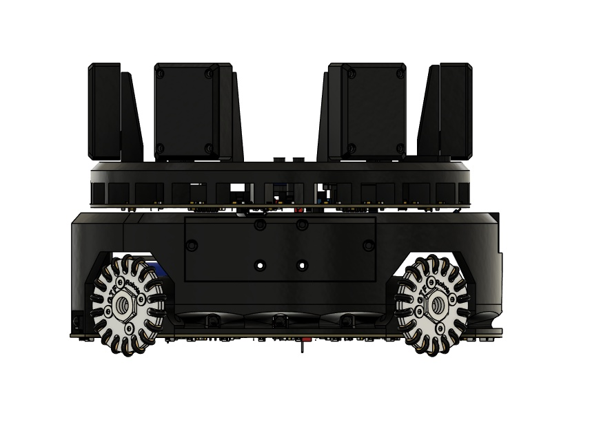
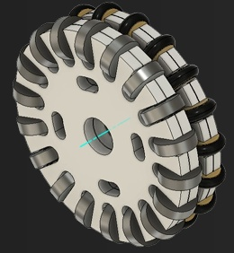
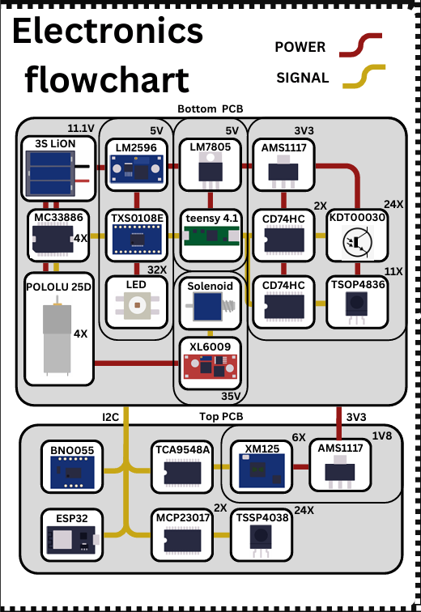
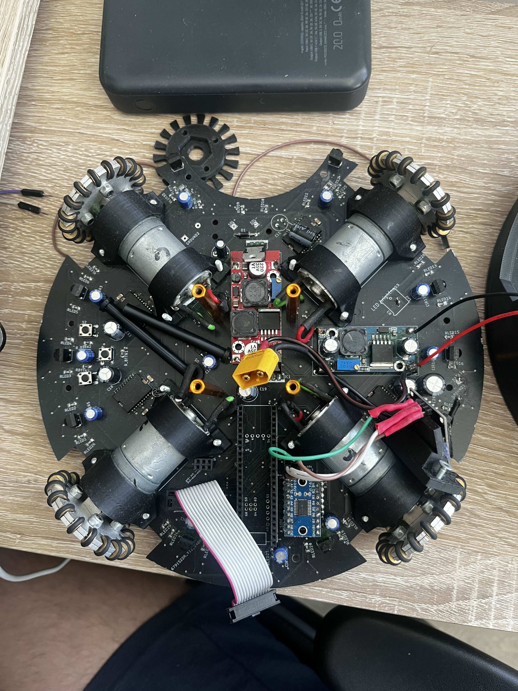

## Timestamp

*Timestamp*

7/12/2025 4:03:19

## Team Name

*What is your team's name?*

Mushrooms

## League

*What league do you participate in?*

Lightweight League

## Country

*Where are you from?*

Slovakia

## Contact

*If other teams have questions about your robot, now or in the future, what email address(es) can we publish along with this document for people to reach you?

(You can put in multiple email addresses, like multiple team members, an email for the whole team or both. Feel free to share other ways of communication like Discord handles)*

destinko497@gmail.com, kohaniova@spse-po.sk

## Social Media

*Team Social Media Links (if you have any)*

https://www.instagram.com/_the__shrooms__/

## Team Photo

*Upload a photo of your whole team with your mentor and robots

Note: This is not mandatory and will be published along with your TDP if you choose to upload something*

## Members & Roles

*What are the names of the team members and their role(s)?*

Matrin Zayonc :  Programming
Ema Lujza Kohániová: Electronics
Igor Višňovský: 3D models

## Meeting Frequency

*How often did your team meet?
(e.g. 90 minutes once per week or a day every weekend.)*

90 minutes twice per week

## Meeting Place

*Where did you meet to work on your robot?
(e.g. a robotics room at school, at some other place, one of your homes, school library etc.)*

at school, one of our homes

## Start Date

*When did your team start working on this year's robot?*

september 2024

## Past Competitions

*Which RoboCupJunior competitions have you competed in and in which leagues?*

slovak open 2023: On Stage, 
European Championship 2023: On Stage
slovak open 2024: soccer lightweight, 
European Championship 2024: Lightweight League
slovak open 2025: soccer lightweight, 
croatia open 2025: soccer lightweight

## Mentor Contribution

*Which parts of your work received the most contribution from your mentor?*

none

## Workload Management

*How did you manage the workload?*

we used Discord and met in school

## AI Tools

*Which AI tools did you use?*

ChatGPT

## Robot1 Overall

*Robot 1 Overall View*

## Robot1 Front

*Robot 1 Front view*

## Robot1 Back

*Robot 1 Back view*

## Robot1 Top

*Robot 1 Top View*

## Robot1 Bottom

*Robot 1 Bottom View*

## Robot1 Right

*Robot 1 Right View*

## Robot1 Left

*Robot 1 Left View*

## Positioning & Movement

*How do you find your position inside the field and how do you use that position to move your robots around?*

To help the robot find the goal and estimate its position, we fuse data from mmWave radars, ultrasonic sensors, and a gyroscope:
The BNO055 gyroscope tracks the robot’s orientation, giving real-time heading information.
Ultrasonic sensors measure distances to nearby objects or walls, helping infer relative position changes, though they’re used sparingly due to lower reliability.
mmWave radars provide more accurate and longer-range distance readings, especially useful for detecting fixed field structures like walls or goalposts—even in noisy or low-visibility conditions.
By combining this data using a lightweight sensor fusion method (similar to a Kalman filter), we can continuously estimate the robot’s position and orientation. This lets the robot recognize field boundaries and determine where the goal is, improving navigation and shot alignment during gameplay.

## Robot2 Overall

*Robot 2 Overall View*

## Robot2 Front

*Robot 2 Front view*

## Robot2 Back

*Robot 2 Back view*

## Robot2 Top

*Robot 2 Top View*

## Robot2 Bottom

*Robot 2 Bottom View*

## Robot2 Right

*Robot 2 Right View*

## Robot2 Left

*Robot 2 Left View*

## Mechanical Design

*How did you design the mechanical parts of your robots?*

We designed our robots’ mechanical parts in Fusion 360, enabling precise 3D modeling and component layout. Guided by RoboCup Soccer Lightweight league rules, we focused on size, weight, and mobility to create a compact, modular design for easier maintenance and upgrades. Key considerations included motor placement for traction, sensor positioning for clear vision, low center of mass for stability, and efficient cable routing.
After initial tests, we redesigned the frame for better access to internal components, reducing setup time. Sensor placement was optimized to eliminate blind spots, and later iterations included standardized parts and mounting slots to support future modifications. These improvements were driven by testing and real-match observations.

## Build Method

*How did you build your design?*

We built our design using a mix of 3D printing, hand tools, and external manufacturing. Most of the structure was made with FDM printers using PLA and PETG, enabling rapid prototyping and custom part assembly. Basic tools like drills and files allowed for on-the-fly adjustments during the build.
Custom PCBs were produced by JLCPCB from our Gerber files, ensuring seamless integration with the mechanical layout. Minor issues such as tight clearances or misaligned holes were fixed through quick tweaks in Fusion 360 and reprints. This iterative approach led to a clean and reliable final build.

## Motors & Reason

*How many motors have you used and why?*

We chose a four-motor setup to enable full omnidirectional movement—forward, backward, sideways, and rotation—by independently controlling each wheel. This configuration provides the flexibility and precision needed for fast, responsive repositioning during RoboCup Soccer matches.
It allows smooth movement even in tight or unpredictable situations, such as avoiding opponents or approaching the ball from different angles. Using fewer than four motors would reduce mobility, while more would add unnecessary complexity and weight. Four motors offered the best balance of performance, control, and simplicity for our goals.

## Kicker Design

*If your robot has a kicker, explain how you designed and built the mechanics of the kicker*

N/A

## Dribbler Design

*If your robot has a dribbler, explain how you designed and built the mechanics of the dribbler.*

N/A

## CAD Files

*CAD design files*

https://github.com/destinko497/robot-2025-robocup-junior-soccer-lightweight

## Mechanical Innovation

*Mechanical Innovation*

Our robot uses a dual omni-wheel setup that blends the strengths of both 3D-printed and CNC-machined components. Initially, we used fully 3D-printed wheels for their low cost and easy prototyping, but they suffered from weak rollers and limited axle durability. In 2024, we upgraded to CNC-machined aluminum omni-wheels for improved strength and precision—but found they lacked traction during fast direction changes.
To address this, we created a hybrid dual-layer design by mounting custom 3D-printed wheels directly onto the CNC wheels. This solution combines the durability and stability of machined parts with the grip and flexibility of 3D-printed materials, resulting in more reliable movement and improved control during RoboCup matches.

## Mechanical Photos

*Photos of your mechanical designs highlights*

## Electronics Block Diagram

*Provide us with a block diagram of your robot's electronics*

## Power Circuit

*How does your power circuits work?*

Our robot is powered by a custom 3S LiPo battery (11.1V nominal), which directly supplies the motors. From this main source, two voltage regulators distribute power to the rest of the system:
An  LM2596 buck converter  steps the voltage down to 5V for the LEDs, offering efficient, low-heat power delivery.
An  LM7805 linear regulator  provides a clean and stable 5V specifically for the Teensy microcontroller, prioritizing voltage stability over efficiency.
From the LM2596’s 5V output, an  AMS1117 regulator  reduces the voltage to 3.3V for sensors. That 3.3V line is then stepped down to 1.8V using an LD1117 regulator  for the mmWave radars. This multi-stage power system ensures each component receives the correct voltage for reliable performance.

## Motor Drive Circuit

*How do you drive your motors? Explain the circuits you use for that*

We control our brushed DC motors using **MC33886 motor driver ICs**, which manage both power delivery and direction. The **Teensy 4.1** generates **PWM signals** to control motor speed with precision. Since the Teensy operates at **3.3V logic**, these signals are passed through an **8-channel logic level converter** to shift them to **5V**, matching the input requirements of the MC33886 drivers.
The motor drivers convert the 5V PWM signals into variable voltage and current outputs, enabling smooth and accurate speed and direction control. This approach allows for responsive, real-time movement—crucial for effective navigation and agility during RoboCup matches.

## Microcontroller & Reason

*What kind of micro controller or board do you use for your robot? Why did you decide to use this part for your robot? If you have more than 1 processor, explain each one separately.*

For RoboCup, we use the Teensy 4.1 as the main microcontroller due to its high processing speed and extensive I/O capabilities, which enable efficient sensor handling, motor control, and real-time movement calculations.
The ESP32, located on the top PCB, is dedicated to wireless communication during matches. It allows the robot to send and receive data without interfering with the Teensy’s core control tasks. While the ESP32 can also interface with peripherals like a robotic arm, that functionality is reserved for other projects and not used during RoboCup.

## Ball Detection

*How does your ball detection sensors and/or camera[s] work?*

We use 11 TSOP3836 infrared sensors on the bottom PCB for ball detection, with their signals routed through a multiplexer. This lets the Teensy 4.1 efficiently read multiple sensor inputs using only a few pins.
On the top PCB, we have 24 TSSP4038 sensors connected via two MCP23017-E/SO I/O expanders, which communicate with the Teensy over the I2C bus. This setup minimizes wiring between the boards and allows the Teensy to read all sensors simultaneously, improving detection accuracy and providing full-field coverage for reliable ball tracking.

## Line Detection

*How does your line detection circuits work?*

Our line detection system uses 24 SMD phototransistors arranged around the robot to detect contrast between the green field and white lines. Each is part of a voltage divider circuit that converts light intensity into a measurable voltage signal.

To improve accuracy, we pair these sensors with 38 red LEDs that illuminate the area directly beneath them, enhancing the contrast between white lines and green turf. The sensor outputs are routed through two multiplexers, allowing the Teensy 4.1 to read all signals efficiently using fewer input pins. This setup provides fast, precise line detection with minimal wiring complexity.

## Navigation/Position Sensors

*What sensors do you use for navigation and how are these sensors connected to your processor? What sensors do you use to find your position in the field? What about the direction your robot faces?*

For navigation and positioning, we use mmWave radar sensors connected to the Teensy 4.1 via a TCA9548APWR I2C multiplexer, which allows multiple radars to operate on the same bus without address conflicts. These sensors provide reliable, real-time obstacle detection and environmental mapping.
To track the robot’s orientation, we use a BNO055 gyroscope and orientation sensor over I2C, which delivers accurate yaw, pitch, and roll data—crucial for maintaining stable direction during movement.

## Kicker Circuit

*How do you drive your kicker system? How does the circuit make the kicker work?*

N/A

## Dribbler Circuit

*How does your dribbler system work? What components and circuits did you use to drive it?*

N/A

## Schematics

*Schematics of your robot*

[https://drive.google.com/open?id=18ejxGKSN2AKtMLplwKlzsPGS4TX2NGVx](https://drive.google.com/open?id=18ejxGKSN2AKtMLplwKlzsPGS4TX2NGVx)
[https://drive.google.com/open?id=1Jq9QM39j54jGcYIVvKPcgA8yKbxfrR9u](https://drive.google.com/open?id=1Jq9QM39j54jGcYIVvKPcgA8yKbxfrR9u)
[https://drive.google.com/open?id=112fU_hK6X083JH58dBmAXbu5hAgHJqI-](https://drive.google.com/open?id=112fU_hK6X083JH58dBmAXbu5hAgHJqI-)

## PCB

*PCB of your robot*

[https://drive.google.com/open?id=1GgLLtTSQHodsNOQ46BL1GzEtPlOrJduH](https://drive.google.com/open?id=1GgLLtTSQHodsNOQ46BL1GzEtPlOrJduH)
[https://drive.google.com/open?id=1A3PpM5820lgaG3D5WiawG7ulbrpbUJlr](https://drive.google.com/open?id=1A3PpM5820lgaG3D5WiawG7ulbrpbUJlr)

## Innovation

*Innovations*

The part of our electronics we’re most proud of is the integration of mmWave radar sensors for mapping and navigation. Compared to more common sensors like ultrasonics or IR, mmWave radars offer higher precision, greater reliability in variable lighting, and strong resistance to environmental noise. This allows our robot to detect walls and obstacles with exceptional accuracy, even under the fast-paced and unpredictable conditions of RoboCup matches. Another key innovation is our modular electronics design. We split the system into two PCBs: the bottom PCB contains the Teensy microcontroller, power circuits, and motor drivers—serving as the robot’s brain and core infrastructure. The top PCB is a modular, swappable unit that connects via a simple interface and can be easily upgraded or customized. This modularity speeds up development and troubleshooting while allowing us to adapt the robot for different tasks beyond RoboCup, such as adding new sensors or robotic arms, without overhauling the entire system.

## Circuit Photos

*Photo of your circuit boards highlights*

## Motor Control

*How do you use your processor to move your motors?*

We use the Teensy 4.1 microcontroller to control our motors by generating PWM (Pulse Width Modulation) signals that determine motor speed and direction. These PWM signals are first passed through an 8-channel logic level converter, which shifts the 3.3V signals from the Teensy to 5V, making them compatible with our MC33886 motor driver ICs.

## Ball Detection Method

*How do you find where the ball is? How do you read the data from the ball detection sensors or camera?*

We use 11 TSOP3836 IR sensors on the bottom PCB and 24 TSSP4038 IR sensors on the top PCB to detect the RoboCup ball’s modulated IR signal. The TSOP sensors connect through a multiplexer, while the TSSP sensors link via two MCP23017 I/O expanders communicating with the Teensy 4.1 over I2C, enabling efficient, low-wiring data reading.
Each sensor is assigned a fixed angle based on its position. When multiple sensors detect the ball, we compute a vector average of their angles weighted by signal strength. This provides a smooth, accurate estimate of the ball’s direction, allowing the robot to track and approach it effectively in real time.

## Ball Catch Algorithm

*How does your algorithm work to catch the ball? Is there a difference between your robots in how they move towards the ball? Explain the differences.*

Your algorithm smartly combines sensor data with motion control for effective ball tracking and scoring. Here’s a concise summary:
The robot first calculates the ball’s direction using vector averaging from active IR sensors. It then rotates to face the ball and drives toward it, adjusting speed based on distance and angle. As it nears the ball, it slows down to maintain control and prevent the ball from bouncing away.
Simultaneously, the robot attempts to align its orientation toward the opponent’s goal during the approach, enabling quicker and more accurate shots once it gains control of the ball. This adaptive and coordinated strategy is consistently applied across all your robots.

## Line Algorithm

*How does your robot find the lines to stay inside the field? What algorithms do you use to avoid going out of bounds?*

Your robot is equipped with 24 SMD phototransistors arranged around its base to sense the white field lines, enhanced by 38 red LEDs that improve contrast against the green turf. Each phototransistor is wired in a voltage divider circuit, and their signals are read via two multiplexers by the Teensy 4.1 microcontroller, providing 360° coverage for precise line detection.
To interpret the sensor data, you use an approach similar to ball detection: each sensor is assigned a fixed angle based on its position. When multiple sensors detect the line, you calculate a vector average of these angles to estimate the line’s direction relative to the robot. This directional estimate helps the robot understand its proximity to the field boundaries.
Based on this information, the robot adjusts its movement to avoid leaving the field—slowing down, stopping, or reversing as needed—while still prioritizing ball tracking and overall gameplay.

## Goal Algorithm

*What algorithms do you use to score goals? How do you use your kicker and dribbler to handle the ball?*

We don’t rely on a single fixed algorithm to score goals—instead, we use our own custom strategy that adapts to the situation on the field. The robot constantly tracks the ball using vector averaging from the IR sensors and attempts to align itself with both the ball and the opponent's goal. When the alignment is close enough and the ball is centered, the robot activates the kicker, which is powered by a solenoid circuit boosted to 35V, to shoot the ball toward the goal.

## Defense Algorithm

*What algorithms do you use to avoid the opponent team scoring? How do your robots defend your own goal?*

N/A

## Robot Communication

*Do your robots communicate with each other? How do you use this communication to your advantage?*

N/A

## Innovation2

*Innovations*

The algorithm we’re most proud of is our custom mapping and localization system, designed specifically for microcontrollers like the Teensy 4.1. It combines data from multiple mmWave radars and a BNO055 gyroscope to estimate the robot’s real-time position and orientation on the field.
Unlike traditional SLAM algorithms—which are often too resource-intensive for microcontrollers—our solution is lightweight, fast, and optimized for the constraints of RoboCup. The mmWave radars detect nearby walls and structures, while the gyroscope provides continuous orientation data. By fusing this information, we can accurately track the robot’s location relative to the field boundaries.
This efficient, low-overhead approach allows the robot to navigate more intelligently, especially in fast-paced or crowded scenarios, giving us a clear competitive edge during matches.

## GitHub Link

*GitHub link*

https://github.com/destinko497/robot-2025-robocup-junior-soccer-lightweight

## BOM

*Bill of Materials (BOM)*

[https://drive.google.com/open?id=1sswIfP9QfKlgVXfVCdqgJ03GWl7_asxb](https://drive.google.com/open?id=1sswIfP9QfKlgVXfVCdqgJ03GWl7_asxb)

## Cost

*How much did it cost you to build your robots?*

Robots (cost of components that are in your robots right now): 800 Euro each
Experiments (failed builds, broken hardware etc.): 2000 Euro
Environment (fields, balls, etc.) : 70 Euro
1 Euro= 1.17 USD

## Funding

*How did you gathered the funds to build the robots?*

65% parents
35%school

## Affordability

*How affordable was it to compete in RoboCupJunior Soccer?*

2

## Answer Check

*Have you checked all of your answers?*

Yes!

## Publication Consent

*We publish TDPs and posters during or after the competition as described in the beginning*

Yes, we acknowledge everything submitted in the above form can be published.

## Email Address

*Email Address*

kohaniova@spse-po.sk

## TDP File

*TDP File Upload (Not required)*

## Extra Column

*Column 67*

