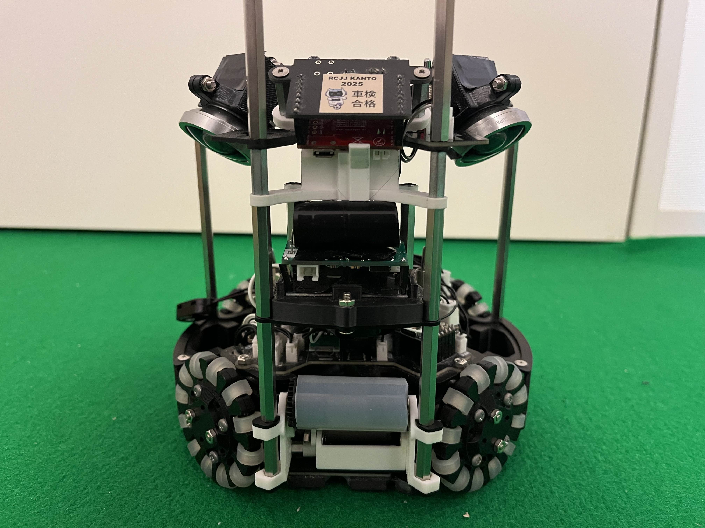
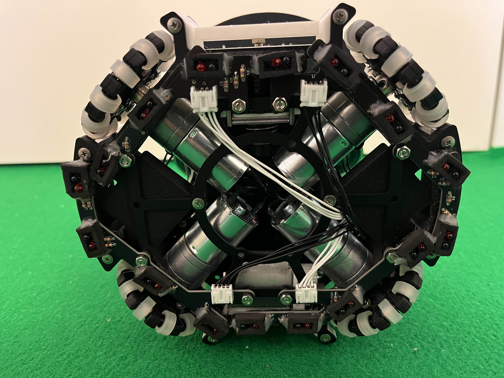
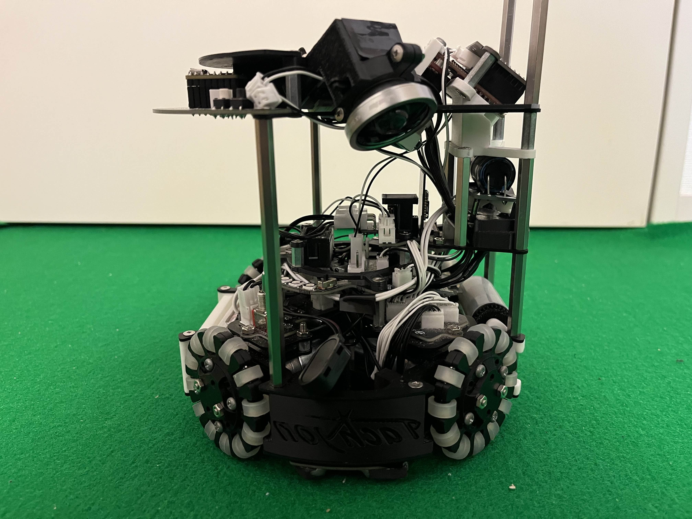
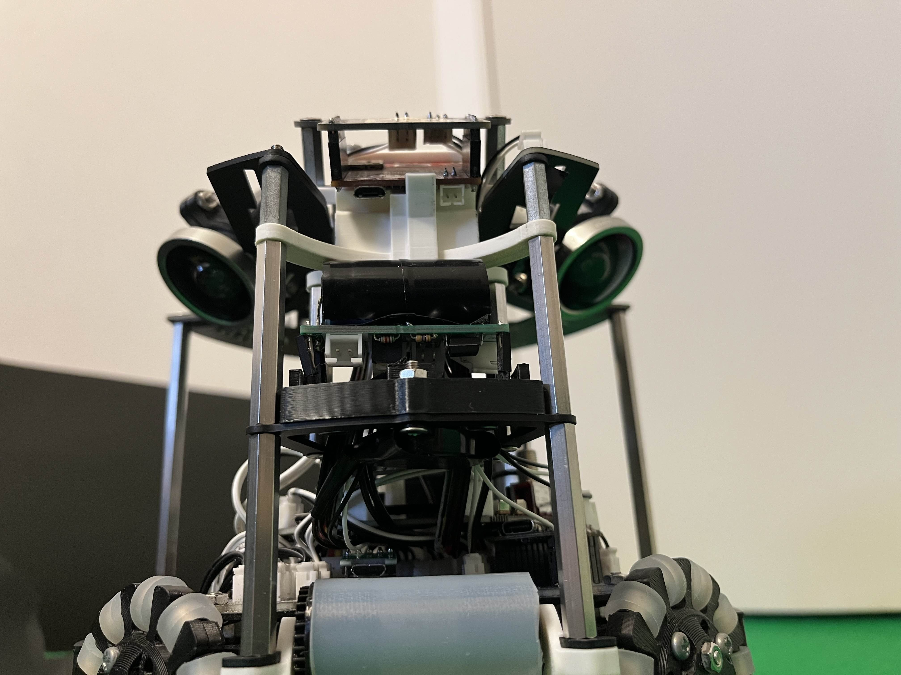
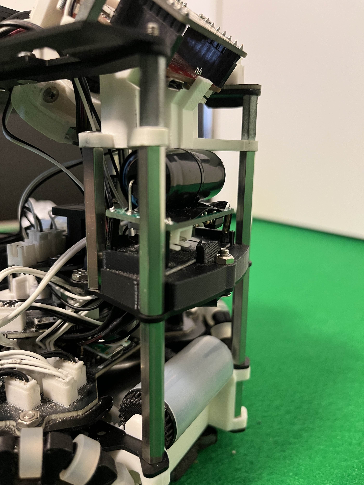
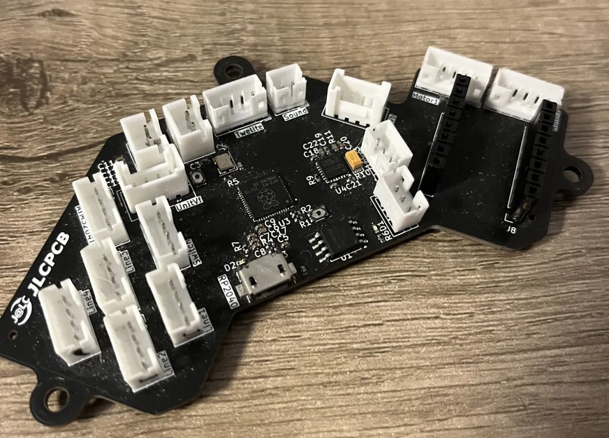

## Timestamp

*Timestamp*

7/13/2025 2:26:35

## Team Name

*What is your team's name?*

Tachyon

## League

*What league do you participate in?*

Open League

## Country

*Where are you from?*

Japan

## Contact

*If other teams have questions about your robot, now or in the future, what email address(es) can we publish along with this document for people to reach you?

(You can put in multiple email addresses, like multiple team members, an email for the whole team or both. Feel free to share other ways of communication like Discord handles)*

Team Member
Yo Nakano : skypeto2023@icloud.com
Yu Nakano : nakano1419@icloud.com
Whole Team
tachyon.rcj2025@gmail.com

## Social Media

*Team Social Media Links (if you have any)*

Website : https://tabitostudio.github.io/TachyonRCJ-jp/
X(Twitter) : https://x.com/Tachyon_robo
YouTube : https://www.youtube.com/@TachyonRCJ

## Team Photo

*Upload a photo of your whole team with your mentor and robots

Note: This is not mandatory and will be published along with your TDP if you choose to upload something*

## Members & Roles

*What are the names of the team members and their role(s)?*

Yo Nakano : Programming and modeling
Yu Nakano : Programming, circuit and PCB design

## Meeting Frequency

*How often did your team meet?
(e.g. 90 minutes once per week or a day every weekend.)*

60 minutes every Friday night

## Meeting Place

*Where did you meet to work on your robot?
(e.g. a robotics room at school, at some other place, one of your homes, school library etc.)*

There is a distance of 900 kilometers between team members, so we rarely meet. We meet once every few months for friendly matches hold by our friends or when we visit home, we work together.

## Start Date

*When did your team start working on this year's robot?*

In March 2024

## Past Competitions

*Which RoboCupJunior competitions have you competed in and in which leagues?*

Japan Open 2022: Lightweight League
Japan Open 2023: Open League

## Mentor Contribution

*Which parts of your work received the most contribution from your mentor?*

There was no technical guidance from our mentor. We received advice from our mentor regarding fundraising for competition participation.

## Workload Management

*How did you manage the workload?*

We communicated on Discord and LINE. Also, we managed tasks and schedule in Notion and edit the robot's program together on GitHub.

## AI Tools

*Which AI tools did you use?*

We used Chat-GPT and Copilot to suggest programs that would realize the algorithms we though. Also, we used GitHub Copilot to do programing more quickly and efficiently.

## Robot1 Overall

*Robot 1 Overall View*

## Robot1 Front

*Robot 1 Front view*

## Robot1 Back

*Robot 1 Back view*

## Robot1 Top

*Robot 1 Top View*

## Robot1 Bottom

*Robot 1 Bottom View*

## Robot1 Right

*Robot 1 Right View*

## Robot1 Left

*Robot 1 Left View*

## Positioning & Movement

*How do you find your position inside the field and how do you use that position to move your robots around?*

The robot estimates its position on the field by getting color components from 160 specified points from the camera. Specifically, the robot gets 16 vectors that indicate how far the field extends in 16 directions around the robot. The robot calculates its relative position from the center of the field using the direction and magnitude of the synthetic vector of these vectors.
The robot uses the estimated position to move to the center of the field when it is an attacker and loses sight of the ball, or to move in front of own goal when it is a keeper.

## Robot2 Overall

*Robot 2 Overall View*

## Robot2 Front

*Robot 2 Front view*

## Robot2 Back

*Robot 2 Back view*

## Robot2 Top

*Robot 2 Top View*

## Robot2 Bottom

*Robot 2 Bottom View*

## Robot2 Right

*Robot 2 Right View*

## Robot2 Left

*Robot 2 Left View*

## Mechanical Design

*How did you design the mechanical parts of your robots?*

I used Fusion 360. I designed the outline of the part onto the sketch, matched the coordinates of the new part and the screw holes, and after export the part, I constrained the part to another part and the screw holes to actually assemble the parts while designing.
Because the camera is mounted high up looking down, we took great care in the design to ensure that no parts would obstruct the camera's view.
We found that some screws were difficult to remove when disassembling the robot, so we changed the shape of the frame to make it easier to access the screws with a screwdriver.

## Build Method

*How did you build your design?*

The parts that could be printed on a 3D printer were produced by a team member using a 3D printer, Ender 3 V3 KE. Metal parts that required CNC manufacturing were produced by JLCPCB (JLCCNC), and printed circuit boards were produced by JLCPCB.
For complex 3D printed parts, we adjusted their shapes to make it as easy as possible to attach support material and make them stable during printing.

## Motors & Reason

*How many motors have you used and why?*

Our robot is equipped with four motors per a robot for locomotion. This design allows us to easily calculate the speed of each motor when moving in any arbitrary direction, by positioning the motors perpendicular to the robot's sides at 90-degree intervals and using vector and trigonometric principles.
Furthermore, we utilized omni wheels for the tires. This enables the robot to move in any direction using just four wheels.
The tires themselves are constructed using 3D-printed wheels and side rollers, along with silicone tubing and shafts.

## Kicker Design

*If your robot has a kicker, explain how you designed and built the mechanics of the kicker*

The voltage boosted by the boost converter is applied to the solenoid when kicking.

## Dribbler Design

*If your robot has a dribbler, explain how you designed and built the mechanics of the dribbler.*

I sketched the cross section of the dribbler in Fusion 360 and designed it while checking where the rollers should be placed and how large the gears could be placed.

## CAD Files

*CAD design files*

## Mechanical Innovation

*Mechanical Innovation*

Our most innovative feature is the new vision system, built using three cameras equipped with fisheye and wide-angle lenses. While it's common to explore four directions with four cameras, or to survey the robot's surroundings with one camera and a conical mirror, our robot utilizes three cameras for ball detection. By using fisheye and wide-angle lenses, it gains a broader field of view, allowing it to cover the robot's surroundings comprehensively. This vision system received high praise at the Japan Competition.

## Mechanical Photos

*Photos of your mechanical designs highlights*

## Electronics Block Diagram

*Provide us with a block diagram of your robot's electronics*

## Power Circuit

*How does your power circuits work?*

The robot uses 12.8V, supplied by eight Ni-Zn batteries with a nominal voltage of 1.6V each connected in series. This voltage is directly utilized by the motor driver. Furthermore, a switching regulator supplies 3.3V to the RP2040 and OpenMV, and 5.0V to the UnitV-M12 and ATmega32U4.

## Motor Drive Circuit

*How do you drive your motors? Explain the circuits you use for that*

The motor operates using an IC called DRV8874.

## Microcontroller & Reason

*What kind of micro controller or board do you use for your robot? Why did you decide to use this part for your robot? If you have more than 1 processor, explain each one separately.*

The robot features two microcontrollers: the RP2040 and the ATmega32U4. We chose the RP2040 because it offers versatile pin configurations, including PWM output, digital input, and serial communication. Its multi-core architecture also enables parallel processing. The ATmega32U4 was selected for its ability to connect directly to a USB connector without needing an external serial conversion IC, which simplifies the surrounding circuitry. Both of these microcontrollers also have the advantage of being programmable in a manner similar to the popular Arduino microcontroller boards.

## Ball Detection

*How does your ball detection sensors and/or camera[s] work?*

Beforehand, we extract the ball's color components while observing the scene from the camera and record them in the source code. Based on this, the camera extracts colors similar to it from within its view, and then transmits the area of that region and its relative angle to the robot's processor.

## Line Detection

*How does your line detection circuits work?*

Red LEDs shines red light onto the floor, and a light sensor converts the amount of reflected light into an electrical signal. This signal's value is read by a microcontroller. If the value exceeds a threshold, it's determined that the line sensor has reacted.

## Navigation/Position Sensors

*What sensors do you use for navigation and how are these sensors connected to your processor? What sensors do you use to find your position in the field? What about the direction your robot faces?*

The robot moves using a gyro sensor to maintain a constant direction as its reference orientation. It acquires the color distribution of the field from its cameras and uses this information to roughly estimate its position within the field. Additionally, it uses ultrasonic sensors to measure its distance from walls, determining whether the robot is near a wall or in the center.

## Kicker Circuit

*How do you drive your kicker system? How does the circuit make the kicker work?*

We use a boost converter to increase the voltage, store it in an electrolytic capacitor, and then apply a signal to a MOSFET to discharge the electricity, thereby operating the solenoid.

## Dribbler Circuit

*How does your dribbler system work? What components and circuits did you use to drive it?*

The motor driver rotates the motor, which increases torque using gears. This rotation then drives rollers, and these rollers, in turn, impart rotation to the ball.

## Schematics

*Schematics of your robot*

## PCB

*PCB of your robot*

## Innovation

*Innovations*

We divided the PCBs used in the robot according to their functions. This not only minimizes the impact on other areas in the event of an electrical failure in one PCB but also leads to a reduction in PCB replacement costs.

## Circuit Photos

*Photo of your circuit boards highlights*

## Motor Control

*How do you use your processor to move your motors?*

The motor control uses a DRV8874 and an RP2040. Each motor is controlled by one digital input from the RP2040, which sets the direction, and one PWM input, which indicates the speed.

## Ball Detection Method

*How do you find where the ball is? How do you read the data from the ball detection sensors or camera?*

The robot uses three onboard cameras to search for the color of the ball. From each camera, it obtains the direction where the ball's color is present and the size of the blob of the ball's color. The location where this area is largest is then taken as the estimated position of the ball

## Ball Catch Algorithm

*How does your algorithm work to catch the ball? Is there a difference between your robots in how they move towards the ball? Explain the differences.*

The robot moves in a direction determined by multiplying the estimated relative angle of the ball to the robot by a certain number. This number varies with the distance between the robot and the ball, ranging from 1.2 to 1.5, and increases as the distance to the ball decreases.

## Line Algorithm

*How does your robot find the lines to stay inside the field? What algorithms do you use to avoid going out of bounds?*

The robot detects white lines by emitting red light from its underside and measuring the amount of reflected light. Upon detecting a white line, the robot moves in the direction of the estimated center of the field, calculated from the distribution of court colors in the camera's view.

## Goal Algorithm

*What algorithms do you use to score goals? How do you use your kicker and dribbler to handle the ball?*

The robot faces the opponent's goal as long as it is visible and kicks the ball in that direction. If the ball is captured by the dribbler, the robot moves towards the goal, and when the distance to the goal reaches a certain threshold, the robot rotates its body and scores by using the remaining spin on the ball.

## Defense Algorithm

*What algorithms do you use to avoid the opponent team scoring? How do your robots defend your own goal?*

Moving along the white line in front of the goal, the robot defends the goal by positioning itself between the ball and the goal.

## Robot Communication

*Do your robots communicate with each other? How do you use this communication to your advantage?*

The robots communicate with each other using a module called TWE-LITE UART. This communication is used for the robots to switch between attacker mode and defense mode.

## Innovation2

*Innovations*

Algorithm for Integrating Camera Information and Estimating Ball Position
This is an algorithm that integrates information from three cameras to determine the estimated position of the ball. Each of the three cameras is located at a different position and operates independently. As a method for integrating the information from these three cameras, we focused on the size of the area where the ball's color is visible in each camera. Trusting the information from the camera showing the largest area of the ball's color is largely consistent with the color detection method performed by each individual camera. In essence, we have successfully integrated the fields of view programmatically.

## GitHub Link

*GitHub link*

https://github.com/Tachyon-RCJ/Robot_code_world

## BOM

*Bill of Materials (BOM)*

[https://drive.google.com/open?id=1s85BXuUll1f8193d4E-4FIc_RzZ9ocX8](https://drive.google.com/open?id=1s85BXuUll1f8193d4E-4FIc_RzZ9ocX8)

## Cost

*How much did it cost you to build your robots?*

Robots: 65000 JPY each
Experiments: 60000 JPY
Environment: 5000 JPY
1 JPY= 0.0068 USD

## Funding

*How did you gathered the funds to build the robots?*

70% sponsors
30% team

## Affordability

*How affordable was it to compete in RoboCupJunior Soccer?*

6

## Answer Check

*Have you checked all of your answers?*

Yes!

## Publication Consent

*We publish TDPs and posters during or after the competition as described in the beginning*

Yes, we acknowledge everything submitted in the above form can be published.

## Email Address

*Email Address*

tachyon.rcj2025@gmail.com

## TDP File

*TDP File Upload (Not required)*

## Extra Column

*Column 67*

