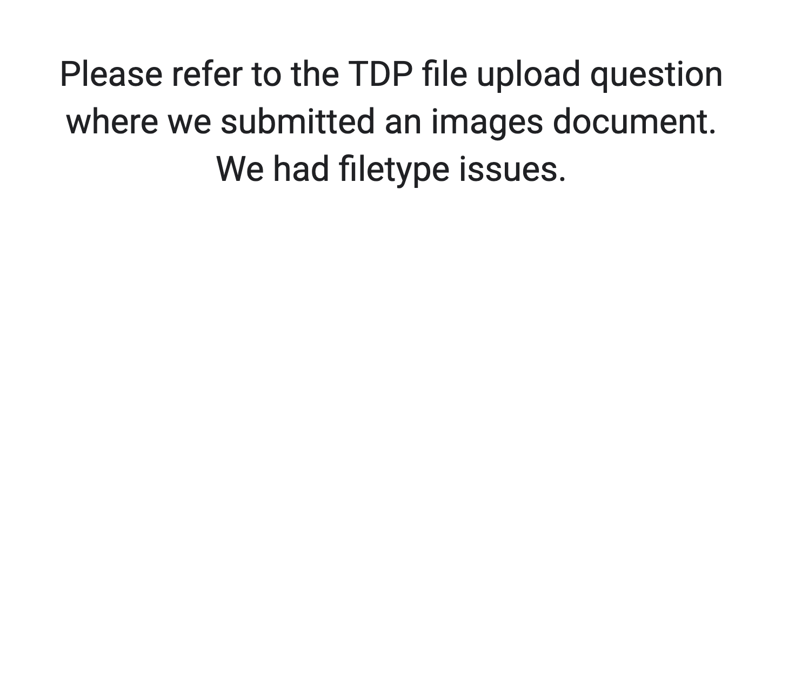

## Timestamp

*Timestamp*

7/17/2025 11:35:35

## Team Name

*What is your team's name?*

Team Elite

## League

*What league do you participate in?*

Open League

## Country

*Where are you from?*

United States of America

## Contact

*If other teams have questions about your robot, now or in the future, what email address(es) can we publish along with this document for people to reach you?

(You can put in multiple email addresses, like multiple team members, an email for the whole team or both. Feel free to share other ways of communication like Discord handles)*

aniket.
apollotouch16@gmail.com
anaiya.badi@gmail.com
madhavendra.thakur@icloud.com

## Social Media

*Team Social Media Links (if you have any)*

## Team Photo

*Upload a photo of your whole team with your mentor and robots

Note: This is not mandatory and will be published along with your TDP if you choose to upload something*

## Members & Roles

*What are the names of the team members and their role(s)?*

TDP file

## Meeting Frequency

*How often did your team meet?
(e.g. 90 minutes once per week or a day every weekend.)*

We mostly worked asynchronously, speaking once every few days and once every other week with the physical bot

## Meeting Place

*Where did you meet to work on your robot?
(e.g. a robotics room at school, at some other place, one of your homes, school library etc.)*

TDP file

## Start Date

*When did your team start working on this year's robot?*

TDP file

## Past Competitions

*Which RoboCupJunior competitions have you competed in and in which leagues?*

TDP file

## Mentor Contribution

*Which parts of your work received the most contribution from your mentor?*

TDP file

## Workload Management

*How did you manage the workload?*

TDP file

## AI Tools

*Which AI tools did you use?*

TDP file

## Robot1 Overall

*Robot 1 Overall View*

## Robot1 Front

*Robot 1 Front view*

## Robot1 Back

*Robot 1 Back view*

## Robot1 Top

*Robot 1 Top View*

[https://drive.google.com/open?id=1ppl3qUtTi7mwLTcM9irQckrssXdATWwV](https://drive.google.com/open?id=1ppl3qUtTi7mwLTcM9irQckrssXdATWwV)

## Robot1 Bottom

*Robot 1 Bottom View*

## Robot1 Right

*Robot 1 Right View*

## Robot1 Left

*Robot 1 Left View*

## Positioning & Movement

*How do you find your position inside the field and how do you use that position to move your robots around?*

TDP file

## Robot2 Overall

*Robot 2 Overall View*

## Robot2 Front

*Robot 2 Front view*

## Robot2 Back

*Robot 2 Back view*

## Robot2 Top

*Robot 2 Top View*

## Robot2 Bottom

*Robot 2 Bottom View*

## Robot2 Right

*Robot 2 Right View*

## Robot2 Left

*Robot 2 Left View*

## Mechanical Design

*How did you design the mechanical parts of your robots?*

TDP file

## Build Method

*How did you build your design?*

TDP file

## Motors & Reason

*How many motors have you used and why?*

TDP file

## Kicker Design

*If your robot has a kicker, explain how you designed and built the mechanics of the kicker*

## Dribbler Design

*If your robot has a dribbler, explain how you designed and built the mechanics of the dribbler.*

## CAD Files

*CAD design files*

https://cad.onshape.com/documents/c0d1176cae6604129d1a5a07/w/05284d4f133ac738f8a07c46/e/a22054de88fd6afbad675e38?renderMode=0&uiState=680a98b4deb2b93099687ff5

## Mechanical Innovation

*Mechanical Innovation*

TDP file

## Mechanical Photos

*Photos of your mechanical designs highlights*

## Electronics Block Diagram

*Provide us with a block diagram of your robot's electronics*

## Power Circuit

*How does your power circuits work?*

TDP file

## Motor Drive Circuit

*How do you drive your motors? Explain the circuits you use for that*

TDP file

## Microcontroller & Reason

*What kind of micro controller or board do you use for your robot? Why did you decide to use this part for your robot? If you have more than 1 processor, explain each one separately.*

TDP file

## Ball Detection

*How does your ball detection sensors and/or camera[s] work?*

TDP file

## Line Detection

*How does your line detection circuits work?*

TDP file

## Navigation/Position Sensors

*What sensors do you use for navigation and how are these sensors connected to your processor? What sensors do you use to find your position in the field? What about the direction your robot faces?*

TDP file

## Kicker Circuit

*How do you drive your kicker system? How does the circuit make the kicker work?*

TDP file

## Dribbler Circuit

*How does your dribbler system work? What components and circuits did you use to drive it?*

TDP file

## Schematics

*Schematics of your robot*

## PCB

*PCB of your robot*

## Innovation

*Innovations*

TDP file

## Circuit Photos

*Photo of your circuit boards highlights*

## Motor Control

*How do you use your processor to move your motors?*

TDP file

## Ball Detection Method

*How do you find where the ball is? How do you read the data from the ball detection sensors or camera?*

TDP file

## Ball Catch Algorithm

*How does your algorithm work to catch the ball? Is there a difference between your robots in how they move towards the ball? Explain the differences.*

TDP file

## Line Algorithm

*How does your robot find the lines to stay inside the field? What algorithms do you use to avoid going out of bounds?*

TDP file

## Goal Algorithm

*What algorithms do you use to score goals? How do you use your kicker and dribbler to handle the ball?*

TDP file

## Defense Algorithm

*What algorithms do you use to avoid the opponent team scoring? How do your robots defend your own goal?*

TDP file

## Robot Communication

*Do your robots communicate with each other? How do you use this communication to your advantage?*

## Innovation2

*Innovations*

TDP file

## GitHub Link

*GitHub link*

## BOM

*Bill of Materials (BOM)*

[https://drive.google.com/open?id=1qqjaZi5Yt-svvO9mlmeW1yISzebpgoNr](https://drive.google.com/open?id=1qqjaZi5Yt-svvO9mlmeW1yISzebpgoNr)

## Cost

*How much did it cost you to build your robots?*

Robots: 1000 dollars

## Funding

*How did you gathered the funds to build the robots?*

5% sponsors
95% parents

## Affordability

*How affordable was it to compete in RoboCupJunior Soccer?*

2

## Answer Check

*Have you checked all of your answers?*

Yes!

## Publication Consent

*We publish TDPs and posters during or after the competition as described in the beginning*

Yes, we acknowledge everything submitted in the above form can be published.

## Email Address

*Email Address*

anaiya.badi@gmail.com

## TDP File

*TDP File Upload (Not required)*

[https://drive.google.com/open?id=1dYwMPYUCAigEyGNSWBUy8xOkw-1Xzp_XrZaE78Ku904](https://drive.google.com/open?id=1dYwMPYUCAigEyGNSWBUy8xOkw-1Xzp_XrZaE78Ku904)

## Extra Column

*Column 67*

