## Timestamp

*Timestamp*

7/12/2025 12:41:09

## Team Name

*What is your team's name?*

Xelerator

## League

*What league do you participate in?*

Open League

## Country

*Where are you from?*

Shanghai, China

## Contact

*If other teams have questions about your robot, now or in the future, what email address(es) can we publish along with this document for people to reach you?

(You can put in multiple email addresses, like multiple team members, an email for the whole team or both. Feel free to share other ways of communication like Discord handles)*

zsc_hcl@126.com, xiaoli0387@outlook.com

## Social Media

*Team Social Media Links (if you have any)*

https://x.com/MlnmXelerator,https://www.youtube.com/
@MillenniumXelerator

## Team Photo

*Upload a photo of your whole team with your mentor and robots

Note: This is not mandatory and will be published along with your TDP if you choose to upload something*

## Members & Roles

*What are the names of the team members and their role(s)?*

James Zheng: Circuit and Programming
David Li: AI training and Programming
Lieselotte Liu: Modeling and Circuit 
Zishuo Ge: Strategy design

## Meeting Frequency

*How often did your team meet?
(e.g. 90 minutes once per week or a day every weekend.)*

Every single day

## Meeting Place

*Where did you meet to work on your robot?
(e.g. a robotics room at school, at some other place, one of your homes, school library etc.)*

A robotics room at school.

## Start Date

*When did your team start working on this year's robot?*

2025.2

## Past Competitions

*Which RoboCupJunior competitions have you competed in and in which leagues?*

China Open 2025: Soccer Open League

## Mentor Contribution

*Which parts of your work received the most contribution from your mentor?*

Instruction of robot design

## Workload Management

*How did you manage the workload?*

We communicated through Dingtalk and we use GitHub share our code.

## AI Tools

*Which AI tools did you use?*

Claude for coding, Gemini for all situations, GPT4o for other MCP services to imporve effiecency.

## Robot1 Overall

*Robot 1 Overall View*

## Robot1 Front

*Robot 1 Front view*

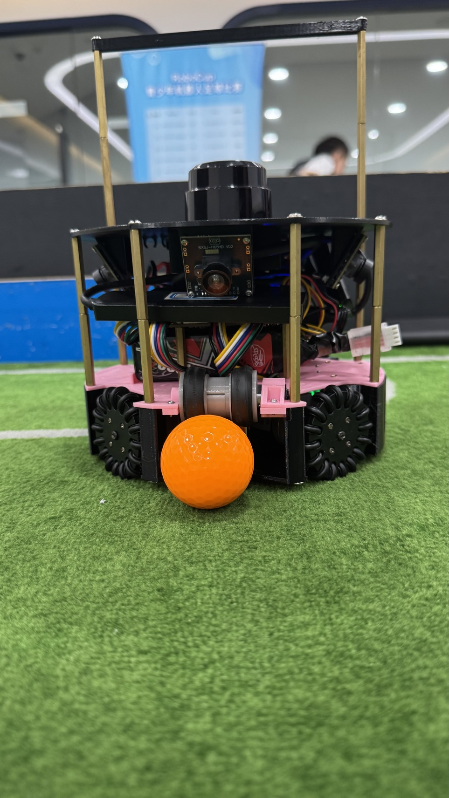

## Robot1 Back

*Robot 1 Back view*

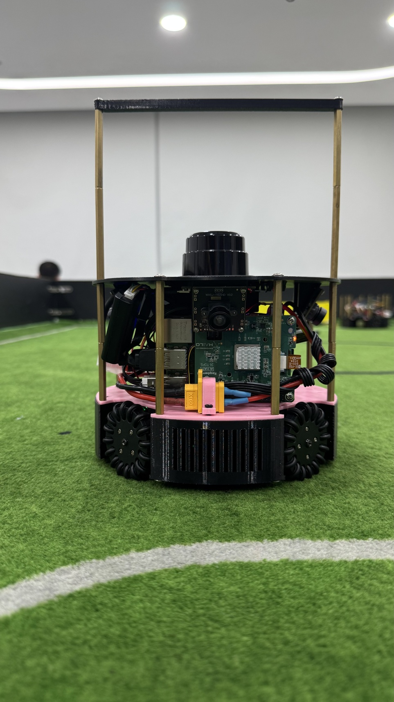

## Robot1 Top

*Robot 1 Top View*

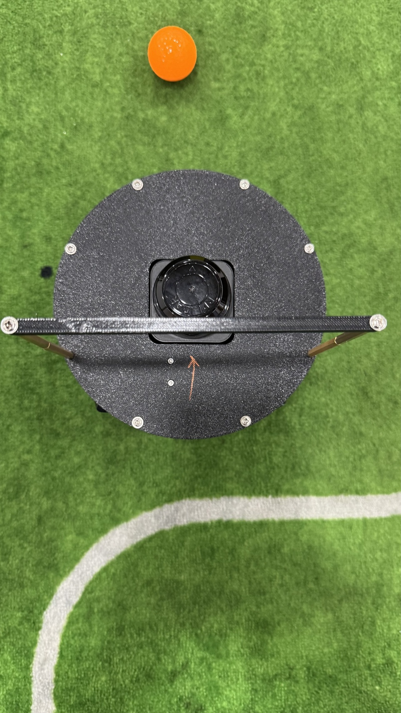

## Robot1 Bottom

*Robot 1 Bottom View*

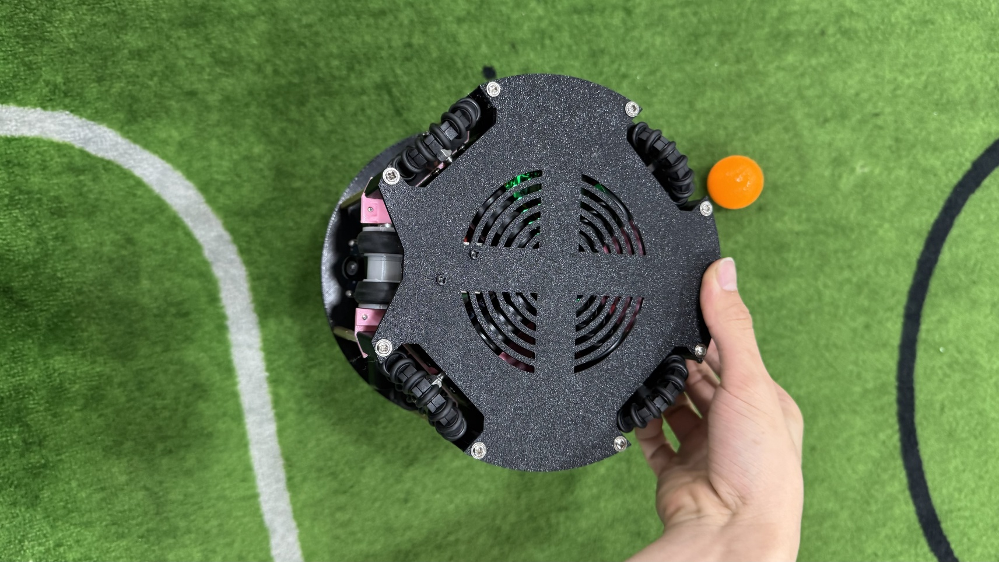

## Robot1 Right

*Robot 1 Right View*

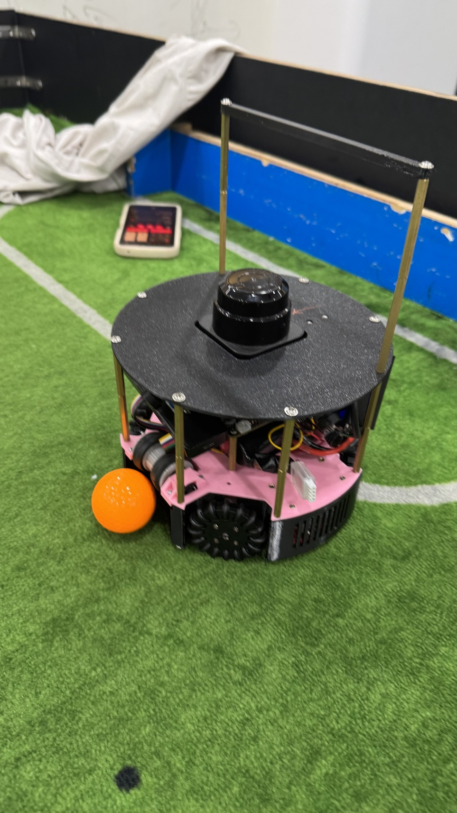

## Robot1 Left

*Robot 1 Left View*

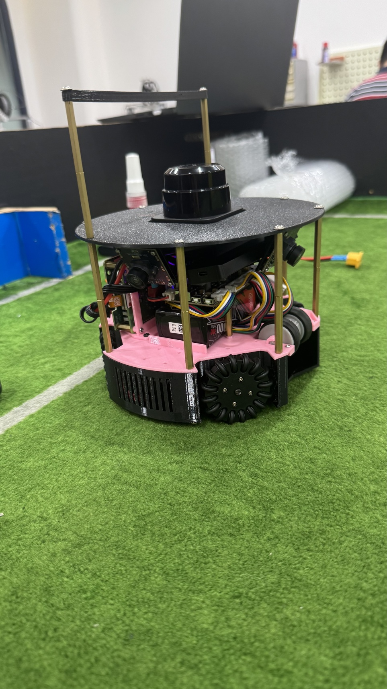

## Positioning & Movement

*How do you find your position inside the field and how do you use that position to move your robots around?*

Lidar

## Robot2 Overall

*Robot 2 Overall View*

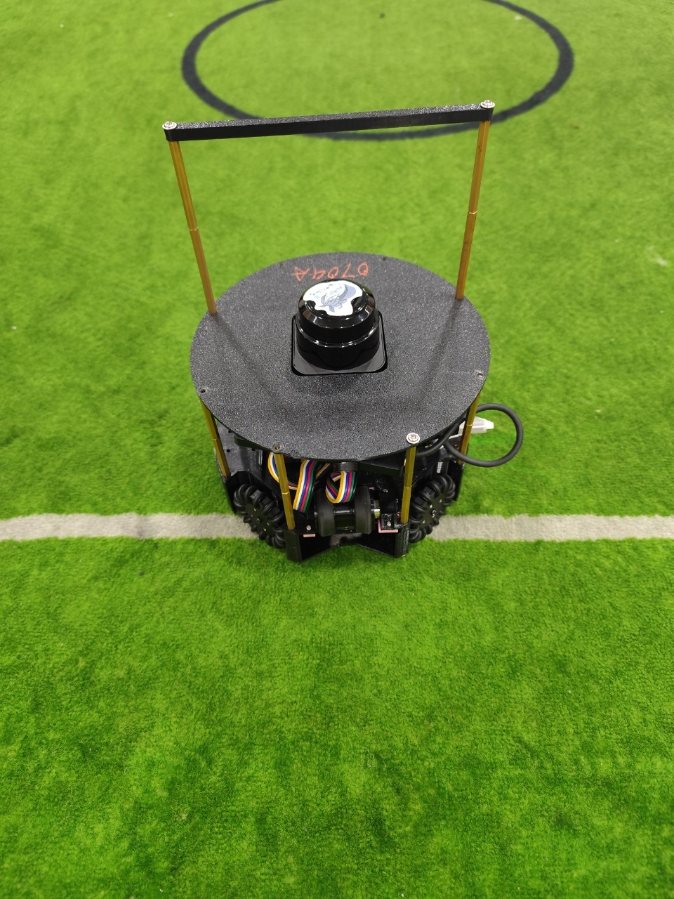

## Robot2 Front

*Robot 2 Front view*

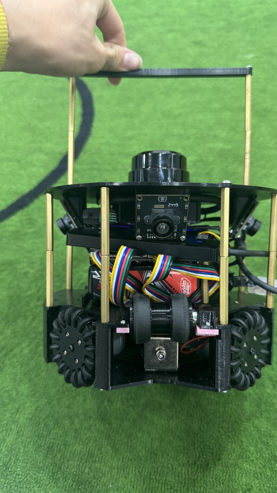

## Robot2 Back

*Robot 2 Back view*

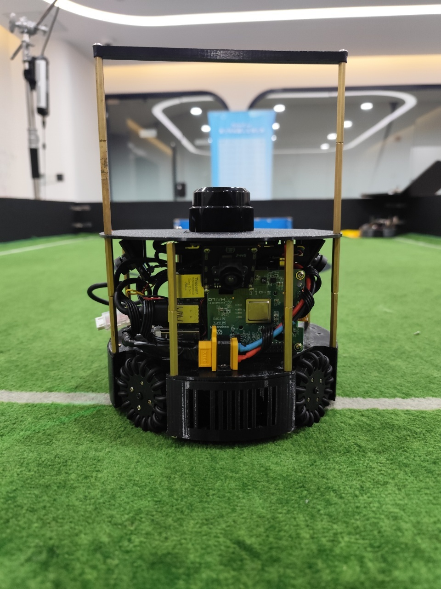

## Robot2 Top

*Robot 2 Top View*

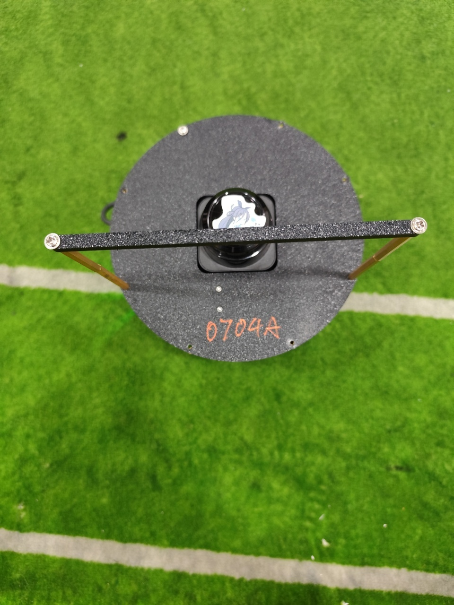

## Robot2 Bottom

*Robot 2 Bottom View*

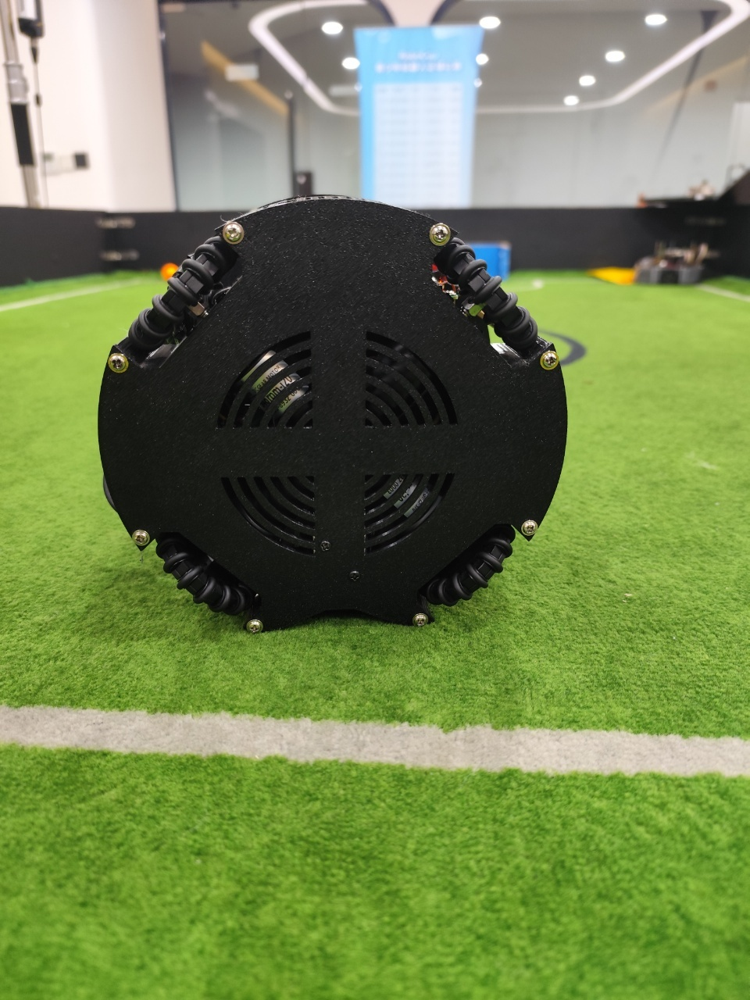

## Robot2 Right

*Robot 2 Right View*

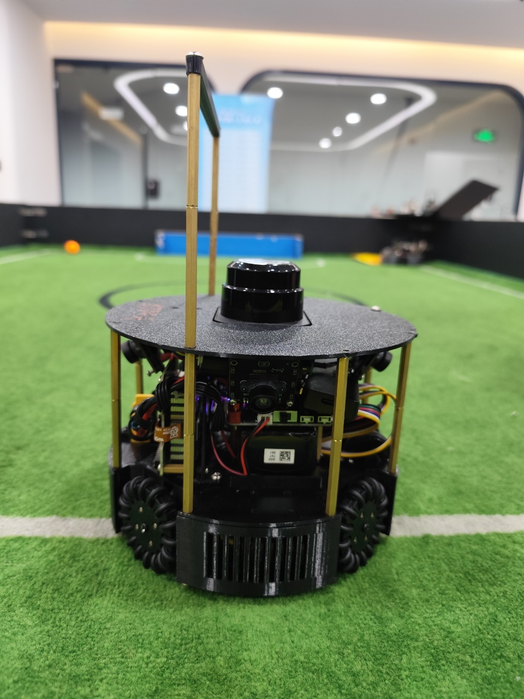

## Robot2 Left

*Robot 2 Left View*

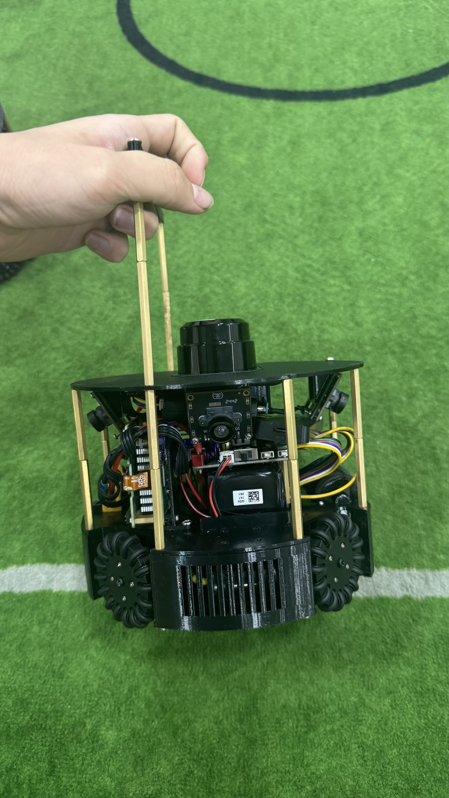

## Mechanical Design

*How did you design the mechanical parts of your robots?*

We design a 3d model by Shapr3D.

## Build Method

*How did you build your design?*

We use 3D printers to build our machines and some customized length cables.

## Motors & Reason

*How many motors have you used and why?*

Four omni wheels so that we are able to move at all directions by using the orthogonal decomposition.

## Kicker Design

*If your robot has a kicker, explain how you designed and built the mechanics of the kicker*

Electromagnet only

## Dribbler Design

*If your robot has a dribbler, explain how you designed and built the mechanics of the dribbler.*

Using a wheel to dribble the ball, no other mechanical parts.

## CAD Files

*CAD design files*

## Mechanical Innovation

*Mechanical Innovation*

not finished yet

## Mechanical Photos

*Photos of your mechanical designs highlights*

## Electronics Block Diagram

*Provide us with a block diagram of your robot's electronics*

## Power Circuit

*How does your power circuits work?*

Our robot has a 12.6V battery pack that is regulated to 5V for our Raspberry Pi 5 and used directly by the motor drivers.

## Motor Drive Circuit

*How do you drive your motors? Explain the circuits you use for that*

The STM32 use PWM to control motor torque and hardware timer to read the encoder data.It enables us to use the PID algorithm to have a precise control of motor speed.

## Microcontroller & Reason

*What kind of micro controller or board do you use for your robot? Why did you decide to use this part for your robot? If you have more than 1 processor, explain each one separately.*

We use a Raspberry Pi 5 8GB and Hailo8 26 TPS for processing the images and detection, which is powered by YOLO-V8, and we use an STM32-F103 as a lower controller for controlling the wheels and determining the robot's attitude.

## Ball Detection

*How does your ball detection sensors and/or camera[s] work?*

First, the cameras will capture the images, then we use a self-pretrained model based on the YOLO-V8 model.

## Line Detection

*How does your line detection circuits work?*

We use lidar to get the position of the robot, which is absolute to the whole court. In this case, we don't need line detection for avoiding running into the restricted areas.

## Navigation/Position Sensors

*What sensors do you use for navigation and how are these sensors connected to your processor? What sensors do you use to find your position in the field? What about the direction your robot faces?*

We use a nine-axis IMU for get the yaw angle of the robot, and using a TOF lidar to position in the filed.

## Kicker Circuit

*How do you drive your kicker system? How does the circuit make the kicker work?*

We use a DC-DC boost module to boost 12V to 48V, which can launch the electromagnet, and a relay acts as a switch for the kicker.

## Dribbler Circuit

*How does your dribbler system work? What components and circuits did you use to drive it?*

We use a 3D-printed wheel to dribble the ball, using a 1.6kRPM motor to power up the wheel and dribble the ball.

## Schematics

*Schematics of your robot*

## PCB

*PCB of your robot*

## Innovation

*Innovations*

We developed a method that can detect robot chassis on the field,by training a YOLOv8 model with a dataset including more than 20 types of chassis.

## Circuit Photos

*Photo of your circuit boards highlights*

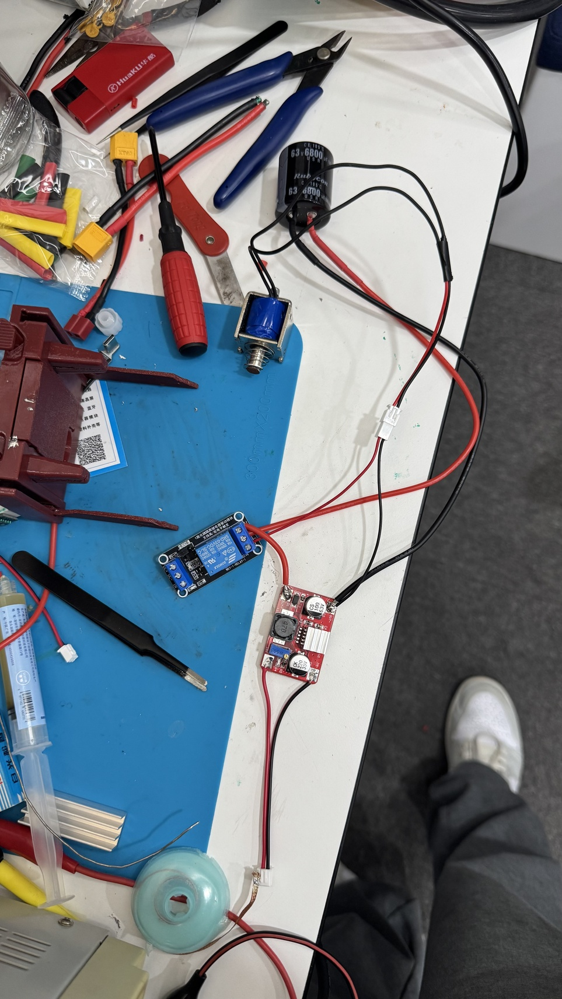

## Motor Control

*How do you use your processor to move your motors?*

By using the encoder installed on the DC motor,AM2857 can read PPS data and use PID algorithms to control motor RPM

## Ball Detection Method

*How do you find where the ball is? How do you read the data from the ball detection sensors or camera?*

We trained a YOLOv8 model with a dataset including golf in several environments,

## Ball Catch Algorithm

*How does your algorithm work to catch the ball? Is there a difference between your robots in how they move towards the ball? Explain the differences.*

There's no difference.

## Line Algorithm

*How does your robot find the lines to stay inside the field? What algorithms do you use to avoid going out of bounds?*

By lidar, they can get the absolute going out of bounds.

## Goal Algorithm

*What algorithms do you use to score goals? How do you use your kicker and dribbler to handle the ball?*

When robots are chasing the ball, robots will dribble the ball after catching the ball. Then use kicker.

## Defense Algorithm

*What algorithms do you use to avoid the opponent team scoring? How do your robots defend your own goal?*

By recognizing the robot and the ball's latest position.

## Robot Communication

*Do your robots communicate with each other? How do you use this communication to your advantage?*

Yes, our robots can use a Bluetooth technology to communicate each other and give the ball position for a smarter strategy.

## Innovation2

*Innovations*

The robot detection, with the help of this, our robots can be much smarter than before, and have a greater chance of winning the game.

## GitHub Link

*GitHub link*

https://github.com/423Tech/Xel-RCJ2025Open.git

## BOM

*Bill of Materials (BOM)*

[https://drive.google.com/open?id=1pdD7NVUWSzhphPuCIYqVlD3XUUZtp2Ow](https://drive.google.com/open?id=1pdD7NVUWSzhphPuCIYqVlD3XUUZtp2Ow)

## Cost

*How much did it cost you to build your robots?*

Robots:314 Euro each, Experiments: 100 Euro, Environment: 300 Euro

## Funding

*How did you gathered the funds to build the robots?*

50% school,50% parents

## Affordability

*How affordable was it to compete in RoboCupJunior Soccer?*

4

## Answer Check

*Have you checked all of your answers?*

Yes!

## Publication Consent

*We publish TDPs and posters during or after the competition as described in the beginning*

Yes, we acknowledge everything submitted in the above form can be published.

## Email Address

*Email Address*

zhengjames0423@gmail.com

## TDP File

*TDP File Upload (Not required)*

## Extra Column

*Column 67*

