## Timestamp

*Timestamp*

7/14/2025 3:01:36

## Team Name

*What is your team's name?*

chaBots Phoenix

## League

*What league do you participate in?*

Lightweight League

## Country

*Where are you from?*

San Luis Potosi, Mexico

## Contact

*If other teams have questions about your robot, now or in the future, what email address(es) can we publish along with this document for people to reach you?

(You can put in multiple email addresses, like multiple team members, an email for the whole team or both. Feel free to share other ways of communication like Discord handles)*

Team’s Email: chabotsmx@gmail.com
Team’s captain Email: hugoigd1012@gmail.com 
And our social media.

## Social Media

*Team Social Media Links (if you have any)*

All of our social media links are on this linktree. https://linktr.ee/chabotsmx

## Team Photo

*Upload a photo of your whole team with your mentor and robots

Note: This is not mandatory and will be published along with your TDP if you choose to upload something*

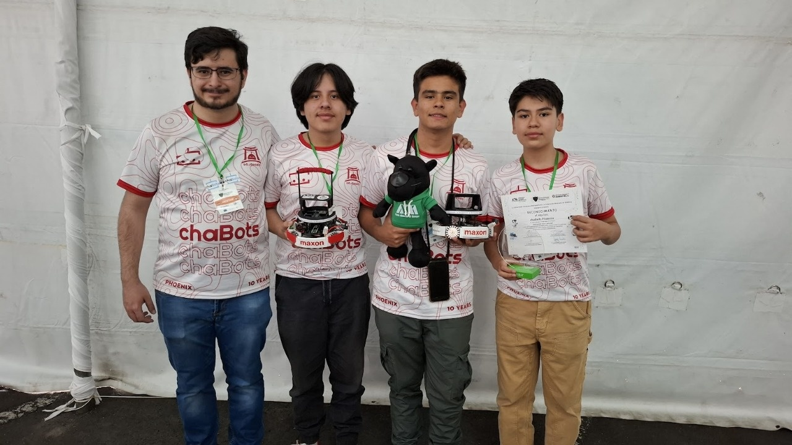

## Members & Roles

*What are the names of the team members and their role(s)?*

Guillermo Alfonso De Anda Navarrete: High Level Software Developer
Honore Alesandro Villanueva Hernandez: Low Level Programmer, Mechanic
Hugo Ivan Guerrero Diaz: Team Captain, PCB Designer, Mechanical Designer, Mechanic

## Meeting Frequency

*How often did your team meet?
(e.g. 90 minutes once per week or a day every weekend.)*

3-4 times a week, depending on the workload.

## Meeting Place

*Where did you meet to work on your robot?
(e.g. a robotics room at school, at some other place, one of your homes, school library etc.)*

We meet at our workshop at a local robotics school called DojoRobot that sponsors us.

## Start Date

*When did your team start working on this year's robot?*

Early concept for the robot started around September of 2024. However, we only started properly design the robot around early February of 2025 when we found our third team member.

## Past Competitions

*Which RoboCupJunior competitions have you competed in and in which leagues?*

Our team captain competed at the 2023 and 2024 RoboCup Mexican Open in the Soccer Lightweight division. As a team we have only competed at the 2025 RoboCup Mexican Open in the Soccer Lightweight division.

## Mentor Contribution

*Which parts of your work received the most contribution from your mentor?*

Our mentor has helped out mostly by bringing up to speed two of our team members in the area of programming. This was done to help our main programmer with the programming workload in the future.

## Workload Management

*How did you manage the workload?*

We used a combination of Discord and Whatsapp for communicating progress and arranging meetings. We used Trello for assigning tasks and goals. We used GitHub, Solidworks and Altium cloud services for design and code version control.

## AI Tools

*Which AI tools did you use?*

We have used OpenAI’s ChatGPT LLM to help develop certain aspects in the robot’s software, such as acting as a mentor for unknown code libraries, or helping strengthen more technical aspects of the code, such as vector calculations and trigonometry. We even developed our own custom prompt for making it easier to interact with the LLM and having more useful answers.

## Robot1 Overall

*Robot 1 Overall View*

## Robot1 Front

*Robot 1 Front view*

## Robot1 Back

*Robot 1 Back view*

## Robot1 Top

*Robot 1 Top View*

## Robot1 Bottom

*Robot 1 Bottom View*

## Robot1 Right

*Robot 1 Right View*

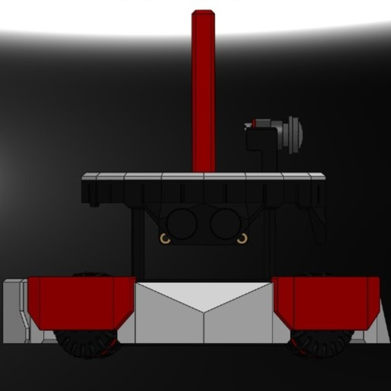

## Robot1 Left

*Robot 1 Left View*

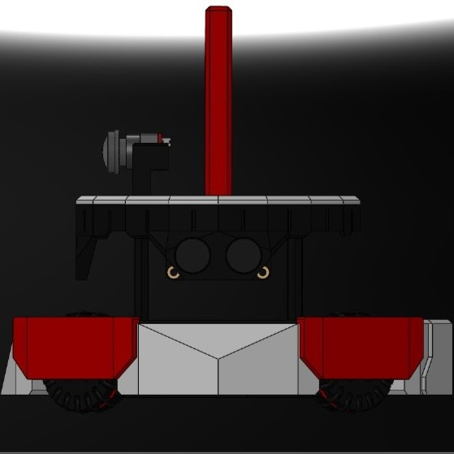

## Positioning & Movement

*How do you find your position inside the field and how do you use that position to move your robots around?*

We mainly use the cameras to find our position inside the field. Mostly for centering our striker and keeping our goalkeeper in effective range to defend. We also use ultrasonic sensors but these might be more useful for technical challanges

## Robot2 Overall

*Robot 2 Overall View*

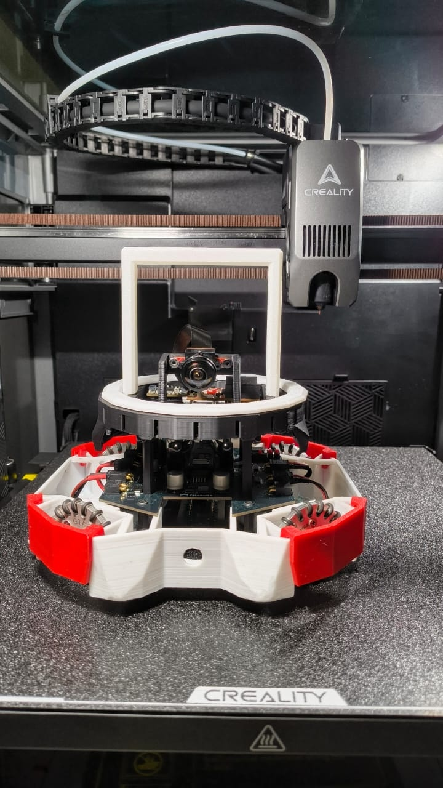

## Robot2 Front

*Robot 2 Front view*

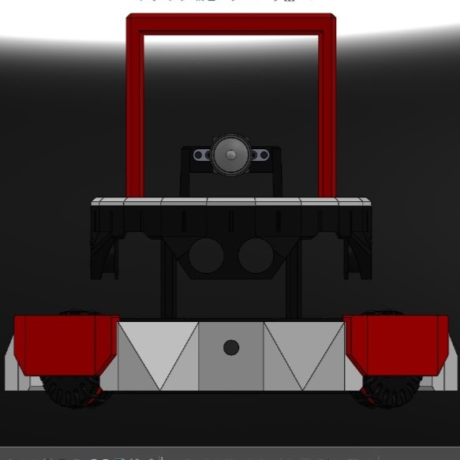

## Robot2 Back

*Robot 2 Back view*

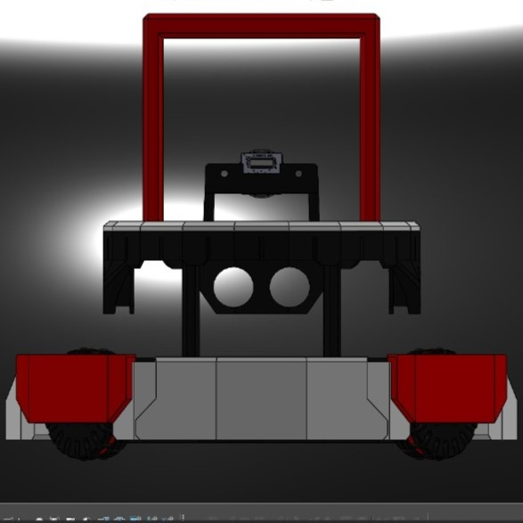

## Robot2 Top

*Robot 2 Top View*

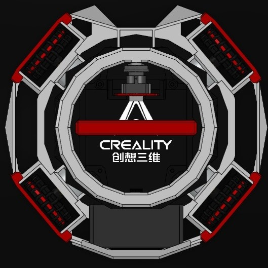

## Robot2 Bottom

*Robot 2 Bottom View*

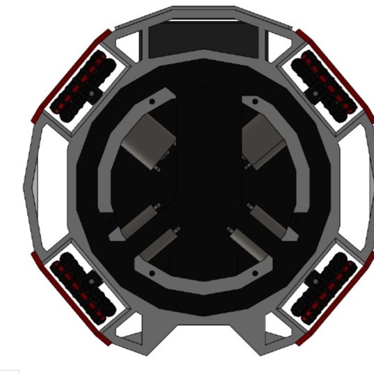

## Robot2 Right

*Robot 2 Right View*

## Robot2 Left

*Robot 2 Left View*

## Mechanical Design

*How did you design the mechanical parts of your robots?*

a

## Build Method

*How did you build your design?*

a

## Motors & Reason

*How many motors have you used and why?*

a

## Kicker Design

*If your robot has a kicker, explain how you designed and built the mechanics of the kicker*

Our robots use two very different solenoids, the JF-1264B and the JF-0837B both are bought and are not designed. One is a relatively small 1.5A  60g solenoid and the other is a very big and heavy 5A 360g solenoid.  The big difference in power and weight mainly comes down to us wanting less weight on our striker for the possible addition of a dribbler.

## Dribbler Design

*If your robot has a dribbler, explain how you designed and built the mechanics of the dribbler.*

Our striker robot has a very simple dribbler setup with an ESC and a brushless motor using timing gears and timing belts with a spring as a damper. However we are unsure if we will be able to integrate its function into our robot in time for Brazil.

## CAD Files

*CAD design files*

https://github.com/chaBotsMX/Phoenix-RCJ-2025/tree/main/CAD

## Mechanical Innovation

*Mechanical Innovation*

a

## Mechanical Photos

*Photos of your mechanical designs highlights*

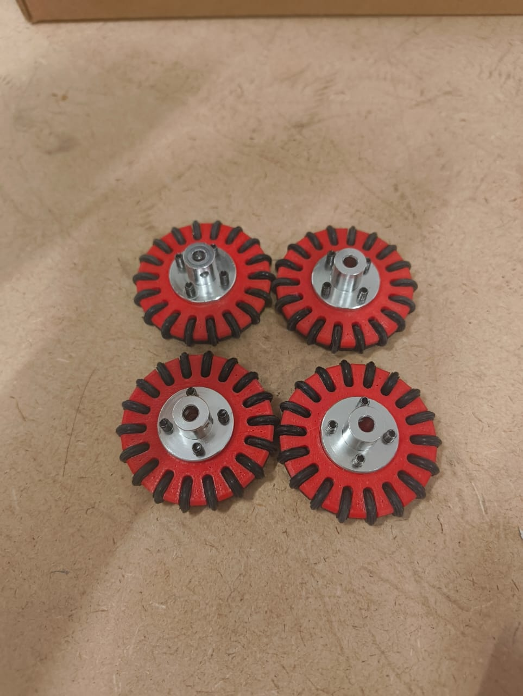
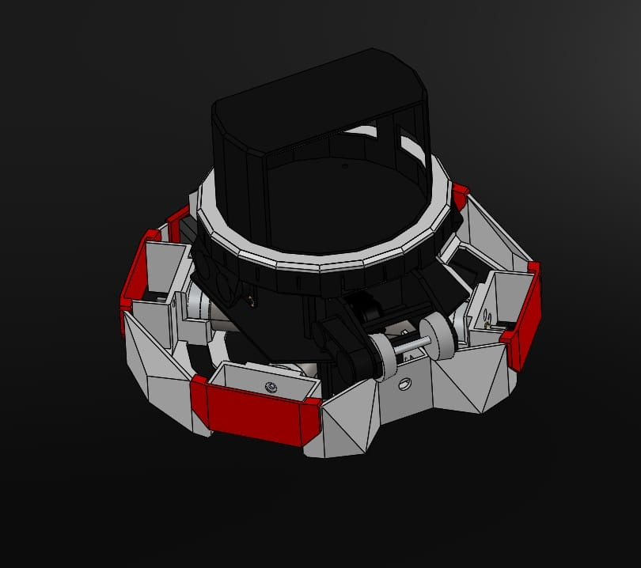

## Electronics Block Diagram

*Provide us with a block diagram of your robot's electronics*

[https://drive.google.com/open?id=1FSll0vcrDcPr3JBmWR2fflBpIaNRKmaT](https://drive.google.com/open?id=1FSll0vcrDcPr3JBmWR2fflBpIaNRKmaT)

## Power Circuit

*How does your power circuits work?*

We use two different batteries, a 11.1V LiPo to drive our motors and a 3.7V LiPo for our logic, none of these are directly regulated, however we use the Teensy 4.1s integrated 3.3 regulator to feed our phototransistors, ultrasonic sensors and IMU. We do however have a 48V boost circuit to charge our solenoid kicker with the 11.1V LiPo.

## Motor Drive Circuit

*How do you drive your motors? Explain the circuits you use for that*

We use the STM VNH7070-ASTR and the recommended circuit with reverse current protection to drive all of our brushed motors. We interface this with our main microcontroller using digital pins and PWM to modulate their speed and direction.

## Microcontroller & Reason

*What kind of micro controller or board do you use for your robot? Why did you decide to use this part for your robot? If you have more than 1 processor, explain each one separately.*

We use 3 Teensy 4.1 microcontrollers for our robots control and sensors. We mainly decided on the Teensy 4.1 because of its amazing processing speed, the amount of pins, analog pins, UART ports and small form factor. Given all of this we are able to easily integrate one of these in each one of our PCBs.

## Ball Detection

*How does your ball detection sensors and/or camera[s] work?*

We use a circular array of 18 TSSP-4038 phototransistors to digitally read and calculate the direction and lose proximity of the ball, with aided proximity detection using analog IR photodiodes. All of the readings are processed by a Teensy 4.1 which is then sent to our main controller via UART. Our camera does not track the ball at all, we only use them to find gaps in the other teams defense.

## Line Detection

*How does your line detection circuits work?*

We use an array of 18 ALS-PT19 phototransistors in tandem with 18 programmable leds to read the changes in reflectivity depending on color. These phototransistors are read with the Teensy 4.1 analog pins which then processes the readings and sends them to our main controller via UART. Our line sensor PCB also has the option to switch into a digital and much faster read mode using a simple comparator circuit, however these readings can still be somewhat inconsistent which led us to continue using analog readings and do the transition threshold with programming.

## Navigation/Position Sensors

*What sensors do you use for navigation and how are these sensors connected to your processor? What sensors do you use to find your position in the field? What about the direction your robot faces?*

a

## Kicker Circuit

*How do you drive your kicker system? How does the circuit make the kicker work?*

a

## Dribbler Circuit

*How does your dribbler system work? What components and circuits did you use to drive it?*

It doesn't :(. We use a 12A ESC to interface with our main microcontroller and turn it on when in effective range.

## Schematics

*Schematics of your robot*

[https://drive.google.com/open?id=1Sc8lz6X9uygmMlblJUYnjlxZm9PD6ipf](https://drive.google.com/open?id=1Sc8lz6X9uygmMlblJUYnjlxZm9PD6ipf)
[https://drive.google.com/open?id=1z4vRriFNucaS4vKBv7ri76VekjJ39R2b](https://drive.google.com/open?id=1z4vRriFNucaS4vKBv7ri76VekjJ39R2b)
[https://drive.google.com/open?id=12pDH3StOgiv74h4-TQdf29j3Th4EhQDt](https://drive.google.com/open?id=12pDH3StOgiv74h4-TQdf29j3Th4EhQDt)
[https://drive.google.com/open?id=1z8NS3NKKNIbPgIx3qKBsosrgfGW_OV4v](https://drive.google.com/open?id=1z8NS3NKKNIbPgIx3qKBsosrgfGW_OV4v)

## PCB

*PCB of your robot*

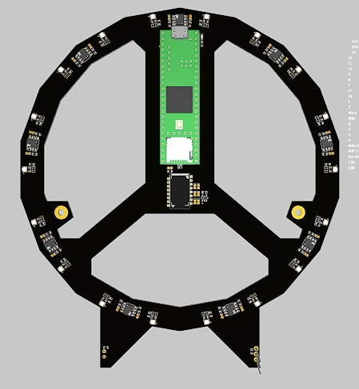
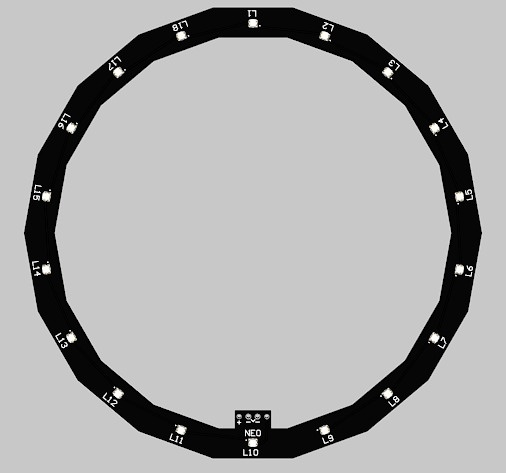
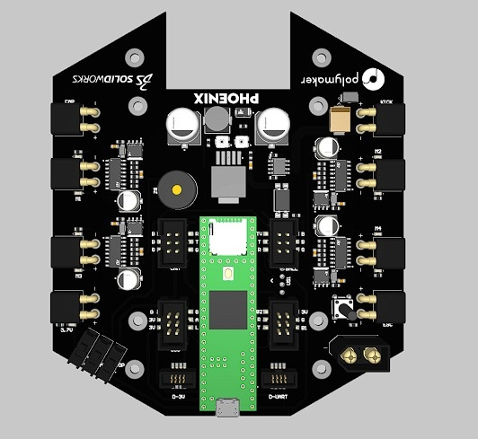
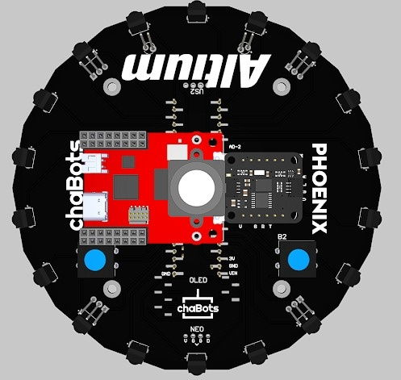

## Innovation

*Innovations*

We are proud of our both analog and digital line sensor circuit although it still may need some work, however I believe the approach of reading the line sensor digitally will greatly aid us in the future. I am also very proud of the extra indicators we were able to add to this year's robot, this includes: buzzer, neopixel light array, screen and motor driver led indicators.

## Circuit Photos

*Photo of your circuit boards highlights*

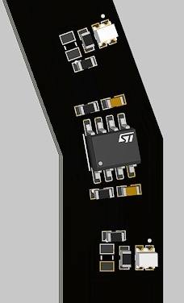
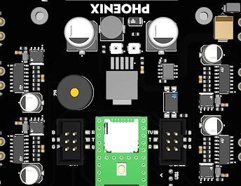
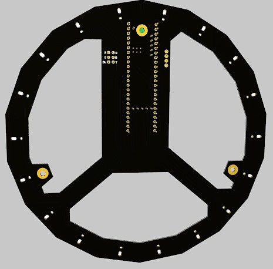

## Motor Control

*How do you use your processor to move your motors?*

a

## Ball Detection Method

*How do you find where the ball is? How do you read the data from the ball detection sensors or camera?*

For the ball localization, we rely on vector calculation based on the inputs of the 18 TSSP sensor array. This allows us to have precise knowledge of both angle and distance of the ball relative to the robot. To achieve this, we first approximate the pulse width of each detected pulse from every sensor, this allows us to have a certain value of intensity in detection of the ball. Then, we represent each sensor as a vector whose magnitude is relative to the detected pulse width, and its angle is the position of the sensor in the sensor array, and sum all of the components of every vector to form a final vector that represents the current position of the ball relative to all the detected sensors.  We also know when the ball is in the capture zone of the robot thanks to the analogic readings of IR photodiodes. After processing the sensors input and calculating a vector, we compress the angle and magnitude’s values to one byte each and send these bytes to the main Teensy through serial communication using UART.

## Ball Catch Algorithm

*How does your algorithm work to catch the ball? Is there a difference between your robots in how they move towards the ball? Explain the differences.*

In our attacker robot, depending on the distance of the ball, is how the robot will move to catch it. When the ball is close, to avoid pushing the ball sideways, the robot drives tracing a circumference around the ball, and when the photodiodes are detecting IR signals, it means the ball is in front of the robot, thus, we know the robot is in control of the ball. And when the ball is far, the robot drives to the angle of the ball with a constant offset to avoid accidental collisions with the ball, and eventually the state will change to the ball being close.
On the other hand, the defense robot will mainly move in either left or right depending on the position of the ball to stop the opponents from scoring, and when the defender catches the ball, or knows the ball is in a neutral point, the robot can apply the same algorithm that the attacker uses for catching the ball and taking it to the opponent’s goal.

## Line Algorithm

*How does your robot find the lines to stay inside the field? What algorithms do you use to avoid going out of bounds?*

We run vector calculations similar to our ball detection algorithm to detect the white lines. We first calibrate all of our sensors by saving the minimum analog value each sensor detects, thus, when the sensors detect a lower reading that the minimum detected in the field, means there’s a brighter color downwards the sensor. We do this calibration routine every time we power our line sensor so we don’t get affected depending on the ambient. After calibration, we represent every detected sensor as an unitary vector that represents the direction of where the line is being detected, and sum all of the vectors to have a concise knowledge of the angle where the line is being detected. We then send this angle to the main microcontroller, where the logic to drive the robot inside the field is to move to the opposite direction of where the line is being detected, and in case of the defender robot it will move along the line.

## Goal Algorithm

*What algorithms do you use to score goals? How do you use your kicker and dribbler to handle the ball?*

As explained before, the robot follows a series of steps to catch the ball. Once the robot is certain the ball is in the capture zone thanks to the readings of an IR photodiode, the robot will execute another algorithm to score a goal: the robot will drive to an angle relative to the largest detected space of the color of the goal in front of the robot, and if the ball has been consistently in the capture zone for a determined time, means the robot can accurately kick the ball. If no goal is detected, the robot will only drive forward to help the ball going to the opposite side of the field. This algorithm helps us to constantly kick the ball inside the goal, allowing precise scoring.

## Defense Algorithm

*What algorithms do you use to avoid the opponent team scoring? How do your robots defend your own goal?*

Our defense robot follows a special algorithm to defend our goal by driving along the white line in the penalty area of the field. First, the line sensor microcontroller now determines if currently the robot is at the left or right curve, or the straight line of the white line, and the position where the line is being detected. Then, with the received data, the main teensy performs a PD controller based on the Y axis position of the robot in the white line, and corrects itself to maintain alignment. At the same time, depending on the ball’s position, the robot will move either left or right, while giving priority to aligning with the PD controller, and will stop when it detects being positioned at a corner and the ball is in the same direction as the detected position inside the white line, this to avoid going out of the defensive area.

## Robot Communication

*Do your robots communicate with each other? How do you use this communication to your advantage?*

Our robots can communicate with themselves through Bluetooth Low Energy using our ESP32 S3 based display. The data the robots send and receive to each other is the current state of the robots, being either enabled or disabled, this determined by the button each robot has that changes these states. This allows the robots to have knowledge of when the other robot is out of the field. We use this to determine if our defense robot should drive to catch the ball and attempt scoring, or if it should stay inside the defensive area to prevent opposing goal scoring.

## Innovation2

*Innovations*

One aspect of the software that we are very proud of is the optimization of serial communication and loop times of our microcontrollers that we’ve managed from the national event to the world championship. During testing after the national competition, we looked forward to reducing latency between the communicating microcontrollers, and being able to receive sensor data and drive the robot as accurately as possible. We were able to do so by avoiding unnecessary trigonometry operations, constantly updating data every iteration of the code loop, and reducing the quantity of data being sent through UART. We shortened delays in serial communication by 2500%.

## GitHub Link

*GitHub link*

https://github.com/chaBotsMX/Phoenix-RCJ-2025/tree/main/Software

## BOM

*Bill of Materials (BOM)*

[https://drive.google.com/open?id=1x-v0Xgm2STnyp60PqGCc2ORqz9aNfwMW](https://drive.google.com/open?id=1x-v0Xgm2STnyp60PqGCc2ORqz9aNfwMW)

## Cost

*How much did it cost you to build your robots?*

An approximate of cost in mexican pesos:
Robot components: MEX $85,800
Experiments: MEX $10,000
Environment: MEX $8,000
MEX $1 = USD $0.05

## Funding

*How did you gathered the funds to build the robots?*

An approximate in percentages:
10% parents, 10% our mentor, 80% sponsors.

## Affordability

*How affordable was it to compete in RoboCupJunior Soccer?*

4

## Answer Check

*Have you checked all of your answers?*

Yes!

## Publication Consent

*We publish TDPs and posters during or after the competition as described in the beginning*

Yes, we acknowledge everything submitted in the above form can be published.

## Email Address

*Email Address*

hugoigd1012@gmail.com

## TDP File

*TDP File Upload (Not required)*

[https://drive.google.com/open?id=1dv3X_B5KHM0FnDkGWjwLwWGe1dyz5ZoO](https://drive.google.com/open?id=1dv3X_B5KHM0FnDkGWjwLwWGe1dyz5ZoO)

## Extra Column

*Column 67*

